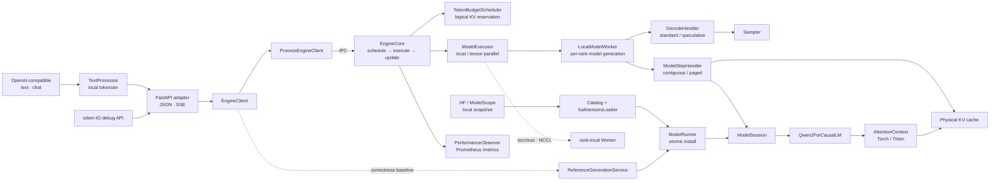
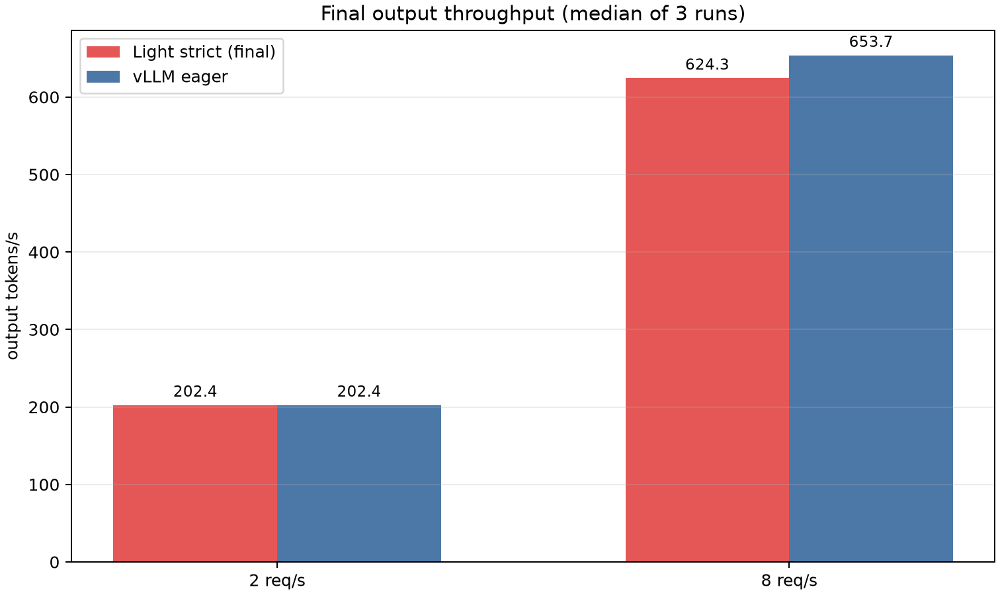
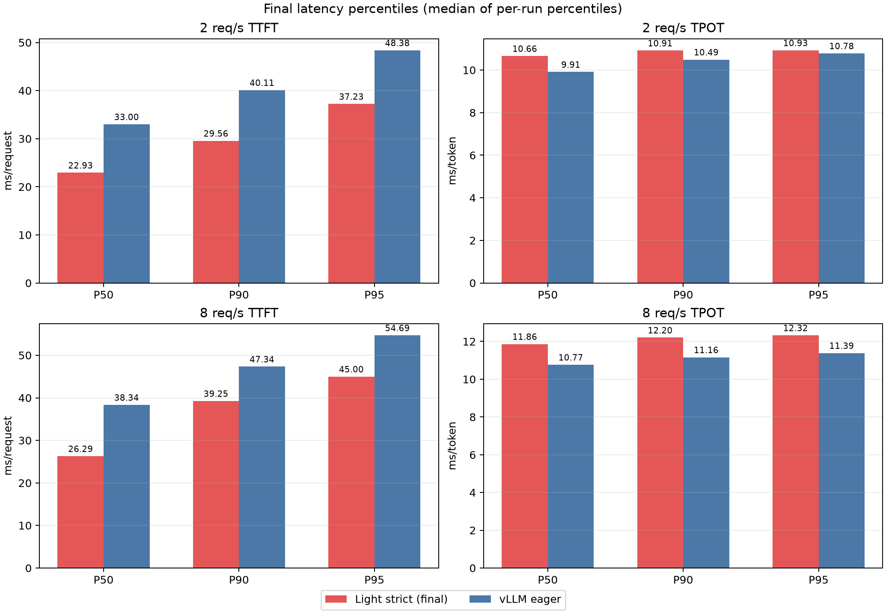
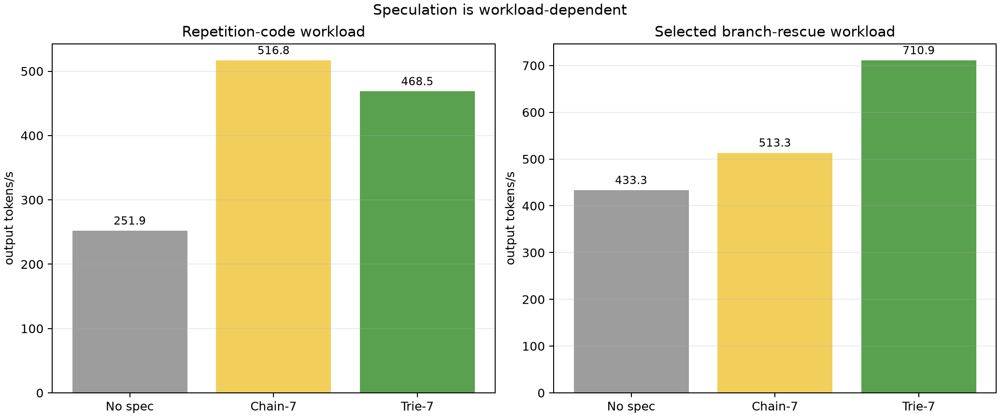
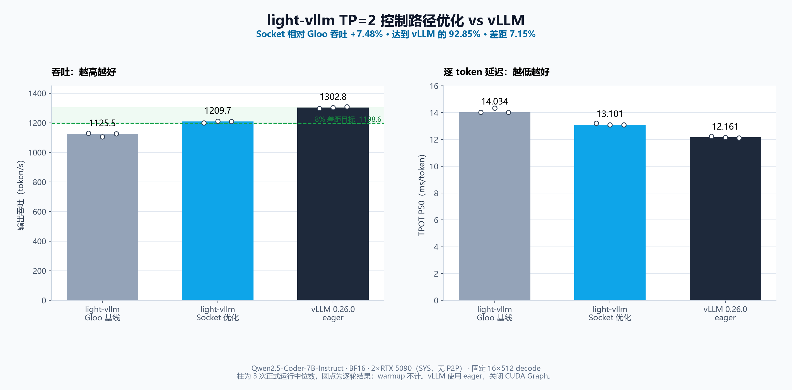

<p align="center">
  
</p>

<h1 align="center">light-vllm</h1>

<p align="center">
  <strong>把一次 LLM 推理请求拆开，让调度、KV cache、模型执行和服务边界都看得见。</strong>
</p>

<p align="center">
  一个小型、可组合的 LLM 推理运行时。当前专注单机 Qwen2/Qwen2.5 推理，
  以及这些能力背后的正确性与性能取舍。
</p>

<p align="center">
  
  
  
  
  
  
  
</p>

<p align="center">
  <a href="#快速开始">快速开始</a> ·
  <a href="docs/design.md">架构设计</a> ·
  <a href="benchmarks/remote_5090/OPTIMIZATION_JOURNEY.md">性能记录</a> ·
  <a href="examples/monitoring/README.md">监控示例</a>
</p>

> [!NOTE]
> light-vllm 不是 vLLM 的兼容替代品，也还不适合直接承载生产流量。它更适合用来读懂推理数据流、验证调度与缓存设计，或做边界清楚的实验。

## 为什么做这个项目

成熟推理框架很强，但想顺着一个请求读清楚 Scheduler、KV cache、Worker 和模型并不轻松。light-vllm 保留一条真正能运行的推理链路，再把每类变化放到明确的扩展点里。

一个新能力该放在哪里，这里尽量给出直白的答案：

- 新模型和新权重格式走注册表，不修改 `ModelRunner` 的分发逻辑。
- 新量化格式替换 `LinearMethod`，新算子后端替换量化 Scheme，不修改 Engine、Scheduler 或 Worker。
- 新采样策略替换 `Sampler`，不新增一套 Executor。
- 连续 KV 与分页 KV 共用 Worker 和模型，只替换 Step Handler。
- HTTP、Prometheus 和进程通信留在边界上，不进入推理核心。

如果你想看一个 token 从请求进入调度、拿到 KV 页、跑过模型，再变成 SSE 事件，这个仓库就是为这件事准备的。

## 现在能做什么

| 范围 | 当前实现 |
| --- | --- |
| 模型与权重 | 原生 Qwen2/Qwen2.5；full attention、default RoPE、GQA、tied embedding；读取 HF/ModelScope 兼容的本地 safetensors 快照 |
| 量化 | Qwen2/Qwen2.5 AWQ W4A16 离线 PTQ、AutoAWQ 兼容导出、自动加载、Torch correctness 与 CUDA GEMM；支持 TP checkpoint 分片 |
| 执行 | token-major packed query、chunked prefill、连续与分页 KV、PyTorch correctness attention、可选 Triton fused paged attention |
| 单机并行 | torchrun + NCCL Tensor Parallel；列/行/词表并行、rank-local 权重与 KV；已完成双 RTX 5090 短序列正确性、显存、性能与故障退出验收 |
| 调度 | 统一 token budget、严格非抢占 completion claim、prefix cache、短请求资源池、TTFT 早拒、可选 self-resubmit |
| 解码 | Greedy、temperature、top-k、top-p、逐请求 seed；N-Gram Chain/Trie proposer 共用树形验证和 KV compact |
| 服务 | 本地 tokenizer、OpenAI-compatible Completion/Chat 流式与非流式 API、token-ID 调试 API、独立 Engine 进程、取消与异常清理、Prometheus 指标 |

暂时没有 FP8、sliding-window/RoPE scaling、第三方 victim preemption、多节点通信或 MaaS 控制面。AWQ 首版只支持
Qwen2/Qwen2.5、W4A16 和 FP16 activation，实机验收使用 group size 128；它不是通用量化框架。v0.2 文本接口首版不支持 tools、
多个 choice、logprobs 或批量 prompt，随机 sampling 也不与投机解码组合。单机 TP/NCCL 已在双 RTX 5090 上完成
Dense 短序列正确性、显存、性能和故障退出验收；AWQ 双卡真实模型验收、BF16 长生成的跨 TP size 逐 token 一致性、
长上下文、跨节点、更多 GPU 拓扑和更多模型仍未完成验收。

## 一张图看懂



Scheduler 管请求顺序、token budget、逻辑 KV reservation 和 block ID。Step Handler 管物理 tensor、block table 与 attention metadata。模型只负责 Q/K/V、RoPE、norm 和 MLP，并通过 `AttentionContext` 访问 KV。

请求开始后会固定一个 `ModelSession`。即使此时 reload，新旧请求也不会混用两代模型。完整图解见 [当前架构总览](docs/diagrams/light-vllm-current-overview.html)、[KV 所有权](docs/diagrams/light-vllm-kv-ownership.html)、[Paged Attention 地址映射](docs/diagrams/light-vllm-paged-attention-token-path.html) 和 [Worker 生命周期](docs/diagrams/light-vllm-worker-lifecycle.html)。

## 快速开始

需要 Python 3.10 或更高版本。在 Windows PowerShell 中运行：

```powershell
python -m venv .venv
.\.venv\Scripts\python.exe -m pip install -e ".[dev]"
.\.venv\Scripts\python.exe -m pytest
```

最小模型调用使用一维 token 流：

```python
import torch

from light_vllm import ForwardBatch, ModelSpec, create_runner

runner = create_runner()
runner.load(
    ModelSpec(
        architecture="tiny-causal-lm",
        loader="init",
        model_args={"vocab_size": 128, "hidden_size": 32},
    )
)

batch = ForwardBatch(input_ids=torch.tensor([1, 2, 3], dtype=torch.long))
output = runner.open_session().forward(batch)
print(output.logits.shape)  # torch.Size([3, 128])
```

### 启动 Qwen2/Qwen2.5 GPU 服务

在 Linux/WSL 上安装可选依赖，并指向已经下载好的本地模型快照：

```bash
python -m venv .venv
.venv/bin/python -m pip install -e ".[serve,triton]"

.venv/bin/light-vllm-serve \
  --architecture qwen2.5 \
  --loader safetensors \
  --weights /models/Qwen2.5-Coder-7B-Instruct \
  --tokenizer /models/Qwen2.5-Coder-7B-Instruct \
  --served-model-name Qwen2.5-Coder-7B-Instruct \
  --request-timeout-seconds 300 \
  --device cuda \
  --dtype bfloat16 \
  --runtime engine \
  --engine-process \
  --kv-reservation blocks \
  --paged-attention-backend triton
```

### 量化并启动 AWQ W4A16

首版 PTQ 只接收本地 Qwen2/Qwen2.5 Dense checkpoint 和 JSONL 校准集。每行至少包含一个 `text` 字段：

```bash
.venv/bin/python -m pip install -e ".[serve,triton,validation]"

.venv/bin/light-vllm-quantize-awq \
  --model /models/Qwen2.5-0.5B-Instruct \
  --output /models/Qwen2.5-0.5B-Instruct-AWQ \
  --calibration-data /data/calibration.jsonl \
  --max-calibration-samples 128 \
  --calibration-sequence-length 512 \
  --group-size 128 \
  --device cuda \
  --dtype float16

.venv/bin/light-vllm-serve \
  --architecture qwen2.5 \
  --loader safetensors \
  --weights /models/Qwen2.5-0.5B-Instruct-AWQ \
  --tokenizer /models/Qwen2.5-0.5B-Instruct-AWQ \
  --served-model-name Qwen2.5-0.5B-Instruct-AWQ \
  --quantization auto \
  --quantization-backend cuda \
  --device cuda \
  --dtype float16 \
  --runtime engine \
  --engine-process \
  --kv-reservation blocks \
  --paged-attention-backend triton
```

`auto` 从 checkpoint 的 `quantization_config` 选择 AWQ；`none` 会明确拒绝量化 checkpoint；`awq` 可用于要求
checkpoint 必须是 AWQ。`torch` backend 是便于 CPU/数值测试的慢速正确性实现，GPU 服务应使用 `cuda` 或
`auto`。CUDA backend 首次加载会编译一个小型扩展，需要 C++ 编译器、Ninja 和 CUDA toolkit；仓库 Dockerfile
已经包含这些工具。AWQ 当前必须显式使用 `--dtype float16`，不能沿用 Dense 示例里的 BF16。

单机两卡 TP 使用 torchrun 启动一张 GPU 一个进程。Rank 0 运行原有 Engine 和 HTTP，其他 Rank 只运行模型 Worker；
TP 已经提供独立进程边界，因此不要再传 `--engine-process`：

```bash
torchrun --standalone --nproc-per-node=2 \
  -m light_vllm.entrypoints.http \
  --architecture qwen2.5 \
  --loader safetensors \
  --weights /models/Qwen2.5-Coder-7B-Instruct \
  --tokenizer /models/Qwen2.5-Coder-7B-Instruct \
  --served-model-name Qwen2.5-Coder-7B-Instruct \
  --device cuda \
  --dtype bfloat16 \
  --runtime engine \
  --tensor-parallel-size 2 \
  --distributed-backend nccl \
  --kv-reservation blocks \
  --paged-attention-backend triton
```

当前实机验收结论见下方 TP=1/2 对照。首版 TP 只支持分页 KV；`unbounded` 会在启动时明确拒绝。

OpenAI Python SDK 可以直接连接本地服务：

```python
from openai import OpenAI

client = OpenAI(base_url="http://127.0.0.1:8000/v1", api_key="local-only")
response = client.chat.completions.create(
    model="Qwen2.5-Coder-7B-Instruct",
    messages=[{"role": "user", "content": "写一个 Python 快速排序"}],
    temperature=0,
    max_tokens=128,
)
print(response.choices[0].message.content)
```

`/v1/completions` 与 `/v1/chat/completions` 都支持流式和非流式返回，以及 `temperature`、`top_k`、`top_p`、`stop`、`seed`、`max_tokens` 和 usage。tokenizer 只从本地目录加载，不联网，也不启用 `trust_remote_code`。

原有 token-ID 接口保留用于引擎调试：

```bash
curl -X POST http://127.0.0.1:8000/generate \
  -H "Content-Type: application/json" \
  -d '{"input_ids":[1,2,3],"max_new_tokens":4}'
```

`POST /generate/stream` 返回 token-ID SSE；`GET /capabilities` 给出模型、KV 与 Scheduler 容量；`GET /metrics` 返回性能快照。完整参数以 `light-vllm-serve --help` 为准。

原生 systemd、Docker Compose 和 Kubernetes 的最小生产骨架见
[生产部署骨架](docs/deployment.md)。三种方式复用同一个服务入口，部署配置不进入推理热路径。

## RTX 5090 上的一组实测

### AWQ W4A16 PTQ 与推理

Qwen2.5-0.5B-Instruct 的 4096-token 校准结果中，AWQ 模型权重显存从 950.17 MiB 降到 454.61 MiB
（47.85%）；固定 2040 个 WikiText-2 next-token 目标上，PPL 从 24.87 变为 27.49（+10.52%）。
`K=N=3584` 的 CUDA AWQ GEMM 在 M=1/8/64/256 四个 shape 上，中位延迟均未劣于同源的 vLLM
legacy `awq_gemm` kernel。端到端对照使用 vLLM 0.26 默认选出的 Marlin：16 个 16→512 请求中 light-vllm 为
1880.93 tok/s，vLLM 为 1529.49 tok/s；64 个 256→64 burst 请求中 light-vllm 为 3509.91 tok/s，vLLM 为
4568.09 tok/s。也就是说 decode-heavy 负载没有观察到退化，但大 batch prefill/服务路径仍有 23.16% 吞吐差距。

完整 PTQ 参数、对照边界、逐请求 JSON、Prometheus 快照与哈希见
[AWQ W4A16 验收报告](benchmarks/remote_5090/results/2026-08-27-awq-ptq-v0.4/REPORT.md)。这组结果不能外推为
“所有 workload 与 vLLM 持平”。

最终对比使用 Qwen2.5-Coder-7B-Instruct BF16、RTX 5090 和同一组 ShareGPT 首轮回放。light-vllm 使用 strict completion claim，不启用 prefix cache、TTFT admission 或 speculative decoding；对照组是关闭 prefix cache 与 speculation 的 vLLM eager。每个实现运行 3 轮，每轮 64 个请求，表中是逐轮指标的中位数。

| 到达率 | 系统 | 输出吞吐 | TTFT P95 | TPOT P50 |
| ---: | --- | ---: | ---: | ---: |
| 2 req/s | light-vllm | 202.41 tok/s | 37.23 ms | 10.658 ms/token |
| 2 req/s | vLLM eager | 202.44 tok/s | 48.38 ms | 9.911 ms/token |
| 8 req/s | light-vllm | 624.34 tok/s | 45.00 ms | 11.864 ms/token |
| 8 req/s | vLLM eager | 653.74 tok/s | 54.69 ms | 10.768 ms/token |

8 req/s 时，light-vllm 的吞吐是 vLLM eager 的 95.5%，TPOT 生成速度是 90.8%，这组负载里的 TTFT P95 更低。2 req/s 的吞吐受请求到达率限制，只适合看低负载延迟。

这不是“普遍快于 vLLM”的结论。结果只覆盖记录中的硬件、模型和 workload，剩余差距也不只来自一个地方。

<p align="center">
  
  
</p>

精确 CSV、逐轮摘要和图表哈希在 [complete-report/analysis](benchmarks/remote_5090/results/2026-08-22-complete-report/analysis/)；完整实验条件、无收益方案和原始数据入口在 [5090 优化记录](benchmarks/remote_5090/OPTIMIZATION_JOURNEY.md)。

<details>
<summary>投机解码为什么不能只看一组接受率？</summary>

重复代码负载里 Chain 更快，专门构造的分支救援负载里 Trie 更快。默认策略要看真实 workload，不能从单次接受率直接下结论。



</details>

### 单机 TP=1/2 实测

TP 对照使用提交 `ae2fef0`、Qwen2.5-Coder-7B-Instruct BF16、两张 RTX 5090 和相同 token workload。
两卡之间是 `NODE` 拓扑，CUDA P2P 不可用；light-vllm 与 vLLM 都关闭 prefix cache 和 speculative decoding，
vLLM 使用 eager 模式。每个配置先 warmup，再正式运行 3 轮；表中是逐轮指标的中位数。

| 系统 | 单卡峰值显存 | 固定 16×512 输出吞吐 | 8 req/s 吞吐 | 8 req/s TTFT P95 | 8 req/s TPOT P50 |
| --- | ---: | ---: | ---: | ---: | ---: |
| light-vllm TP=1 | 25,381 MiB | 1,141.01 tok/s | 583.03 tok/s | 49.05 ms | 13.93 ms/token |
| light-vllm TP=2 | 13,237 MiB | 944.85 tok/s | 520.03 tok/s | 337.50 ms | 16.52 ms/token |
| vLLM eager TP=1 | 17,333 MiB | 1,357.07 tok/s | 631.13 tok/s | 60.55 ms | 11.70 ms/token |
| vLLM eager TP=2 | 9,187 MiB | 1,200.21 tok/s | 581.44 tok/s | 61.07 ms | 13.19 ms/token |

TP=2 把 light-vllm 的单卡峰值显存降低了 47.8%，达到“模型分片而不是复制”的目标；但这台没有 P2P/NVLink 的
机器上，固定解码吞吐只有 TP=1 的 82.8%，8 req/s 吞吐为 89.2%，高负载 TTFT 也明显变差。因此当前 TP 的价值
是扩展可加载模型容量，不是让 7B 模型在该拓扑上加速。8 req/s 时 light-vllm TP=1/2 吞吐分别是同条件 vLLM 的
92.4%/89.4%；2 req/s 到达受限场景四个配置都约为 202 tok/s，不能用来证明饱和吞吐接近。

单卡回归另用 TP 引入前的 `aa791aa` 与 clean `b71d9db` TP=1 路径做 5+5 轮同条件 A/B：吞吐中位数从
1,260.92 提升到 1,276.92 tok/s（+1.27%），TPOT P50 从 12.567 降到 12.462 ms/token（-0.83%），未观察到
性能劣化。

直接模型 step 的 100 次计时均值中，TP=1/2 分别为 11.785/12.545 ms。另一个 Rank 0 单 step profiler 样本中，
TP=2 的 GEMM CUDA 时间从 9.044 降到 4.660 ms，57 次 AllReduce 与一次 LM Head AllGather 的 device operator
合计约 0.912 ms；该单 Rank 样本不等于双 Rank 端到端通信占比。独立 primitive 测试的每 Rank 中位数为
56 次 AllReduce 1.126 ms、词表 AllGather 0.138 ms，量级约为 model step 均值的 10%，但两者不是同一次测量，
只能作诊断参考。CPU 发起/同步与 Gloo 控制通信也存在，最终未形成加速。

正确性测试对 TP=1/2 的 4 个不同 prompt、每个 8 个输出 token 逐 token 对照，无差异。BF16 长解码不承诺跨
TP size 位一致：1×512 实验曾从第 36 个输出 token 分叉，同一 TP=1 服务重复运行也出现不同轨迹。该现象与
BF16 数值路径差异在自回归生成中被放大相符，但尚未采集分叉步骤的 logits，根因仍待量化。它不影响上述等工作量
性能比较，但仍需补充逐步 logits 容差和质量评测，不能写成“长序列完全一致”。故障测试在活动请求中终止 Rank 1，
其余进程在 16.9 秒内退出、端口释放、
两张卡显存归零。复现实验入口是
[`run_tp_comparison_matrix.sh`](benchmarks/remote_5090/run_tp_comparison_matrix.sh)、
[`analyze_tp_comparison.py`](benchmarks/remote_5090/analyze_tp_comparison.py) 和
[`test_tp_failure_exit.sh`](benchmarks/remote_5090/test_tp_failure_exit.sh)。Docker/Kubernetes TP=2 配置已经提供，
但容器性能 A/B 仍需在具有 Docker/K3s 权限的双卡宿主机上完成，不能由静态 YAML 渲染替代。

### TP=2 控制路径优化

后续在另一台双 RTX 5090（`SYS` 拓扑、无 P2P）上复核了 TP 热路径。旧实现每个 step 都通过 Gloo 广播
`ExecutionBatch` 并同步执行状态；Rank 0 分层计时显示两者合计约 `1.007 ms/step`。单机默认控制通道改为有序
Unix socket 后降至约 `0.170 ms/step`，而 NCCL 仍只负责模型 tensor collective。固定 `16×512` decode、warmup
后 3 轮的结果如下：

| 实现 | 输出吞吐中位数 | TPOT P50 中位数 |
| --- | ---: | ---: |
| light-vllm Gloo 控制 | 1,125.48 tok/s | 14.034 ms/token |
| light-vllm Unix socket 控制 | 1,209.68 tok/s | 13.101 ms/token |
| vLLM 0.26.0 eager | 1,302.81 tok/s | 12.161 ms/token |



新路径相对旧路径提升 `7.48%`，达到同条件 vLLM 吞吐的 `92.85%`，差距为 `7.15%`。TP=1 用相反运行顺序各做
一组 `3+3`，合计每个版本 6 轮；中位吞吐从 `1,194.14` 到 `1,194.96 tok/s`（`+0.07%`），未观察到单卡
性能劣化。4×8 token 的 TP=1/2 逐 token 对照仍完全一致，活动请求中终止 Rank 1 后 16.519 秒内整组退出、端口
释放且显存归零。完整条件与边界见
[TP 控制路径优化验收](benchmarks/remote_5090/results/2026-08-26-tp-control-path/REPORT.md)。

## 运行时边界

- `reference` 是无调度、全序列重算的语义基线；`engine` 才使用 token budget、KV cache 和增量执行。
- `blocks` 装配 `PagedKVCacheManager + PagedStepHandler`；`unbounded` 是连续 KV 的实验对照，不提供容量保护。
- prefix cache 只复用已经提交的完整 prompt 页。self-resubmit 默认关闭，启用后也只回滚撞墙请求自己。
- 普通生成只投影需要采样的 logits 行；投机验证可以一次确认多个 token，但 Scheduler 只提交真实接受的连续前缀。

## 文档导航

| 想了解什么 | 从这里开始 |
| --- | --- |
| 当前架构为什么这样拆 | [docs/design.md](docs/design.md) |
| 每个模块负责什么 | [docs/architecture.md](docs/architecture.md) |
| 5090 优化过程和失败实验 | [benchmarks/remote_5090/OPTIMIZATION_JOURNEY.md](benchmarks/remote_5090/OPTIMIZATION_JOURNEY.md) |
| Prometheus、Grafana 与 HPA 示例 | [examples/monitoring/README.md](examples/monitoring/README.md) |

## 开发与验证

提交前运行：

```powershell
.\.venv\Scripts\python.exe -m pytest
.\.venv\Scripts\ruff.exe check .
.\.venv\Scripts\ruff.exe format --check .
git diff --check
```

核心 CPU 测试不依赖 CUDA；没有 GPU 或 Triton 时，相关数值测试会自动跳过。
