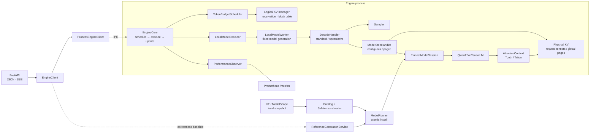

# light-vllm

light-vllm 是一个小型、可组合的 LLM 推理运行时。当前工作集中在单机 Qwen2/Qwen2.5 推理：把 Scheduler、KV cache、模型执行和 HTTP 边界拆清楚，再用真实负载检查每次优化有没有收益。

它不是 vLLM 的兼容替代品，也还不是生产级 serving。这个仓库更适合阅读推理数据流、验证调度与缓存设计，或在明确边界上继续做实验。

[架构设计](docs/design.md) · [边界说明](docs/architecture.md) · [5090 优化记录](benchmarks/remote_5090/OPTIMIZATION_JOURNEY.md) · [监控示例](examples/monitoring/README.md)

## 最终实验结果

最终对比使用 Qwen2.5-Coder-7B-Instruct BF16、RTX 5090 和同一组 ShareGPT 首轮回放。Light 采用 strict completion claim，不启用 prefix cache、TTFT admission 或 speculative decoding；对照组是关闭 prefix cache 与 speculation 的 vLLM eager。每个实现运行 3 轮，每轮 64 个请求，表中数值是逐轮指标的中位数。

| 到达率 | 系统 | 输出吞吐 | TTFT P95 | TPOT P50 |
| ---: | --- | ---: | ---: | ---: |
| 2 req/s | light-vllm | 202.41 tok/s | 37.23 ms | 10.658 ms/token |
| 2 req/s | vLLM eager | 202.44 tok/s | 48.38 ms | 9.911 ms/token |
| 8 req/s | light-vllm | 624.34 tok/s | 45.00 ms | 11.864 ms/token |
| 8 req/s | vLLM eager | 653.74 tok/s | 54.69 ms | 10.768 ms/token |

8 req/s 下，light-vllm 的吞吐是 vLLM eager 的 95.5%，TPOT 生成速度是 90.8%；这组负载里的 TTFT P95 更低。2 req/s 的吞吐受请求到达率限制，只适合看低负载延迟。这里没有“普遍快于 vLLM”的结论：剩余差距与模型 kernel、CUDA Graph 和控制路径都有关，结果也只适用于记录的硬件、模型和 workload。


最终报告还保留了一个容易被平均数掩盖的结果：投机策略依赖 workload。重复代码负载里 Chain 更快；专门构造的分支救援负载里 Trie 更快，因此默认策略不能只看一组接受率。


精确 CSV、逐轮数据摘要和图表哈希位于 [complete-report/analysis](benchmarks/remote_5090/results/2026-08-22-complete-report/analysis/)。完整实验条件、失败过的优化方向和原始数据入口见 [OPTIMIZATION_JOURNEY.md](benchmarks/remote_5090/OPTIMIZATION_JOURNEY.md)。

## 当前架构



HTTP 只依赖 `EngineClient`。GPU 服务可以把 Engine、Scheduler、Worker 和 CUDA context 放进独立进程；reference 路径保留全序列重算，作为同步正确性基线。

Scheduler 管逻辑 KV reservation 和 block ID，Step Handler 管物理 tensor 与 attention metadata。一次只允许一个不可变 step 在模型侧执行；请求开始后固定 `ModelSession`，模型 reload 不会让活动请求跨 generation。

模型只生成 Q/K/V、RoPE、norm 和 MLP，并通过 `AttentionContext` 使用连续或分页 KV。Torch backend 是可读的正确性基线，Triton backend 直接按 block table 读取物理页。[完整总览](docs/diagrams/light-vllm-current-overview.html)、[KV 所有权](docs/diagrams/light-vllm-kv-ownership.html)、[Paged Attention 地址映射](docs/diagrams/light-vllm-paged-attention-token-path.html)、[迭代事务](docs/diagrams/light-vllm-iteration-transaction.html) 和 [Worker 生命周期](docs/diagrams/light-vllm-worker-lifecycle.html) 都有单文件图。

## 已经实现

| 范围 | 当前实现 |
| --- | --- |
| 模型与权重 | 原生 Qwen2/Qwen2.5 full attention、default RoPE、GQA、tied embedding；HF/ModelScope 兼容的本地 safetensors 快照 |
| 执行 | token-major packed query、chunked prefill、连续与分页 KV、PyTorch correctness attention、可选 Triton fused paged attention |
| 调度 | 统一 token budget、严格非抢占 completion claim、prefix cache、短请求资源池、TTFT 早拒、可选 self-resubmit |
| 解码 | Greedy sampler；N-Gram Chain/Trie proposer 共用树形验证和 KV compact |
| 服务 | JSON/SSE token-ID API、独立 Engine 进程、取消与异常清理、Prometheus 指标 |

当前没有 tokenizer 和文本 prompt，也没有随机 sampling、sliding-window/RoPE scaling、量化权重、第三方 victim preemption、分布式执行或 OpenAI-compatible API。Triton 路径完成了 RTX 5090 上的既有数值与性能验收，但长上下文、跨显卡和更多模型仍未验证。

## 快速开始

Python 3.10 或更高版本。Windows PowerShell：

```powershell
python -m venv .venv
.\.venv\Scripts\python.exe -m pip install -e ".[dev]"
.\.venv\Scripts\python.exe -m pytest
```

最小模型调用使用一维 token 流：

```python
import torch

from light_vllm import ForwardBatch, ModelSpec, create_runner

runner = create_runner()
runner.load(
    ModelSpec(
        architecture="tiny-causal-lm",
        loader="init",
        model_args={"vocab_size": 128, "hidden_size": 32},
    )
)

batch = ForwardBatch(input_ids=torch.tensor([1, 2, 3], dtype=torch.long))
output = runner.open_session().forward(batch)
print(output.logits.shape)  # torch.Size([3, 128])
```

在 Linux/WSL 上启动 Qwen GPU 服务：

```bash
python -m venv .venv
.venv/bin/python -m pip install -e ".[serve,triton]"

.venv/bin/light-vllm-serve \
  --architecture qwen2.5 \
  --loader safetensors \
  --weights /models/Qwen2.5-Coder-7B-Instruct \
  --device cuda \
  --dtype bfloat16 \
  --runtime engine \
  --engine-process \
  --kv-reservation blocks \
  --paged-attention-backend triton
```

当前接口直接接收 token IDs：

```bash
curl -X POST http://127.0.0.1:8000/generate \
  -H "Content-Type: application/json" \
  -d '{"input_ids":[1,2,3],"max_new_tokens":4}'
```

`POST /generate/stream` 返回 SSE；`GET /capabilities` 给出模型、KV 与 Scheduler 容量，`GET /metrics` 返回性能快照。完整参数以 `light-vllm-serve --help` 为准。

## 运行与开发边界

- `reference` 是无调度、全序列重算的语义基线；`engine` 才使用 token budget、KV cache 和增量执行。
- `blocks` 装配 `PagedKVCacheManager + PagedStepHandler`；`unbounded` 是连续 KV 的实验对照，不提供容量保护。
- prefix cache 只复用已经提交的完整 prompt 页。self-resubmit 默认关闭，启用后也只回滚撞墙请求自己。
- 普通生成只投影需要采样的 logits 行；投机验证可以一次确认多个 token，但 Scheduler 只提交真实接受的连续前缀。

提交前运行：

```bash
python -m pytest
ruff check .
ruff format --check .
git diff --check
```

核心 CPU 测试不依赖 CUDA；Triton 测试在没有 GPU 或 Triton 时自动跳过。
