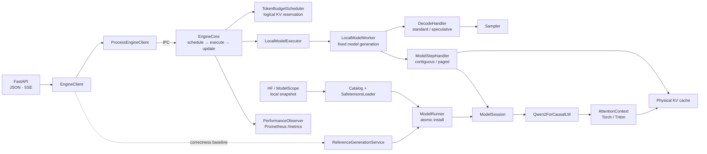

<h1 align="center">light-vllm</h1>

<p align="center">
  <strong>把一次 LLM 推理请求拆开，让调度、KV cache、模型执行和服务边界都看得见。</strong>
</p>

<p align="center">
  一个小型、可组合的 LLM 推理运行时。当前专注单机 Qwen2/Qwen2.5 推理，
  以及这些能力背后的正确性与性能取舍。
</p>

<p align="center">
  
  
  
  
  
  
</p>

<p align="center">
  <a href="#快速开始">快速开始</a> ·
  <a href="docs/design.md">架构设计</a> ·
  <a href="benchmarks/remote_5090/OPTIMIZATION_JOURNEY.md">性能记录</a> ·
  <a href="examples/monitoring/README.md">监控示例</a>
</p>

> [!NOTE]
> light-vllm 不是 vLLM 的兼容替代品，也还不适合直接承载生产流量。它更适合用来读懂推理数据流、验证调度与缓存设计，或做边界清楚的实验。

## 为什么做这个项目

成熟推理框架很强，但想顺着一个请求读清楚 Scheduler、KV cache、Worker 和模型并不轻松。light-vllm 保留一条真正能运行的推理链路，再把每类变化放到明确的扩展点里。

一个新能力该放在哪里，这里尽量给出直白的答案：

- 新模型和新权重格式走注册表，不修改 `ModelRunner` 的分发逻辑。
- 新采样策略替换 `Sampler`，不新增一套 Executor。
- 连续 KV 与分页 KV 共用 Worker 和模型，只替换 Step Handler。
- HTTP、Prometheus 和进程通信留在边界上，不进入推理核心。

如果你想看一个 token 从请求进入调度、拿到 KV 页、跑过模型，再变成 SSE 事件，这个仓库就是为这件事准备的。

## 现在能做什么

| 范围 | 当前实现 |
| --- | --- |
| 模型与权重 | 原生 Qwen2/Qwen2.5；full attention、default RoPE、GQA、tied embedding；读取 HF/ModelScope 兼容的本地 safetensors 快照 |
| 执行 | token-major packed query、chunked prefill、连续与分页 KV、PyTorch correctness attention、可选 Triton fused paged attention |
| 调度 | 统一 token budget、严格非抢占 completion claim、prefix cache、短请求资源池、TTFT 早拒、可选 self-resubmit |
| 解码 | Greedy sampler；N-Gram Chain/Trie proposer 共用树形验证和 KV compact |
| 服务 | JSON/SSE token-ID API、独立 Engine 进程、取消与异常清理、Prometheus 指标 |

暂时没有 tokenizer、文本 prompt、随机 sampling、sliding-window/RoPE scaling、量化权重、第三方 victim preemption、分布式执行或 OpenAI-compatible API。Triton 路径已在 RTX 5090 上完成现有场景的数值与性能验收，但长上下文、跨显卡和更多模型仍未验证。

## 一张图看懂



Scheduler 管请求顺序、token budget、逻辑 KV reservation 和 block ID。Step Handler 管物理 tensor、block table 与 attention metadata。模型只负责 Q/K/V、RoPE、norm 和 MLP，并通过 `AttentionContext` 访问 KV。

请求开始后会固定一个 `ModelSession`。即使此时 reload，新旧请求也不会混用两代模型。完整图解见 [当前架构总览](docs/diagrams/light-vllm-current-overview.html)、[KV 所有权](docs/diagrams/light-vllm-kv-ownership.html)、[Paged Attention 地址映射](docs/diagrams/light-vllm-paged-attention-token-path.html) 和 [Worker 生命周期](docs/diagrams/light-vllm-worker-lifecycle.html)。

## 快速开始

需要 Python 3.10 或更高版本。在 Windows PowerShell 中运行：

```powershell
python -m venv .venv
.\.venv\Scripts\python.exe -m pip install -e ".[dev]"
.\.venv\Scripts\python.exe -m pytest
```

最小模型调用使用一维 token 流：

```python
import torch

from light_vllm import ForwardBatch, ModelSpec, create_runner

runner = create_runner()
runner.load(
    ModelSpec(
        architecture="tiny-causal-lm",
        loader="init",
        model_args={"vocab_size": 128, "hidden_size": 32},
    )
)

batch = ForwardBatch(input_ids=torch.tensor([1, 2, 3], dtype=torch.long))
output = runner.open_session().forward(batch)
print(output.logits.shape)  # torch.Size([3, 128])
```

### 启动 Qwen2/Qwen2.5 GPU 服务

在 Linux/WSL 上安装可选依赖，并指向已经下载好的本地模型快照：

```bash
python -m venv .venv
.venv/bin/python -m pip install -e ".[serve,triton]"

.venv/bin/light-vllm-serve \
  --architecture qwen2.5 \
  --loader safetensors \
  --weights /models/Qwen2.5-Coder-7B-Instruct \
  --device cuda \
  --dtype bfloat16 \
  --runtime engine \
  --engine-process \
  --kv-reservation blocks \
  --paged-attention-backend triton
```

当前 HTTP 接口直接接收 token IDs：

```bash
curl -X POST http://127.0.0.1:8000/generate \
  -H "Content-Type: application/json" \
  -d '{"input_ids":[1,2,3],"max_new_tokens":4}'
```

`POST /generate/stream` 返回 SSE；`GET /capabilities` 给出模型、KV 与 Scheduler 容量；`GET /metrics` 返回性能快照。完整参数以 `light-vllm-serve --help` 为准。

## RTX 5090 上的一组实测

最终对比使用 Qwen2.5-Coder-7B-Instruct BF16、RTX 5090 和同一组 ShareGPT 首轮回放。light-vllm 使用 strict completion claim，不启用 prefix cache、TTFT admission 或 speculative decoding；对照组是关闭 prefix cache 与 speculation 的 vLLM eager。每个实现运行 3 轮，每轮 64 个请求，表中是逐轮指标的中位数。

| 到达率 | 系统 | 输出吞吐 | TTFT P95 | TPOT P50 |
| ---: | --- | ---: | ---: | ---: |
| 2 req/s | light-vllm | 202.41 tok/s | 37.23 ms | 10.658 ms/token |
| 2 req/s | vLLM eager | 202.44 tok/s | 48.38 ms | 9.911 ms/token |
| 8 req/s | light-vllm | 624.34 tok/s | 45.00 ms | 11.864 ms/token |
| 8 req/s | vLLM eager | 653.74 tok/s | 54.69 ms | 10.768 ms/token |

8 req/s 时，light-vllm 的吞吐是 vLLM eager 的 95.5%，TPOT 生成速度是 90.8%，这组负载里的 TTFT P95 更低。2 req/s 的吞吐受请求到达率限制，只适合看低负载延迟。

这不是“普遍快于 vLLM”的结论。结果只覆盖记录中的硬件、模型和 workload，剩余差距也不只来自一个地方。

<p align="center">
  
  
</p>

精确 CSV、逐轮摘要和图表哈希在 [complete-report/analysis](benchmarks/remote_5090/results/2026-08-22-complete-report/analysis/)；完整实验条件、无收益方案和原始数据入口在 [5090 优化记录](benchmarks/remote_5090/OPTIMIZATION_JOURNEY.md)。

<details>
<summary>投机解码为什么不能只看一组接受率？</summary>

重复代码负载里 Chain 更快，专门构造的分支救援负载里 Trie 更快。默认策略要看真实 workload，不能从单次接受率直接下结论。


</details>

## 运行时边界

- `reference` 是无调度、全序列重算的语义基线；`engine` 才使用 token budget、KV cache 和增量执行。
- `blocks` 装配 `PagedKVCacheManager + PagedStepHandler`；`unbounded` 是连续 KV 的实验对照，不提供容量保护。
- prefix cache 只复用已经提交的完整 prompt 页。self-resubmit 默认关闭，启用后也只回滚撞墙请求自己。
- 普通生成只投影需要采样的 logits 行；投机验证可以一次确认多个 token，但 Scheduler 只提交真实接受的连续前缀。

## 文档导航

| 想了解什么 | 从这里开始 |
| --- | --- |
| 当前架构为什么这样拆 | [docs/design.md](docs/design.md) |
| 每个模块负责什么 | [docs/architecture.md](docs/architecture.md) |
| 5090 优化过程和失败实验 | [benchmarks/remote_5090/OPTIMIZATION_JOURNEY.md](benchmarks/remote_5090/OPTIMIZATION_JOURNEY.md) |
| Prometheus、Grafana 与 HPA 示例 | [examples/monitoring/README.md](examples/monitoring/README.md) |

## 开发与验证

提交前运行：

```powershell
.\.venv\Scripts\python.exe -m pytest
.\.venv\Scripts\ruff.exe check .
.\.venv\Scripts\ruff.exe format --check .
git diff --check
```

核心 CPU 测试不依赖 CUDA；没有 GPU 或 Triton 时，相关数值测试会自动跳过。
