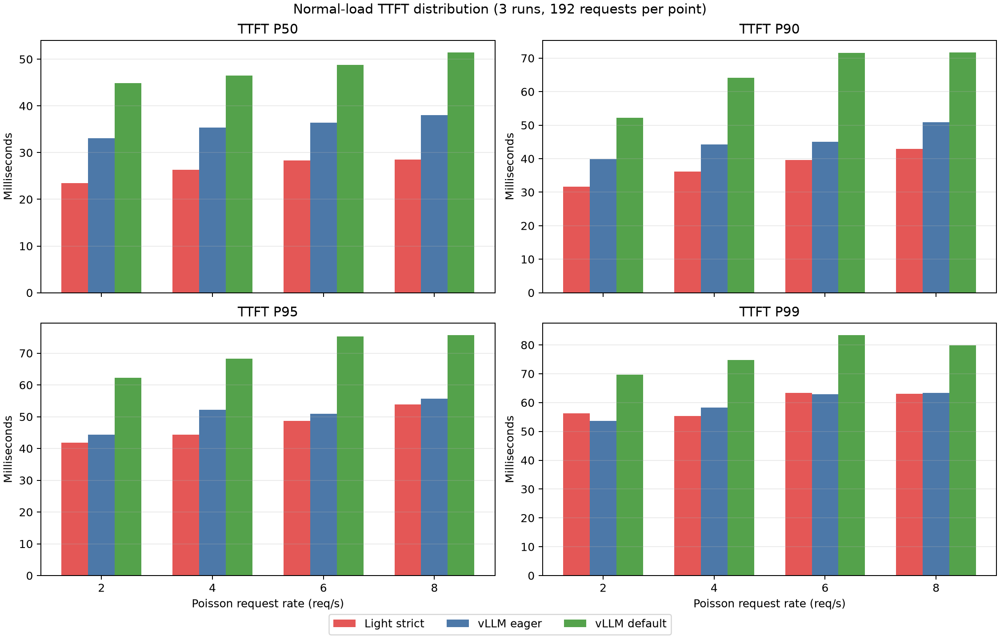
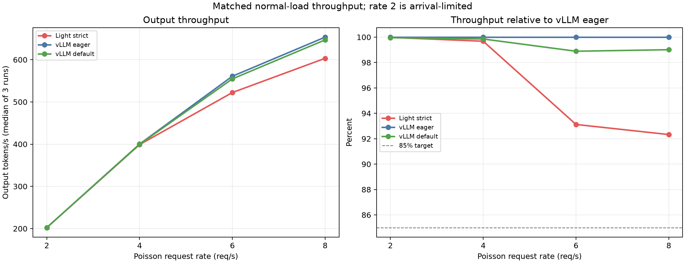
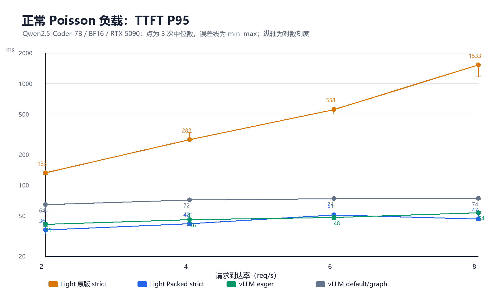
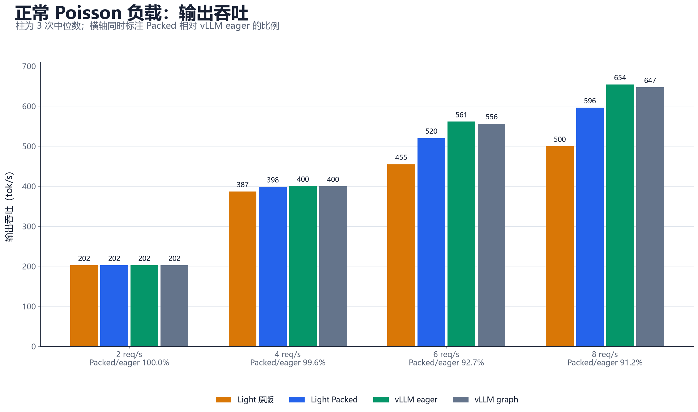
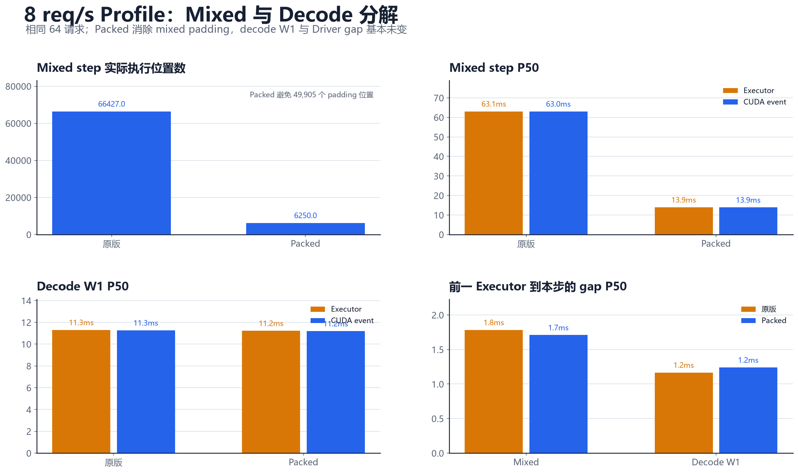
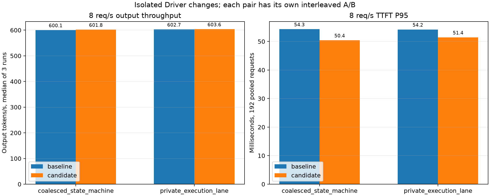
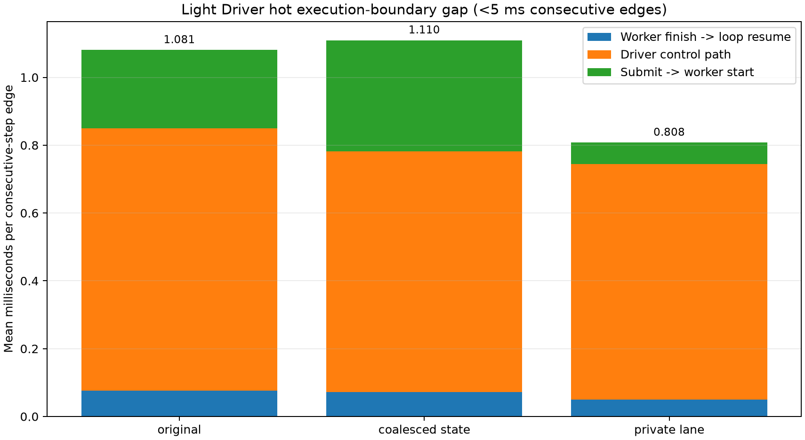

# light-vLLM 性能与调度实验复盘

这份文档记录了 2026-08-19 至 2026-08-21 的完整排查过程。起点是 strict 模式为每个请求保留最坏完成长度，终点是在正常 ShareGPT 流量下，Light strict 的 TTFT 与 vLLM eager 基本持平，8 req/s 吞吐达到其 92.3%。

中间绕过几次路。我们先后怀疑过 completion claim、rolling 比例、TTFT 阈值、Attention kernel、CUDA launch 数和每步同步。实验逐一排除后，影响最大的两项才浮出来：mixed batch 的 padding 计算，以及两次模型执行之间的 Driver 空档。

## 最终结果先放在这里

最终代码位于 `codex/driver-step-pipeline@2faf265`。正常负载采用 ShareGPT 首轮请求、固定 seed 的 Poisson 到达；每个速率先 warm-up 64 个请求，再跑 3 轮正式实验。

| req/s | Light strict 吞吐 | vLLM eager 吞吐 | Light / eager | Light TTFT P95 | eager TTFT P95 |
| ---: | ---: | ---: | ---: | ---: | ---: |
| 2 | 202.38 tok/s | 202.43 tok/s | 100.0% | 41.77 ms | 44.31 ms |
| 4 | 398.86 tok/s | 400.15 tok/s | 99.7% | 44.33 ms | 52.25 ms |
| 6 | 522.21 tok/s | 560.78 tok/s | 93.1% | 48.71 ms | 50.89 ms |
| 8 | 603.27 tok/s | 653.40 tok/s | 92.3% | 53.89 ms | 55.73 ms |





这组结果不能说明“非抢占已经全面胜过抢占”。实验给了 32K KV，Light 没有 self-resubmit，vLLM 也没有 preemption。容量压力被拿掉后，strict completion claim 不再造成两个数量级的 TTFT 差距。抢占取舍要看后面的 4K KV 压力实验。

## 实验口径

除特别说明外，统一环境如下：

- RTX 5090 32 GB，Qwen2.5-Coder-7B-Instruct，BF16，greedy；
- block size 16，`max_num_sequences=16`，单步 token budget 512；
- Light 和 vLLM 使用同一模型快照；
- vLLM eager 是执行效率主基准，default/graph 只作第二参照；
- 调度压力实验使用 4096 KV tokens，执行层实验使用 32768 KV tokens；
- 正常负载使用 64 条 ShareGPT 首轮请求，共 5804 prompt tokens、7514 output tokens；
- 服务端仍看到 `max_new_tokens=512`，客户端按固定的真实输出长度结束流。P50 输出长度为 41，只有 10/64 达到 512。

固定生成 512 token 只用于最坏容量边界和长时间 micro-profile。它不是生产流量结论。

正式对比都要求请求数和输出长度完整。BF16 动态 batch 会改变舍入路径，因此跨实现不保证 token ID 逐项一致；本文不把“请求成功且长度一致”写成“文本逐字一致”。

## 整条路线

| 阶段 | 当时改了什么 | 数据告诉我们的事 |
| --- | --- | --- |
| strict 最坏长度预留 | 为 prompt 与最大输出领取完整 completion claim | 零回滚成立，但低并发让吞吐大幅落后 |
| 旧 rolling 10% | 保留已有 KV，按最坏剩余长度的 10% 分段续领 | 思路可行，旧状态机却制造了大量假暂停 |
| eager refresh | claim 用完时先原子续领，再决定是否暂停 | 修掉假暂停，仍没有追平 vLLM |
| TTFT 1.25 秒早拒 | 用历史 step 延迟预测首 token 等待 | 能保护部分请求，但会误拒和漏判，不是硬 SLO |
| CUDA 与 fused kernel | 合并权重、norm、RoPE、KV mapping，重写部分 Triton 路径 | device 时间下降，但 matched trace 反证 kernel 是主因 |
| CPU history 修复 | 普通 decode 不再复制、校验完整 token history | batch build 降 85.9%，吞吐提高 6.13% |
| 当前 optimistic | `prompt + 1 block`，新准入最多用 90% KV；撞墙者 self-resubmit | TTFT 提前，但压力下重算、吞吐和流连续性都不理想 |
| mixed 热路径收窄 | 线性 query 不构造 tree visibility，只投影需要的 logits 行 | 8 req/s 吞吐提高 5.3%，TTFT 仍有 1.52 秒 |
| Packed Query | `[B,W]` 改为一维 token-major，彻底不算 padding | 8 req/s TTFT 从约 1.53 秒降到 46.5 ms |
| Sampler / staging 消融 | packed logits 保留；metadata packing 和伪 overlap 回退 | 小张量不是端到端主因，剩余差距在 Driver 边界 |
| Driver 状态机与私有 lane | 原子提交上一轮并准备下一轮；常驻单线程执行 lane | 派发 0.328→0.064 ms，热 gap 1.110→0.808 ms |

## 1. strict：最坏长度预留保证了什么

strict 的代码逻辑很直接。Scheduler 准入普通请求时令 `guarantee_completion=True`，KV manager 把 `prompt + max_new_tokens` 换成完整 completion claim。账本始终满足：

```text
已使用的唯一页 + 所有 completion claims <= 总页数
```

当前代码入口在 `runtime/scheduler/token_budget.py` 的 `_try_admit()`，容量校验在 `runtime/kv_cache.py`。请求一旦被接纳，后续 decode 不挑第三方 victim，也不会因容量不足丢掉自己的 KV。

最初压力实验让 16 个请求同时到达。每条 prompt 128 token，最大输出 512 token，总容量只有 4096 token。strict 一次最多接纳：

```text
floor(4096 / (128 + 512)) = 6 requests
```

这不表示请求一定会输出 512，也不表示 GPU 只能处理 6 条。它只是为最坏情况预留容量。

| 系统 | 吞吐 | P99 E2E | 调度事件 |
| --- | ---: | ---: | ---: |
| Light strict | 213.12 tok/s | 38.437 s | 0 回滚 |
| vLLM | 786.81 tok/s | 10.251 s | 13 次 preemption |


第一条反证就出现在这里：213 对 787 不能说明非抢占更好。strict 证明的是“接纳后不回滚”，代价是按用户声明的最坏上界限制并发。

在后来的真实长度 burst 中，strict 的最坏 token gap 是 0.361 秒，vLLM 是 3.360 秒；但 strict 吞吐只有 395.18 tok/s，vLLM 是 786.15 tok/s。更连续的流是事实，更慢的 TTFT 和吞吐也是事实。

## 2. 旧 rolling 10%：想法没错，实现先撞了墙

这一阶段最容易和当前代码混淆。旧 rolling 10% 已经不是最终方案，它当时的定义是：

> running request 保留已经写入的 KV，再额外领取“最坏剩余长度”的 10%；这段用完后续领。续领失败时保留 KV、暂停等待，不回滚。

它不是把 `max_new_tokens=512` 改成 51，也不是每隔 10 ms 清理 KV。实验里 `self-resubmit=false`，已经输出的 token 和已写入的 KV 都保留。

旧实现把“当前 claim 用完”误当成“全局容量用完”。请求第一次越过 claim 边界就暂停，要等 KV release epoch 才会重试，即使此时还有空闲页。

| workload | strict | rolling 10% 旧实现 |
| --- | ---: | ---: |
| Poisson 4 req/s 吞吐 | 317.14 tok/s | 258.37 tok/s |
| Poisson 4 req/s P95 TTFT | 5.353 s | 5.687 s |
| 64-request burst 吞吐 | 395.18 tok/s | 231.99 tok/s |
| 64-request burst 最坏 token gap | 0.361 s | 5.872 s |

rolling 比 strict 还慢，不是 10% 必然太小，而是 claim 边界制造了假容量墙。

### eager refresh

修复后的 reserve 顺序是：先按最新 `known input + 10% worst remaining` 原子扩大 claim，再重试本轮 reservation；只有真实空闲容量不够时才暂停。

| 指标 | 旧 rolling | eager refresh | 变化 |
| --- | ---: | ---: | ---: |
| steady 吞吐 | 258.37 | 327.94 tok/s | +26.9% |
| steady P95 TTFT | 5.687 | 3.308 s | -41.8% |
| steady 暂停 | 108.00 | 26.67 次 | -75.3% |
| burst 吞吐 | 231.99 | 343.87 tok/s | +48.2% |
| burst P95 TTFT | 14.974 | 11.226 s | -25.0% |


三轮 A/B 都完成 64/64 请求和 7514 个输出 token，回滚仍为 0。这个实验只证明 eager refresh 修掉了一批假暂停；vLLM 仍更快，不能把它写成调度策略已经胜出。

## 3. TTFT 早拒：减少工作不等于引擎变快

`--max-tolerable-ttft-seconds 1.25` 的单位一直是秒。1.25 来自一次 vLLM burst 的实测 TTFT P50，不是 vLLM 自身使用的准入配置。

预测器根据 pending model tokens 和历史 step latency 估算等待时间。最初只收集 3 个 step 样本，低并发 warm-up 后直接外推 burst，结果每轮只接纳 3/64。正式实验把最少观测增至 100，并按相同 arrival mode 预热。

在当前 optimistic 路径上的独立复测如下：

| 8 req/s 模式 | 成功请求 | 交付 token | goodput | 已接纳 TTFT P95 | 控制事件 |
| --- | ---: | ---: | ---: | ---: | --- |
| Light strict + 1.25s | 37/64 | 68.4% | 303.22 tok/s | 5.44 s | 27 个 429 |
| Light optimistic + 1.25s | 60/64 | 91.3% | 428.44 tok/s | 1.79 s | 4 个 429，2 次 resubmit |
| vLLM default，无早拒 | 64/64 | 100% | 603.88 tok/s | 1.33 s | 22 次 preemption |


optimistic 的 TTFT 从不开 gate 时的 5.32 秒降到 1.79 秒，但它拒绝了请求，只完成 91.3% 的 offered tokens。strict 即使拒绝约 42% 的请求，也没有守住 1.25 秒，因为 token-only predictor 没有表达等待 completion claim 的时间。

因此 TTFT admission 是过载保护，不是实际 deadline。以后要预测“还要经历多少个 step 才轮到首次 prefill”，而不是继续盲调一个秒数。

## 4. 并行投机验证：另一条独立支线

投机实验与调度排查共用同一台 5090，但回答的是不同问题。Chain 和 Trie 都把多个候选放进一次 target forward；Trie 允许根部分叉，适合近期链条第一步容易猜错的输入。

| 模式 | 吞吐 | 相对 no-spec | 提议节点/attempt | 可见 token/verification |
| --- | ---: | ---: | ---: | ---: |
| no spec | 433.25 tok/s | 1.00× | 0 | 1.0 |
| Chain-7 | 513.34 tok/s | 1.18× | 7.0 | 4.5 |
| Trie-7 | 710.92 tok/s | 1.64× | 4.5 | 5.0 |


这批输入中 Trie 用更少候选槽得到更多可见 token，因此更快。它不证明所有自然流量上 Trie 都优于 Chain。Chain 与 Trie 的 48/48 输出一致；跨动态 batch 的 no-spec BF16 输出存在数值分叉，报告没有隐去这个边界。

早期汇总曾只比较“平均接受 draft token”，出现过 Chain 高于 Trie。单看这个数得不出 Trie 更好：Trie 的收益来自一次验证覆盖多个根分支，要同时看可见 token、占用的 target slot 和端到端吞吐。这里采用后续口径一致的最终统计。

## 5. CUDA 排查：kernel 有损失，但不是总差距

早期 direct step profile 中，Light wall 为 13.640 ms，CUDA total 为 11.861 ms，还有 549 次 launch。我们先做了几项合理的 GPU 优化：

- QKV 与 gate/up 权重打包；
- fused add + RMSNorm、SiLU、RoPE；
- paged KV write mapping 每步只准备一次；
- 调整 Triton paged attention 分块，减少小张量构造。

优化后 direct step wall 降到 11.259 ms，CUDA total 降到 10.507 ms，launch 降到 354。收益真实存在，但服务仍落后。

随后固定 `B=16, W=1, context≈256`，双方 greedy，vLLM 使用 eager，统计 30 个稳态 decode step：

| GPU 类别 | Light | vLLM eager |
| --- | ---: | ---: |
| GEMM | 9.764 ms | 9.804 ms |
| Attention | 0.485 ms | 0.432 ms |
| KV write | 0.110 ms | 0.052 ms |
| 所有 kernels | 10.592 ms | 10.742 ms |
| launches / step | 324.0 | 383.1 |


Light 的 Attention 和 KV write 确实各慢约 0.05 ms，但 kernel 总和反而短 0.15 ms，launch 数也更少。服务 step 却是 14.359 对 10.983 ms，相差 3.376 ms。

“主要损失都是 kernel”到这里被推翻了。下一步必须看 CPU 和执行边界。

## 6. CPU history：第一处确定的大热点

轻量分段计时把 Light 相邻 Executor 调用之间的 2.637 ms 拆开：batch build 0.857 ms、线程池派发 0.335 ms、apply 0.352 ms、Scheduler 0.255 ms、SSE 0.234 ms，其余是校验、observer、锁和事件循环。


最大的具体热点在普通 decode 的完整 history：

```text
Engine: tuple(state.token_ids)
  -> ExecutionRequest: 再 tuple 化
  -> 扫描所有 token
  -> 切 scheduled slice 再和本轮 input 比较
```

16 条请求的 history 校验平均占 0.735 ms/step，从生成 Q1 的 0.283 ms 增到 Q4 的 1.194 ms。普通 decode 根本不消费这份完整 history，只有 speculative proposer 需要。

修复后 `ExecutionRequest.context_token_ids` 允许为 `None`。`num_lookahead_tokens=0` 时只传本轮 input；有草稿节点时才复制只读 history。没有把 Engine 内部的可变 list 当 view 传给执行线程，避免破坏请求快照语义。

| 指标 | 修复前 | 修复后 | 变化 |
| --- | ---: | ---: | ---: |
| 吞吐 | 1103.8 | 1171.5 tok/s | +6.13% |
| Batch build | 0.841 | 0.119 ms | -85.9% |
| Executor 间空档 | 2.600 | 1.645 ms | -0.954 ms |
| CUDA event | 11.831 | 11.946 ms | 基本不变 |


CUDA 时间没有变，CPU 曲线和吞吐同时改善。这一刀的因果关系是闭合的。

## 7. 当前 optimistic：它不是旧 rolling 10%

根据后续复核，旧 rolling、锚点和 handoff 没有进入当前主线。当前 self-resubmit 方案是：

1. 常规请求首次只领取 `prompt + 1 block`；
2. 新准入最多使用全局 90% KV，余下 10% 只给 running decode 增长；
3. running request 不持有“剩余长度 10%”的滚动 claim；
4. 真正撞墙时只释放撞墙者自己的 KV，并重新排队；
5. prefix cache 找回已提交的完整 prompt 页；已发出的 token 不会重复发送，但对应生成 KV 要重算；
6. 达到 resubmit 次数或回滚进度阈值后，转回 strict completion claim。

相关代码在 `runtime/scheduler/token_budget.py`、`runtime/kv_cache.py` 和 `entrypoints/http.py`。默认 `initial_extra_blocks=1`、`kv_admission_watermark=0.9`、最多 resubmit 2 次。

4K KV、Poisson 8 req/s 的压力对照：

| 模式 | 吞吐 | TTFT P95 | 最大 token gap P95 | 控制事件 |
| --- | ---: | ---: | ---: | --- |
| Light strict | 380.86 tok/s | 9.545 s | 0.642 s | 0 rollback |
| Light optimistic | 334.91 tok/s | 5.318 s | 3.256 s | 5 resubmit，回滚 1936 tokens |
| vLLM no-preempt，max seqs 6 | 494.04 tok/s | 5.225 s | 31 ms | 0 preemption |
| vLLM default，max seqs 16 | 606.49 tok/s | 1.285 s | 389 ms | 22 preemptions |


optimistic 把 TTFT 提前了，却把排队搬到生成途中：重算增加，吞吐低于 strict，token gap 和 E2E 尾部也更差。vLLM 的 victim preemption 在这批持续压力流量上换来了更高吞吐和更低 TTFT，代价是被抢占请求停顿更久。

能保留的产品结论只有一条：strict 不牺牲已运行请求的 KV 进度，流更连续。它不是免费的吞吐优化。

## 8. mixed batch：造成秒级 TTFT 的 GPU 浪费

CPU history 修掉后，正常 8 req/s 的 Light 吞吐仍只有 500.76 tok/s，vLLM eager 为 652.90；TTFT P95 是 1519.8 对 54.1 ms。固定 W1 kernel 又没有这个量级的差距。

profile 显示，normal mixed step 中 81.9% 的 token position 是 padding。旧 Worker 把不同 query 长度补成 `[B,W]`，一个长 prefill 和多个单 token decode 混在一起时，所有 decode 行也跑满 W。visibility 和 lm_head 的浪费曾进一步放大这件事。

第一轮先做了两个窄修复：普通线性 query 不再物化 tree visibility，lm_head 只计算 Decode Handler 声明的行。8 req/s 吞吐提高 5.3%，但 padded 主布局还在，所以 TTFT 仍是 1.52 秒。


这一步还踩过一个坑：第一版 linear visibility 把 `QUERY_WIDTH` 设成 Triton `constexpr`，生产流量每遇到新宽度就编译一个新 kernel，出现 300～500 ms 的冷启动 step。最终改为 runtime program axis，避免按宽度特化。固定 W1 micro 看不到这种问题，必须用真实混合形状复测。

## 9. Packed Query：把 `[B,W]` 改成真正的一维 token 流

提交 `c1f18dc` 统一了模型执行契约：

- `ForwardBatch.input_ids/positions` 是 `[total_query_tokens]`；
- `query_start_loc=[0, len(q0), len(q0)+len(q1), ...]` 表达请求边界；
- slot mapping 和 Attention 的 query 轴也按真实 token 一维展开；
- Triton grid 按 `total_query_tokens × heads` 启动，不为 padding query 发 program；
- logits 只投影 Decode Handler 指定的全局 token 行；
- tree speculation 仍使用同一个 `QueryLayout` 语义，只把 visibility 压成紧凑 query 行，没有保留第二套 padded 模型路径。

当前契约可在 `modeling/models/interfaces.py`、`runtime/execution/worker.py`、`paged_attention.py` 和 `triton_paged_attention.py` 中看到。

| req/s | 原版 TTFT P95 | Packed TTFT P95 | eager TTFT P95 | Packed / eager 吞吐 |
| ---: | ---: | ---: | ---: | ---: |
| 2 | 132.8 ms | 36.3 ms | 41.4 ms | 100.0% |
| 4 | 281.8 ms | 41.9 ms | 46.0 ms | 99.6% |
| 6 | 557.8 ms | 51.0 ms | 48.3 ms | 92.7% |
| 8 | 1532.9 ms | 46.5 ms | 53.8 ms | 91.2% |





8 req/s profile 中，两版都有 57 个 mixed step。原版 P50 为 63.06 ms，Packed 后是 13.93 ms；旧布局需要执行 56,155 个位置，真实 token 只有 6,250 个，Packed 避免了 49,905 个 padding 位置。decode W1 基本不变，11.30→11.22 ms。



这组数据闭合了 TTFT 根因：请求不是被 strict 长期挡住，而是 mixed GPU step 太慢，首 token 消化速度跟不上到达速度。Packed 消掉 padding 后，waiting 队列不再累积。

`reserved_sequences` 也做了 `off/1/2/4/8` 消融。设为 8 会把一半 sequence slot 划给短池，TTFT 恶化到 2520.6 ms，吞吐降到 485.4 tok/s；默认值保持 1。

## 10. Sampler、staging 和“伪 overlap”

Packed 后剩余吞吐差距约 8%，我们继续逐项验证。

Sampler profile 看似有 0.62 ms/step，但直接 argmax 只有 23.4 微秒；大部分时间是 `.tolist()` 等待此前 GPU 工作。旧路径还会 split logits 再 stack，微基准 86.2 微秒。最终保留 packed logits 契约，因为它删除了真实重复复制；normal-8 吞吐只提高约 0.11%，不把它宣传成性能收益。

metadata packing 把固定 B16/W1 的 5 个小 tensor 传输从 83.3 降到 43.7 微秒，端到端却没有稳定收益，还增加约 90 行布局代码，已回退。pinned staging 也只有个位数微秒，不满足“每步至少 0.5 ms 才引入 buffer 生命周期”的门槛。

每步 CUDA event `synchronize()` 也做了独立消融。固定 B16/W1 吞吐从 1202.2 变为 1204.6 tok/s，只差 0.20%；TPOT 中位数从 13.176 变为 13.187 ms。Sampler 的 `.tolist()` 本来就要等待 logits，所以 timer 不是 1.65 ms Executor 外 gap 的来源。

第一版 Driver overlap 只把 observer/stats 发布移动到 Executor 提交之后。trace 显示两段并没有重叠，A/B 也没有稳定收益，因此回退。把 `_drive` 改名成 `_prepare/_run/_finish` 同样不会自动产生流水。

最终相同工作量 profile：

| 系统 | profile span | 主执行边界累计 | 边界间 gap |
| --- | ---: | ---: | ---: |
| Light strict | 12.762 s | 11.288 s | 1.474 s |
| vLLM eager | 11.491 s | 11.268 s | 0.223 s |

Light 比 eager 多出的 1.271 秒中，约 1.251 秒落在执行边界之间。这个数字指明了方向，但不能直接说某个 Python 函数占了 98.4%，因为两边 profile 边界并不完全同构。


## 11. Driver 最终修复：状态机与常驻执行 lane

这一轮先把安全边界说清楚：普通 decode 的下一步 token 依赖本步采样结果，KV commit 和 Scheduler 状态也要在 output apply 后才确定。同一个请求不能凭空准备 N+1；硬塞双缓冲会破坏取消、lease 和 KV 账本。

最终保留两个小而清楚的改动。

### 原子推进状态机

提交 `578b8f6` 引入 `_PreparedStep` 和 `_CompletedStep`。`EngineCore._advance_locked()` 在同一个状态临界区内提交上一轮输出，然后最多准备下一轮：

```text
completed output
  -> validate / apply / release
  -> schedule / build / acquire
  -> one prepared step
```

它没有增加第二批 in-flight，也没有让同一请求重复调度。单独 A/B 的吞吐只提高 0.29%，接近运行噪声；TTFT P95 下降 7.15%。说明“少进一次状态边界”有帮助，但不是剩余 gap 的主体。

### 私有 ExecutionLane

提交 `a9b8114` 增加常驻单线程 `ExecutionLane`。Engine 不再每轮把模型执行交给通用线程池；同一个 Executor 始终在一条私有 lane 上运行，仍保持单 in-flight。关闭 Engine 时先越过安全边界，再关闭 lane。

派发时间从 0.328 降到 0.064 ms/step。热路径总 gap 从 1.110 降到 0.808 ms/step，主要收益确实来自 dispatch；端到端吞吐只提高 0.14%，因为 GPU 频率和 CUDA step 波动比这段小收益更大。





最终 hot control 还能拆成：输出处理 0.092 ms、转入原子推进 P50 0.013 ms、`apply/schedule/build` 0.575 ms、进入下一次执行 0.014 ms。中间 0.575 ms 依赖上一 token 的 CPU 结果，不能靠再挪一次锁或再加一个普通线程隐藏。

## 最后能说什么

### 关于非抢占

strict 的价值是已接纳请求不会因 KV 压力被回滚，token 流更连续。它会把等待推给新请求，因此压力下 TTFT 和吞吐可能明显更差。正常 32K KV 实验里双方都没有容量事件，只能用于比较执行效率，不能拿来证明非抢占优于抢占。

当前 optimistic 也没有形成比 vLLM 更好的折中。`prompt + 1 block + 90% watermark` 提前了首 token，撞墙后的全量 KV 回滚却带来重算和长 token gap。若继续改调度，方向应是降低回滚粒度、改进重新竞争顺序，并让 TTFT predictor 感知 completion claim 与 sequence slot。

### 关于执行性能

两个数量级的 TTFT 差距已经找到并修掉：主因是 `[B,W]` mixed padding，不是 strict 本身。Packed Query 后，Light TTFT 已与 vLLM eager 同级；剩余约 7%～8% 的高负载吞吐差距主要出现在 decode 持续供给和 Driver 控制路径。

固定 W1 的 kernel sum、launch 数和 Attention 差异都解释不了完整差距。CUDA Graph 以后可以做，但不能替代 Driver 设计。下一阶段若继续逼近 vLLM/SGLang，需要评估 GPU-side sampled-token relay、持久 batch/metadata 和有界异步调度，让 CPU 在不破坏 KV/取消语义的前提下更早准备下一步。

## 哪些做法不要再重复

- 不用固定 512-token 输出代表生产分布；它只适合容量压力和长时间 profile。
- 不只报已接纳请求 TTFT。接纳率、429、交付 token 和 goodput 必须一起给。
- 不把 kernel duration、CUDA event window、CPU wall 和服务 step 混加。
- 不用一次 microbenchmark 推断正常 mixed workload。
- 不因为代码“看起来能 overlap”就保留；trace 和交替 A/B 没收益就回退。
- 不把一项局部优化扩大成系统结论。eager refresh 修的是假暂停，Packed 修的是 padding，私有 lane 修的是线程派发。

## 关键提交

| 提交 | 内容 |
| --- | --- |
| `6ff6f8e` | strict 非抢占保护进入主线 |
| `1ba494e` | 当前 optimistic admission、decode 热路径和 TTFT 控制改进 |
| `46901d4` | selected logits、线性 visibility 等 paged decode 窄修复 |
| `c1f18dc` | 统一 token-major Packed Query |
| `39d3031` | 保留 packed model-step logits |
| `578b8f6` | 合并 Driver 状态推进 |
| `a9b8114` | 常驻私有 ExecutionLane |
| `2faf265` | 最终分析、报告和图 |

旧 rolling 10% 与 eager refresh 是历史实验代码，已由当前 optimistic 方案替代；报告保留它们，是为了说明结论如何被数据修正，不是建议恢复旧实现。

## 数据与复现入口

- 早期 strict、rolling、TTFT、CUDA、CPU：[`results/2026-08-20-profiled-qwen25-coder-7b/`](results/2026-08-20-profiled-qwen25-coder-7b/)
- 当前 optimistic 与 vLLM 抢占：[`results/2026-08-21-optimistic-preemption-comparison/`](results/2026-08-21-optimistic-preemption-comparison/)
- 1.25 秒 TTFT gate：[`results/2026-08-21-ttft125-comparison/`](results/2026-08-21-ttft125-comparison/)
- runtime gap：[`RUNTIME_GAP_ANALYSIS.md`](RUNTIME_GAP_ANALYSIS.md)
- Packed Query：[`results/2026-08-21-packed-query-ttft/report.md`](results/2026-08-21-packed-query-ttft/report.md)
- Sampler / staging：[`results/2026-08-21-driver-sampler-staging/report.md`](results/2026-08-21-driver-sampler-staging/report.md)
- Driver 最终报告：[`results/2026-08-21-driver-step-pipeline/analysis/report.md`](results/2026-08-21-driver-step-pipeline/analysis/report.md)
- Driver 全量原始数据包：`results/driver-step-pipeline-delivery-20260821.tar.gz`，SHA-256 `b2466bbc8b09240fa252637766eca7d6e8b04aa99861909c19281e5745200ae1`。

最终分支本地测试为 242 passed、1 skipped；ruff、format check 和 `git diff --check` 通过。所有原始结果已下载到本地并按清单校验。本文没有触发新的远端实验，也没有推送 GitHub。
