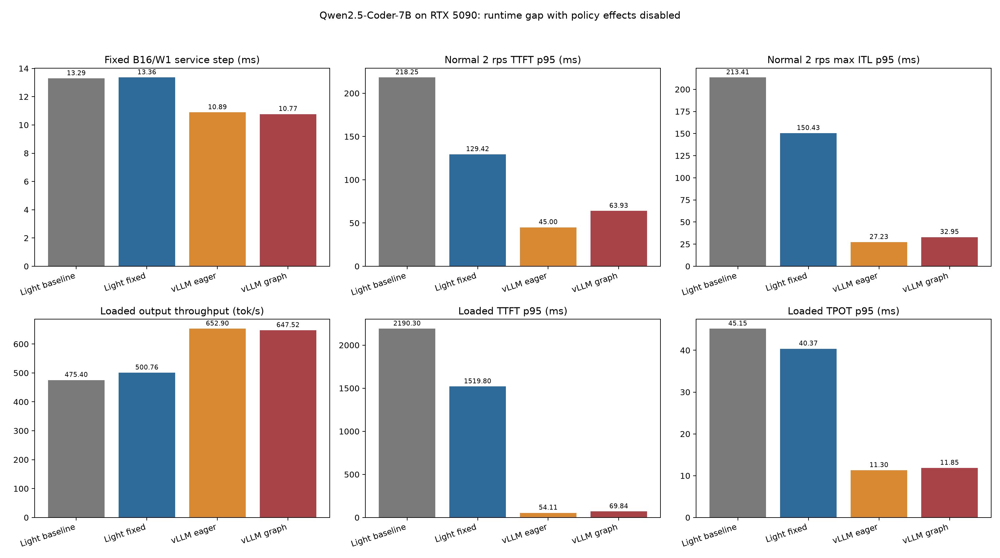
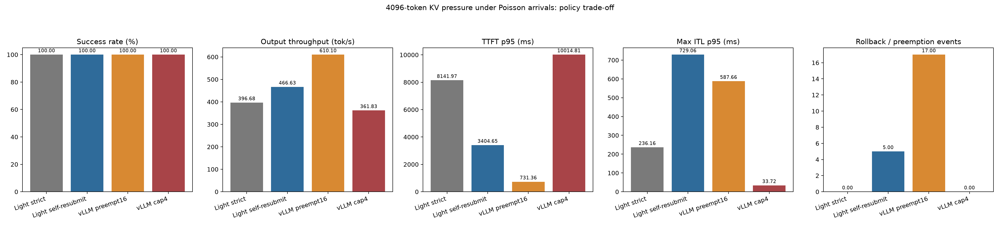
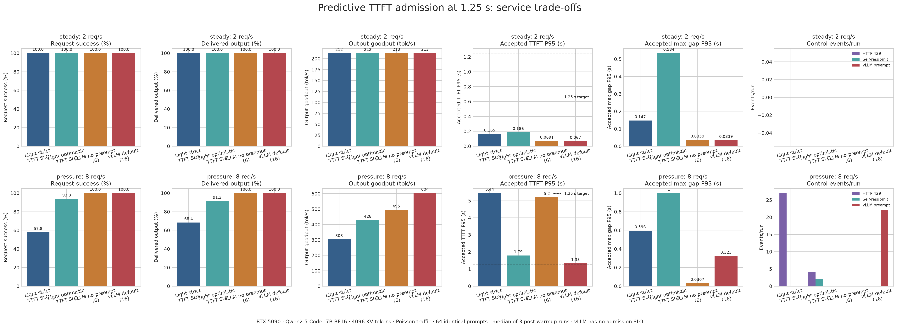

# light-vllm 与 vLLM 0.26 运行时差距审计

## 结论

当前代码没有一个“关闭非抢占后等同 vLLM”的模式。

- 未开启 `--enable-self-resubmit` 时，light-vllm 是 **strict completion claim**：请求准入前先承诺从 prompt 到
  `max_new_tokens` 最坏上界所需的全部逻辑 KV 容量。后续 decode 不会挑选 victim，也不会因容量压力回滚。
- 开启 `--enable-self-resubmit` 时，light-vllm 是 **optimistic self-resubmit**：只给 prompt 和少量额外页，当前请求自己
  撞墙后释放自己的 KV、把 `num_computed_tokens` 归零并重新排队。
- vLLM 0.26 默认既不做 completion claim，也不是“撞墙者只回滚自己”。它按当前 step 增量分配 KV；不足时从 running
  队列尾部或按优先级选择 victim，释放 victim 的 KV、把 victim 的 computed 归零并插回 waiting 队首。

因此只有在 **KV 足够、两边都没有 preemption/self-resubmit、TTFT/prefix/speculation 都关闭** 时，两者的外在效果才近似：
running-first、token budget、chunked prefill、每个普通 decode 请求每步一个 token。即便此时调度政策被中和，执行拓扑和
模型热路径仍明显不同，不能称为“同一套调度器”。

已有固定 `B=16, W=1` 实验已经排除了“剩余差距主要来自 kernel 计算”：light-vllm 的 kernel 总时长反而略短，服务
step 却慢约 3.38 ms。确认的主要损失位于 CPU 编排以及 kernel 之间的提交空洞，而不是 attention kernel 本体。

## 1. 时间究竟花在哪里

数据来自
[`steady_decode_time_breakdown.json`](results/2026-08-20-profiled-qwen25-coder-7b/steady_decode_time_breakdown.json)
和
[`cpu_fix_ab_summary.json`](results/2026-08-20-profiled-qwen25-coder-7b/cpu_fix_ab_summary.json)。模型为
Qwen2.5-Coder-7B-Instruct/BF16，RTX 5090；vLLM 使用 eager，固定 16 个请求、16-token prompt、每请求生成 512 token。

| 指标 | light-vllm | vLLM eager | Light - vLLM |
| --- | ---: | ---: | ---: |
| trace kernel sum / step | 10.592 ms | 10.742 ms | **-0.150 ms** |
| service effective step | 14.359 ms | 10.983 ms | **+3.376 ms** |
| attention kernel | 0.485 ms | 0.432 ms | +0.053 ms |
| GEMM kernel | 9.764 ms | 9.804 ms | -0.040 ms |
| kernel launches / step | 324 | 383 | -59 |

这组形状是纯 decode `W=1`，不存在 padded query 宽度或二次方 visibility 的放大。因此它能回答一个很窄但很关键的
问题：**vLLM 更快不是因为它的 kernel 总量更少，也不是因为 light 发了更多 CUDA launch。**

### 已经确认的 CPU 差距

基线每步都会在 `EngineCore._build_execution_batch_locked()` 中复制完整 token history，并在
`ExecutionRequest.__post_init__()` 再扫描、tuple 化和校验。修复后普通 decode 的 `context_token_ids` 为 `None`，只有
投机 proposer 才物化完整 history：

- `src/light_vllm/runtime/engine/core.py:338-341`
- `src/light_vllm/runtime/execution/interfaces.py:206-217`

三轮配对实验中位数：

| 指标 | 修复前 | 修复后 | 变化 |
| --- | ---: | ---: | ---: |
| build batch / step | 0.841 ms | 0.119 ms | -0.722 ms |
| executor 外部间隙 / step | 2.600 ms | 1.645 ms | -0.954 ms |
| service step | 14.495 ms | 13.658 ms | -0.837 ms |
| 吞吐 | 1103.8 tok/s | 1171.5 tok/s | +6.13% |
| executor CUDA event | 11.831 ms | 11.946 ms | 基本不变 |

这证明第一段差距确实是 CPU history copy/validation；修复没有让 GPU 计算变快，却直接缩短了服务 step。

### 尚待当前分支实测拆分的剩余差距

CPU history 修复后仍有约 1.65 ms/step 的 executor 外部间隙。当前循环严格串行：

1. 锁内 `schedule → stats → build batch → acquire`；
2. `await run_in_executor(executor.execute)`；
3. 等同步执行完整返回后 `validate → release → apply`；
4. 下一轮才重新进入 schedule。

代码见 `src/light_vllm/runtime/engine/core.py:264-329`。这里没有下一步 CPU prepare 与当前步 GPU execute 的
double buffer。vLLM 的 batch-queue 执行拓扑把 future 等待、采样和下一轮调度放在连续流水中；因此即使双方 policy
不触发回滚，driver topology 也不相同。

本分支已修复过时 profiler（旧脚本只包裹 `asyncio.to_thread`，而当前 Engine 使用 `run_in_executor`），并新增逐 step
记录：batch size、query width、实际模型 token、executor wall/thread CPU、CUDA event、相邻 executor gap，以及 full
模式下每个嵌套 CPU stage 的时间戳。正常 Poisson 负载会据此按 decode-only、mixed 和 prefill 宽度分桶。

## 2. 调度路径对照

### light-vllm strict

`TokenBudgetScheduler._try_admit()` 在没有 self-resubmit policy 时令 `guarantee_completion=True`
（`token_budget.py:423-439`）。`PagedKVCacheManager.try_add_request()` 把
`max_num_committed_tokens` 换算成 `completion_block_limit`，并要求
`已占用页 + 新 completion claims <= 总页数`（`kv_cache.py:470-503`）。

后果：

- 好处：已准入请求不会因 KV 压力被抢占或重算；
- 代价：按用户声明的最坏输出上界准入，实际短输出也会暂占逻辑 claim，降低可运行并发；
- 与 vLLM 的差异：vLLM 对当前 step 做增量分配，不提前预留整个 completion。

### light-vllm optimistic self-resubmit

开启 self-resubmit 后，常规请求 `guarantee_completion=False`，只领取 prompt 加
`initial_extra_blocks`；reserve 失败时 `_resubmit()` 释放撞墙请求自己的全部 KV、累计回滚量、把
`num_computed_tokens=0` 并 append 到 waiting（`token_budget.py:485-512`）。

这不是“关闭非抢占后采用 vLLM 调度”，而是 light 自己的 best-effort admission + self rollback。它不挑选第三方 victim；
重排是 append；达到回滚次数/进度阈值后又回到 strict completion claim。

### vLLM 0.26

vLLM 先调度 running 请求并按本轮 token 数调用 `allocate_slots()`。失败时，FCFS 从 running 尾部 pop victim；priority
模式选择最低优先级 victim，直到当前请求可以分配或只剩自身。实现见 vLLM 0.26 官方源码
[`scheduler.py:519-566`](https://github.com/vllm-project/vllm/blob/v0.26.0/vllm/v1/core/sched/scheduler.py#L519-L566)。
`_preempt_request()` 释放 victim blocks、设 `num_computed_tokens=0` 并 prepend 到 waiting，见
[`scheduler.py:1115-1135`](https://github.com/vllm-project/vllm/blob/v0.26.0/vllm/v1/core/sched/scheduler.py#L1115-L1135)。

### 哪里近似，哪里不一致

| 维度 | Light strict | Light self-resubmit | vLLM 0.26 |
| --- | --- | --- | --- |
| KV admission | 最坏 completion 全量 claim | prompt + 少量页 | 当前 step 增量分配 |
| 容量不足对象 | 不应发生；否则报不变量错误 | 撞墙者自己 | running 尾部/低优先级 victim |
| 回滚后位置 | 不适用 | waiting 尾部 | waiting 队首 |
| prefix recovery | optimistic 强制开启，回收完整 prompt 页 | 完整 prompt 页可命中 | 取决于 prefix cache 配置 |
| 运行顺序 | admitted round-robin | admitted round-robin + strict fallback | running-first FCFS/priority |
| 无压力时 | 外在效果近似 vLLM | 外在效果近似 vLLM | continuous batching |

所以“关闭 policy 影响”的正确实验不是把 Light 某个开关称为 vLLM 模式，而是给足 KV，并要求两边观测到
`preemption=0`、`self_resubmit=0`、拒绝为 0。此时测到的差距才可以归到模型执行、CPU 编排和 driver topology。

## 3. 图片中问题的当前代码复核

| 图片判断 | 结论 | 当前代码证据与边界 |
| --- | --- | --- |
| padded `[B,W]` 让短 decode 跟长 prefill 一起跑满宽度 | **属实** | `worker.py:223-265` 仍构造 padded dense batch；会影响 mixed step，不解释固定 `W=1`。 |
| 每步构造 `[B,W,W]` visibility | **原问题属实，当前分支已修线性路径** | `paged_attention.py:158-174` 是原始 Python 构造；`triton_paged_attention.py:268-272` 现在只有非线性 tree 才调用，普通 causal chain 在 kernel 内解析判断。 |
| lm_head 对全部 padded query 做 vocab projection 后再切片 | **原问题属实，当前分支已修** | `ModelStepRequest.logit_query_indices` 精确声明所需行；`qwen2.py:512-513` 在 lm_head 前 gather。普通 decode 只选每请求最后行，prefill-only 为空，spec 选正式尾行+draft。 |
| strict completion claim 过度保守 | **属实，但属于政策权衡，不是 kernel bug** | `token_budget.py:425` 和 `kv_cache.py:470-503`。它解释容量压力下的并发/准入，不解释 KV 充足、固定 B16 的每步慢。 |
| 单 driver 严格串行、无 CPU/GPU overlap | **属实** | `engine/core.py:264-329`。这是固定 `W=1` 剩余 CPU gap 的首要架构候选。 |
| 每步 CUDA event `synchronize()` 是 1.65 ms gap 的全部来源 | **不成立** | sampler 的 `.tolist()` 已先等待 logits；历史 A/B 中 executor wall 与 CUDA event 只差约 0.04 ms，而 1.65 ms 是 executor 调用之间。timer 不能解释 executor 外 gap。 |
| Python tensor/list/逐元素校验是热路径开销 | **部分属实** | metadata、slot mapping、visibility 和 block validation 都在每步执行；但固定 W1 需逐项 profile，不能把所有 residual 都算给 tensor 构造。 |
| `.tolist()` 会同步 GPU | **属实** | `sampling.py:28`；但它的 wall time包含等待前面所有已入队 kernel，不能等同于 sampling kernel 自身耗时。 |
| Light CUDA launch 太多 | **被固定 W1 trace 反证** | Light 324 次/step，vLLM eager 383 次/step；问题是 launch/API 间空洞和流水，而不是次数更多。 |
| attention kernel 是主因 | **被固定 W1 trace 反证** | attention 只差 0.053 ms/step，整步差 3.376 ms。mixed/prefill 仍需单独测。 |
| 缺 CUDA Graph 是 eager 对比差距 | **不成立** | 匹配的 vLLM eager 对照也关闭 graph。vLLM default 会另列，不能把 graph 收益归因给 scheduler。 |
| self-resubmit 丢失已输出 token | **不属实** | Engine 的可见 token history 不会清空或重复发送；归零的是 KV computed 进度，代价是重算。 |

## 4. 最终实验配置

分支：`codex/runtime-gap-profile-and-fix`。运行时基线为 `fbf20da`，最终候选运行时代码为 `9b4d91c`；后续提交只改分析脚本和图。

两组实验回答不同问题，不能混在一起解释：

- **raw runtime 组**给足 `32768` KV tokens，并同时关闭 prefix cache、TTFT admission、speculation；要求 Light
  self-resubmit/pause 和 vLLM preemption 都为 0。这组只看模型执行与 runtime，不让调度政策事件污染数据。
- **policy 压力组**把 KV 降到 `4096` tokens，以固定 seed 的 ShareGPT replay 和 Poisson `8 req/s` 触发容量竞争，
  比较 Light strict、Light self-resubmit、vLLM default preempt16，以及用并发上限 4 避免抢占的 vLLM 内控。

两组都使用 RTX 5090、Qwen2.5-Coder-7B-Instruct/BF16、block size 16、单步 token budget 512；每个模式独立
warm-up 后跑 3 轮，表中取逐指标中位数。正常负载是主结论，固定 `B=16,W=1` 只作热路径 micro-profile。

已实现：

1. 修正 profiler 的 `run_in_executor` 埋点，并输出逐 step 形状/CPU/CUDA/gap；
2. 普通线性 Triton attention 跳过 `[B,W,W]` visibility；tree 路径保持显式矩阵；
3. last-token/selected-row logits，在 vocabulary head 前裁剪；
4. CUDA positions 范围检查改为异步 assertion，避免热路径 host sync；
5. 修复 profiler 的 signal dump、区间重叠统计和 vLLM CPU stage hook，使 normal mixed step 能按形状归因。

### 4.1 raw runtime：政策事件为 0 时仍有差距

| 场景 | Light 基线 | Light 修复后 | vLLM eager | vLLM graph |
| --- | ---: | ---: | ---: | ---: |
| 固定 B16/W1 service step | 13.29 ms | 13.36 ms | 10.89 ms | 10.77 ms |
| 正常 2 req/s TTFT P95 | 218.25 ms | 129.42 ms | 45.00 ms | 63.93 ms |
| 正常 2 req/s max ITL P95 | 213.41 ms | 150.43 ms | 27.23 ms | 32.95 ms |
| loaded 8 req/s output throughput | 475.40 tok/s | **500.76 tok/s** | 652.90 tok/s | 647.52 tok/s |
| loaded 8 req/s TTFT P95 | 2190.30 ms | **1519.80 ms** | 54.11 ms | 69.84 ms |
| loaded 8 req/s TPOT P95 | 45.15 ms | **40.37 ms** | 11.30 ms | 11.85 ms |

2 req/s 下约 202 tok/s 的观测吞吐由到达速率限制，不能拿来排最大吞吐。8 req/s loaded 下，修复把 Light 吞吐提高
`5.3%`，TTFT P95 降低 `30.6%`，但仍比 vLLM eager 少 `23.3%` 吞吐，TPOT P95 约为其 `3.6` 倍。固定
`W=1` 没有改善，说明本轮收益来自 mixed/prefill 浪费的减少，不是 ordinary decode kernel 变快。

vLLM eager 与 graph 的差别很小，且 loaded 下 graph 还略慢。因此 **缺 CUDA Graph 不是 Light 对 vLLM eager
差距的解释**；它是后续可做的优化，不是当前根因。

### 4.2 policy 压力：非抢占换连续性，抢占换 TTFT/吞吐

| 模式 | 成功率 | 吞吐 | TTFT P95 | max ITL P95 | 中位控制事件 |
| --- | ---: | ---: | ---: | ---: | ---: |
| Light strict | 100% | 396.68 tok/s | 8.142 s | 0.236 s | 0 |
| Light self-resubmit | 100% | 466.63 tok/s | 3.405 s | 0.729 s | 5 次，回滚 1984 tokens |
| vLLM default preempt16 | 100% | **610.10 tok/s** | **0.731 s** | 0.588 s | 17 次抢占 |
| vLLM cap4 | 100% | 361.83 tok/s | 10.015 s | **0.034 s** | 0 |

这张图确实能说明非抢占的价值，但不能说明 Light 总体性能更好：

- Light strict 不回滚已运行请求，所以流内连续性优于 Light self-resubmit 和 vLLM preempt16；代价是新请求长时间排队，
  TTFT 最差。
- vLLM preempt16 通过 17 次 victim preemption 得到最高吞吐和最低 TTFT，但被抢占请求出现更长 token gap。
- vLLM cap4 不是“关闭抢占开关”，而是用更低并发使抢占不发生。它的 max ITL 最好，TTFT 和吞吐最差，独立验证了
  “保运行连续性，就会把等待推给新请求”这一普遍取舍。
- Light self-resubmit 位于两者之间，但它会释放自己的 KV 并重算。已经输出给用户的 token 不会丢；损失的是 KV 进度和
  流内连续性。

### 4.3 `--max-tolerable-ttft-seconds 1.25` 的独立结果

raw runtime 组故意关闭 TTFT gate；否则 429 会改变 offered work，吞吐差异就不能归到 runtime。按照单独的用户可见
SLO 实验开启 `--max-tolerable-ttft-seconds 1.25` 后，结果如下：

- 2 req/s 下四组中位均 64/64 完成，Light optimistic TTFT P95 为 0.186 s，vLLM default 为 0.067 s；
- 8 req/s 下 Light optimistic 中位完成 60/64，拒绝 4 个请求，交付 91.3% offered tokens，TTFT P95 1.79 s，
  goodput 428.44 tok/s；
- 同组 vLLM 没有 admission SLO，64/64 完成，TTFT P95 1.33 s，goodput 603.88 tok/s；
- Light strict 即使拒绝中位 27/64，已接纳请求 TTFT P95 仍为 5.44 s。

所以 1.25 秒是**准入预测阈值**，不是首 token 的硬 deadline。它对 optimistic 有用，但以 429 和少交付 token 为代价；
strict completion claim 的真实等待没有被当前 token-only predictor 表达，不能靠继续调小秒数解决。

## 5. normal-loaded CPU/GPU 明细与最终根因

| Light profile 指标 | 基线 | 修复后 |
| --- | ---: | ---: |
| Executor wall / step | 18.276 ms | 17.074 ms |
| CUDA-event window / step | 18.244 ms | 17.041 ms |
| Executor 外部 gap / step | 1.467 ms | 1.454 ms |
| Scheduler / step | 0.242 ms | 0.218 ms |
| Build batch / step | 0.150 ms | 0.135 ms |
| Validate + apply / step | 0.417 ms | 0.382 ms |
| mixed padded Executor P50 | 69.518 ms | **62.489 ms** |
| decode W1 Executor P50 | 11.486 ms | 11.387 ms |

这些 stage 是嵌套墙钟，尤其 `model_forward` 与 `sampler` 会因为 GPU 同步点移动而互相转移时间，**不能相加**。CUDA-event
window 也包含 stream idle、kernel launch 间隙和 H2D，并不等于纯 kernel sum。

vLLM eager 的 normal-loaded 轻量 profile 为：engine step 10.342 ms、execute_model 7.639 ms、future wait wall
2.098 ms（thread CPU 仅 0.026 ms）、sampler 0.436 ms、scheduler 0.095 ms、update 0.049 ms；相邻 engine step gap
只有 0.204 ms。Light 的 executor 外 gap 为 1.454 ms，单是 driver topology 就多约 `1.25 ms/step`。

结合固定 W1 trace，可以把结论说得更精确：

1. **不是“损失基本都是 kernel 本体”。** 固定 W1 下 Light kernel sum 10.592 ms，vLLM eager 10.742 ms，Light
   还短 0.150 ms；但 service step 慢 3.376 ms。
2. **不是 CUDA launch 次数太多。** 固定 W1 下 Light 324 launches/step，vLLM 383，Light 更少。真正的问题是
   Python/driver 工作、H2D 和 launch 之间的空洞，以及下一步 CPU prepare 不能和当前步 GPU 重叠。
3. **normal mixed 的 GPU 浪费仍真实存在。** 最终 profile 中 81.9% padded token position 是填充；mixed step P50
   62.489 ms，而 decode W1 只有 11.387 ms。`[B,W]` padded 布局仍是下一项最高价值 GPU 改造，合理方向是
   varlen/flatten，而不是继续微调 W1 attention kernel。
4. **本轮修复有效但不是终点。** linear visibility 和 selected-row logits 缩短 mixed step；没有改变 padded 主布局，也
   没有把 Engine 改成 double buffer，所以不能抹平 vLLM 差距。

## 6. 一次重要的失败与修正

第一版 linear visibility fast path 把 `QUERY_WIDTH` 声明成 Triton `constexpr`。正常负载中每遇到新宽度就编译一个新
kernel：profile 捕获到 `W=35` 单步 507.7 ms、`W=34` 单步 301 ms，直接把 TTFT/ITL 拖到秒级。最终实现改为三维
grid，让 query offset 成为 runtime program axis，不再按宽度特化；RTX 5090 的 linear/tree 数值测试随后全部通过。

这个过程也解释了为什么固定 B16/W1 microbenchmark 不够：它只有一个宽度，看不到真实生产混合形状中的首次编译风暴。

## 7. 输出完整性边界

所有正式轮次请求数、成功数和 replay 输出长度均完全匹配：normal 每轮 64/64、7514 tokens；fixed 每轮 16/16、8192
tokens；没有连接、HTTP 或长度错误。RTX 5090 上 linear/tree attention、selected logits、普通与投机执行测试均通过。

但不能宣称跨实现逐 token bitwise 一致。进一步复核发现，基线 Light 自己重复跑固定 B16/W1 时，16 条 512-token 输出
也没有一条整段完全相同；最终 Light 也一样。vLLM 重复跑更稳定，但长生成仍有分叉。这说明当前 BF16/Triton 生成路径
存在数值/批次相关的贪心分叉，且不是本轮修复单独引入。性能结论只在“请求完整、输出长度一致、greedy 服务成功”的
边界内成立；逐 token 确定性应作为独立 correctness 事项继续追踪。

## 8. 最终判断

- 非抢占不是吞吐卖点；它的卖点是 **running request 不因容量压力被回滚，token 流更连续**。必须同时展示更差的 TTFT
  和吞吐，结论才完整。
- Light 当前落后 vLLM 不是一个单独 kernel：固定 W1 的主要损失在串行 driver/stream bubbles，normal mixed 还叠加
  padded `[B,W]` 浪费。
- 下一步优先级应是 `varlen/flatten → driver double-buffer/overlap → 再评估 CUDA Graph`。completion claim、TTFT
  predictor 与 self-resubmit 的改进属于调度控制面，不能代替执行层优化。
