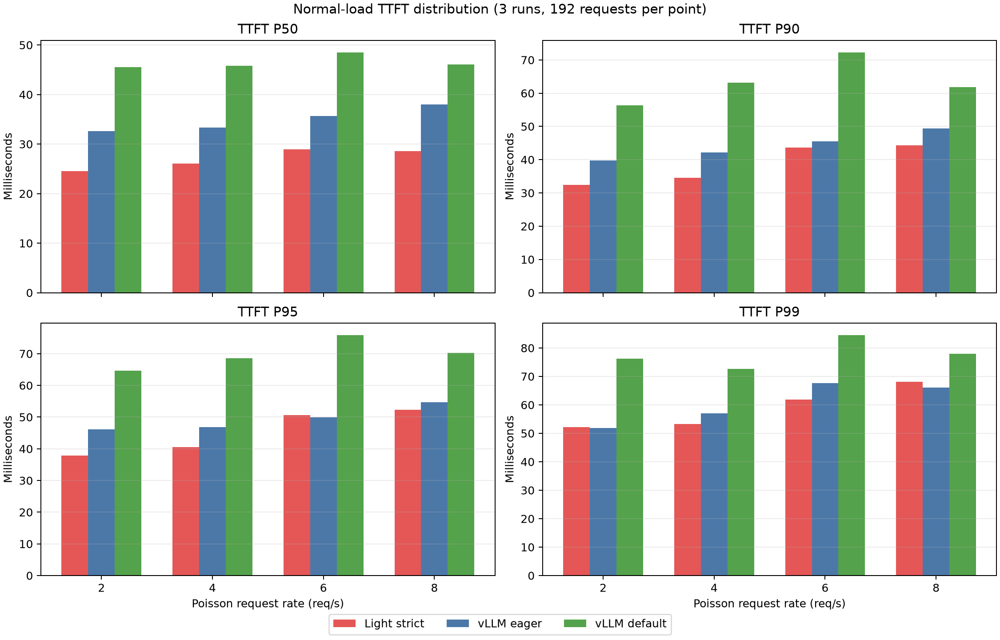
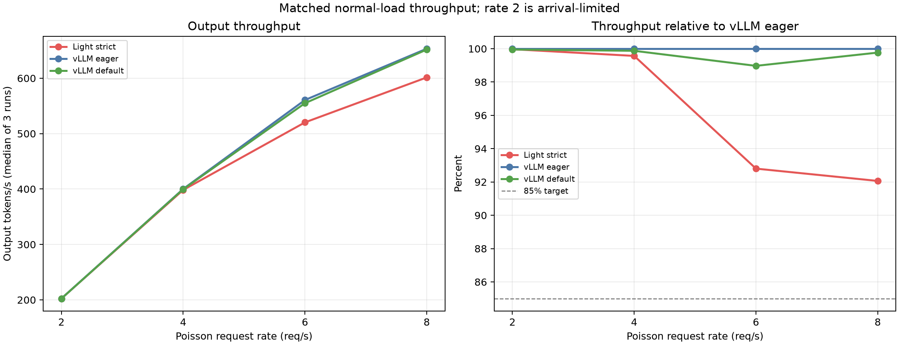
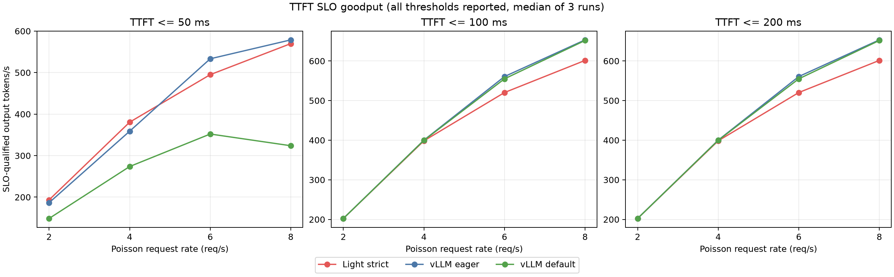
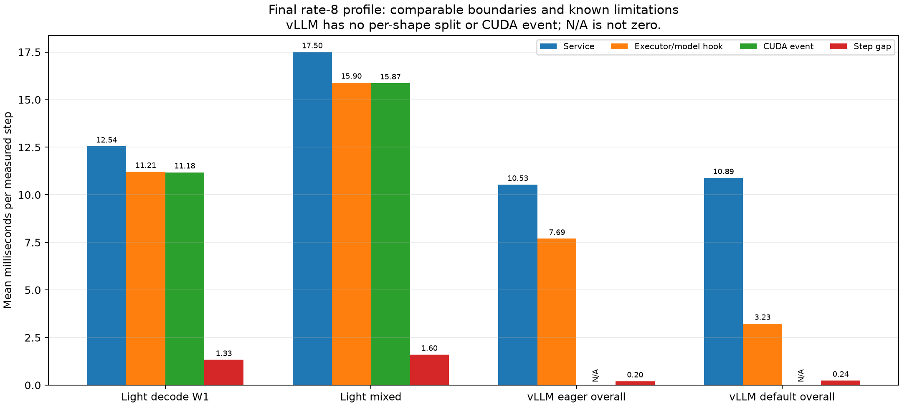

# light-vLLM Driver / Sampler / Staging 根因实验

## 一句话结论

Packed Query 已经消除了此前 TTFT 两个数量级差距。本轮在正常 ShareGPT Poisson 负载下，Light strict 的 TTFT P50 在 2/4/6/8 req/s 均低于 vLLM eager；8 req/s 吞吐为 601.4 tok/s，达到 eager 的 92.1%，但 TPOT 仍慢约 21%。最终 profile 进一步表明：同一工作量下，Light 相比 eager 多出的 1.271 s profile span 中，约 1.251 s 出现在相邻执行边界之间，剩余缺口首先应继续查 Driver 控制路径，而不是笼统归因给 kernel。

本轮只保留了一个很小的 Sampler 边界修复；Driver “伪 overlap”和 metadata packing 因没有稳定端到端收益而回退。

## 版本和公平条件

- 分支：`codex/driver-overlap-sampler-staging`
- Packed Query 基线：`4cc0dbf`
- 最终实验提交：`c5c6490`
- 保留的运行时提交：`39d3031 runtime: keep model step logits packed`
- 模型：Qwen2.5-Coder-7B-Instruct，BF16
- GPU：RTX 5090；driver 595.71.05；PyTorch 2.11.0+cu130
- KV：32K token；block size 16；max sequences 16；scheduled token budget 512
- 双方关闭 prefix cache、TTFT admission 和 speculation
- Light 使用 strict completion claim；vLLM eager 是主性能基准，vLLM default/graph 是上限参照
- workload：ShareGPT replay、Poisson 2/4/6/8 req/s、固定 seed 和逐请求输出长度
- 每个点完整 warmup 64 个请求，再执行 3 次正式运行；性能汇总不包含 warmup 和 profile

36 个正式 run 全部 64/64 成功，每轮输出 7,514 token。Light self-resubmit、回滚和拒绝增量均为 0；vLLM eager/default 的 preemption 增量均为 0。

## 最终正常负载结果

表中吞吐是 3 次正式运行的中位数；TTFT 是合并三轮 192 个成功请求后的分位数。

| req/s | 模式 | 吞吐 tok/s | 相对 eager | TTFT P50 ms | TTFT P95 ms | TTFT P99 ms |
| ---: | --- | ---: | ---: | ---: | ---: | ---: |
| 2 | Light strict | 202.4 | 100.0% | 24.6 | 37.9 | 52.1 |
| 2 | vLLM eager | 202.4 | 100.0% | 32.6 | 46.2 | 51.9 |
| 2 | vLLM default | 202.3 | 100.0% | 45.6 | 64.6 | 76.2 |
| 4 | Light strict | 398.4 | 99.6% | 26.1 | 40.5 | 53.2 |
| 4 | vLLM eager | 400.1 | 100.0% | 33.3 | 46.8 | 57.1 |
| 4 | vLLM default | 399.6 | 99.9% | 45.8 | 68.6 | 72.6 |
| 6 | Light strict | 520.3 | 92.8% | 29.0 | 50.6 | 61.9 |
| 6 | vLLM eager | 560.7 | 100.0% | 35.7 | 49.9 | 67.6 |
| 6 | vLLM default | 554.9 | 99.0% | 48.5 | 75.9 | 84.5 |
| 8 | Light strict | 601.4 | 92.1% | 28.5 | 52.4 | 68.0 |
| 8 | vLLM eager | 653.2 | 100.0% | 38.0 | 54.7 | 66.1 |
| 8 | vLLM default | 651.7 | 99.8% | 46.1 | 70.3 | 77.9 |





结果满足预先定义的两条主验收线：8 req/s TTFT P95 远低于 eager 的 3 倍，吞吐高于 eager 的 85%。更有意义的是，Light 的 TTFT P50 在四个速率都低 17%～26%；P95 除 6 req/s 的 1.3% 小幅反转外，其余也更低。8 req/s pooled P99 比 eager 高约 3%，因此不能把优势扩大到所有尾部分位。

2/4 req/s 的吞吐由到达速率限制，不代表三者的引擎上限。6/8 req/s 才开始暴露 Light 约 7%～8% 的稳态吞吐缺口。

## 不只看 P95：SLO goodput

下图把“TTFT 达到 50/100/200 ms 的请求所贡献的输出 token”除以整轮 wall time。阈值全部报告，不挑最有利的一个。



- 50 ms 严格 SLO 下，Light 在 2/4 req/s 的合格 goodput 高于 eager；6/8 req/s 略低于 eager，但显著高于 default。
- 100/200 ms 下所有请求都合格，goodput 退化为总吞吐，Light 的高负载缺口仍是约 8%。
- 这说明 Light 的优势是首 token 延迟，不是持续 decode 速度。

## 时间到底花在哪里

补充 profile 使用相同的 64 个请求、5,804 prompt token 和 7,514 output token。profile 会引入额外开销，所以这里只做时间归因，不覆盖前面的无 profiler 性能数。

| 系统 | 完整 profile span | 主执行边界累计 wall | 边界间 gap | gap 占 span |
| --- | ---: | ---: | ---: | ---: |
| Light strict | 12.762 s | Executor 11.288 s | 1.474 s | 11.55% |
| vLLM eager | 11.491 s | Engine step 11.268 s | 0.223 s | 1.94% |
| vLLM default | 11.605 s | Engine step 11.349 s | 0.256 s | 2.20% |

Light 与 eager 的 profile span 相差 1.271 s；两者边界内累计 wall 只差约 20 ms，而边界间 gap 相差 1.251 s。按这组相同工作量的时间账，约 98.4% 的 span 差落在边界外空档。

这个数字是“下一步把预算花在哪里”的强证据，但不是“98.4% 已定位到某个 Python 函数”：Light 的 Executor 与 vLLM 的 Engine step 并非完全同构边界，vLLM profile 也没有逐 step CUDA event。



Light 自身可以做更细的同口径分解：

| Light step | 数量 | Service 均值 | Executor 均值 | CUDA event 均值 | 前序 gap 均值 |
| --- | ---: | ---: | ---: | ---: | ---: |
| decode W1 | 921 | 12.54 ms | 11.21 ms | 11.18 ms | 1.33 ms |
| 异构 packed | 59 | 17.50 ms | 15.90 ms | 15.87 ms | 1.60 ms |

59 个异构/prefill-bearing step 实际执行 6,268 个 token；旧 padded 布局等价占用 57,061 个位置，本轮仍避免了 50,793 个 padding 位置。这里不能严格叫“prefill+decode mixed”，因为当前 profile 只记录 batch shape，没有逐请求 prefill/decode 标签。

vLLM 的 CPU hook 只能给出全局阶段 wall：eager 的 `execute_model` 约 7.69 ms/step、future wait 2.01 ms、sampler 0.44 ms、schedule+update 0.15 ms；default 主要把时间重新分布到 execute、future wait 和 sampling。`future_result` 不是 CUDA 时间，不能和 Light CUDA event 对标，也不能据此声称 default kernel 更快。

## 三个方向逐项验证

### 1. Sampler：保留小修，但不宣称吞吐收益

Profiler 中 `sampler.sample` 约 0.62 ms/step，看起来很大；微基准证明真正的直接 argmax 只有约 23.4 us wall。大部分 0.62 ms 是 `.tolist()` 等待之前模型工作完成，不是 argmax 自身。

旧路径把每个请求的 logits 切开，再 `torch.stack` 回同一个矩阵后 argmax；B16×152,064 的微基准中：

| 路径 | wall P50 | CUDA-event P50 |
| --- | ---: | ---: |
| 直接 packed argmax | 23.4 us | 14.6 us |
| split → stack → argmax | 86.2 us | 74.0 us |

因此保留 `ModelStepOutput(logits, logits_start_loc)`：普通采样直接消费连续 logits，投机路径按请求取 slice。正式 normal-8 A/B 的吞吐中位数只从 599.5 到 600.2 tok/s，约 +0.11%，属于运行噪声；保留它是因为删除了真实的重复复制，并把 packed 契约表达得更准确，不是因为端到端成绩显著。

### 2. Metadata / staging：微基准有收益，端到端不够

固定 B16/W1 微基准中，把 5 个小 metadata tensor 合成一次传输，wall P50 从 83.3 us 降到 43.7 us，理论上节约约 40 us/step。但第一版需要约 90 行额外布局和切片逻辑，normal A/B 没有稳定收益，还放大了未预热 Triton shape 的冷启动尾部，因此已回退。

主 input/position 的 pinned staging 只看到个位数微秒收益；没有达到计划中“每步 ≥0.5 ms 才引入可复用 buffer”的门槛，所以没有增加 buffer 生命周期和并发所有权复杂度。

### 3. Driver overlap：问题属实，第一版方案不产生 overlap

尝试过把 observer/statistics 发布移动到 Executor 已提交之后。埋点显示这段工作并未落入 Executor 执行区间，交替 A/B 也没有稳定收益，因此已回退。

简单把 `_drive` 拆成 `_prepare/_run/_finish` 仍然只是换函数名：同一请求下一步依赖本步采样 token、KV commit 和 Scheduler 状态，在 output apply 前不能安全重复调度。真正的 overlap 需要显式的 in-flight cohort/请求集合、KV lease 跨完整生命周期，以及“同一请求未完成不得再次调度”的契约；这应是独立架构改动，不能塞进本轮热路径小修。

## 冷启动异常为什么会出现

最初只预热 8 个请求时，candidate 曾出现 0.3～0.6 s TTFT/ITL 尾部。完整 profile 把其中 296.8 ms 定位在 B3/W1 的 `worker.model_forward`/CUDA event，而不是 metadata Python 构造；这是新 Triton specialization 首次编译/加载造成的冷启动空洞。

正式矩阵改为完整预热 64 个请求后，最大 ITL 恢复到约 42 ms。报告将冷启动问题单列，不能把它混进稳态 A/B，也不能靠删除异常点美化数据。

## 对“非抢占 vs 抢占”的准确结论

本组 32K KV 下三种模式都没有触发回滚或 preemption，所以不能说实验“证明非抢占优于抢占”。它证明的是：

1. 消除 padded mixed 计算后，strict completion claim 本身没有再造成两个数量级 TTFT 差距。
2. Light 在保留完整完成保证、零回滚、零拒绝的前提下，正常负载 TTFT 已经与 vLLM eager 同级，P50 还更低。
3. 当前剩余缺口是高负载 TPOT/吞吐与 Driver gap；容量压力下 strict 与 victim preemption 的取舍仍需单独压力实验。

Light 的 TPOT P50 在 2/4/6/8 req/s 比 eager 慢约 14%～25%，max-ITL P95 也更高。不能用 TTFT 图掩盖这项持续输出缺口。

## 正确性和工程边界

- 本地完整测试：239 passed；ruff、format check、`git diff --check` 通过。
- RTX 5090 CUDA/Triton/投机相关测试：63 passed。
- 正式性能矩阵：36/36 run 均 64/64 成功，逐轮输出 token 总数一致。
- Light 所有正式 run：self-resubmit=0、rolled-back token=0、rejected=0、overloaded=0。
- vLLM 所有正式 run：preemption=0。
- 回放设置 `respect_eos=false`，达到目标长度后客户端关闭部分流；Prometheus 的 `cancelled` 不能误读为客户端失败，JSON 中全部 HTTP 200 且 replay target 全命中。
- 本分支没有保留 metadata packing、observer submit-first 或双缓冲代码，也没有修改 `reserved_sequences` 默认值。
- 未经授权没有推送 GitHub。

## 数据与复现

- 分析脚本：`benchmarks/remote_5090/analyze_driver_sampler_staging.py`
- 汇总：`analysis/summary.json`、`analysis/summary.csv`
- 正式矩阵：`normal-matrix/`
- 最终 profile：`final-profiles/`
- 微基准：`baseline/micro/micro-b16-w1.json`
- 重画命令：

  ```bash
  python benchmarks/remote_5090/analyze_driver_sampler_staging.py \
    benchmarks/remote_5090/results/2026-08-21-driver-sampler-staging
  ```

- 完整数据包：`../driver-sampler-staging-20260821.tar.gz`
- 数据包哈希：`../driver-sampler-staging-20260821.tar.gz.sha256`
- 包内 `SHA256SUMS` 覆盖除清单自身外的全部文件；最终交付前在独立临时目录解包并逐项复核。

AutoDL 实例按要求保持开机，不由本任务关机。
