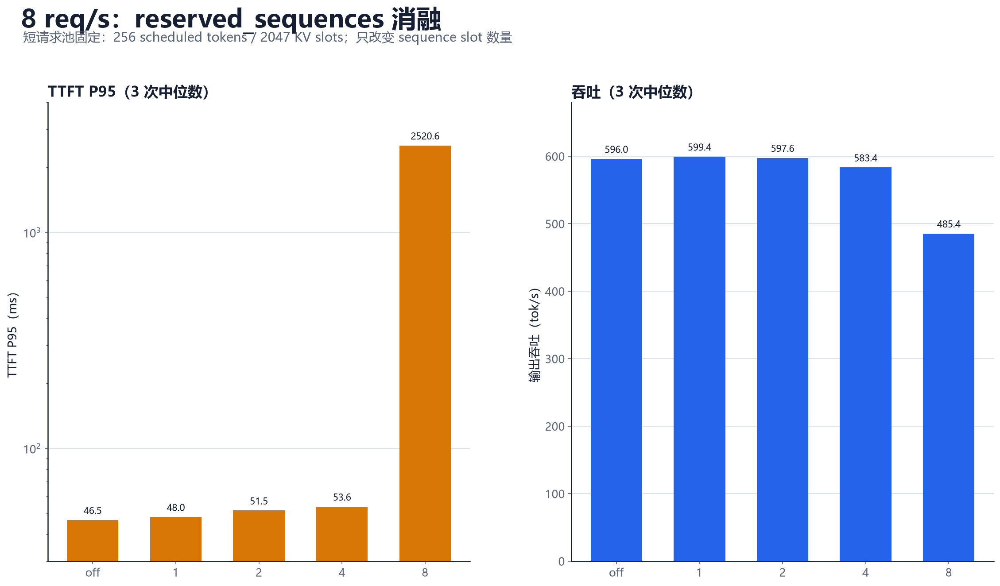

# light-vLLM Packed Query 与 TTFT 根因实验

## 一句话结论

原先 8 req/s 下约 1.5 秒的 TTFT P95，主要不是 strict 非抢占造成，而是 mixed prefill/decode batch 被补齐成 `[B, W]` 后执行了大量 padding。改成统一 token-major Packed Query 后，TTFT P95 中位数降到 46.5 ms，吞吐达到 vLLM eager 的 91.2%；strict completion claim 保持不变，self-resubmit、回滚和拒绝均为 0。

## 版本与公平条件

- baseline：`c81e519`
- Packed Query 运行时代码：`c1f18dc`
- 分支：`codex/packed-query-ttft`；benchmark 消融参数提交：`6c46884`
- 模型：Qwen2.5-Coder-7B-Instruct，BF16，RTX 5090
- KV：32K tokens，block size 16；max sequences 16；scheduled token budget 512
- 双方关闭 prefix cache、TTFT admission 和 speculation；Light 使用 strict completion claim
- 正常 ShareGPT replay，Poisson 2/4/6/8 req/s；每档 warmup 后 3 次正式运行
- vLLM eager 是主基准；vLLM default/graph 只作为第二参照

## 主结果

| req/s | 原版 TTFT ms | Packed TTFT ms | vLLM eager TTFT ms | Packed/eager TTFT | Packed tok/s | vLLM eager tok/s | Packed/eager 吞吐 |
| --- | --- | --- | --- | --- | --- | --- | --- |
| 2 | 132.8 | 36.3 | 41.4 | 0.88× | 202.3 | 202.4 | 100.0% |
| 4 | 281.8 | 41.9 | 46.0 | 0.91× | 398.4 | 400.2 | 99.6% |
| 6 | 557.8 | 51.0 | 48.3 | 1.06× | 520.1 | 561.2 | 92.7% |
| 8 | 1532.9 | 46.5 | 53.8 | 0.86× | 596.0 | 653.9 | 91.2% |

最关键的 8 req/s 还做了独立服务启动的 `baseline→candidate` 三组交替复核：baseline TTFT P95/吞吐中位数为 1468.2 ms / 502.9 tok/s，candidate 为 52.5 ms / 600.6 tok/s。收益不是测试顺序或机器时间漂移造成的。

## 根因证据

8 req/s 的完整 profile 中，两版都出现 57 个 mixed step：

- 原版 mixed step P50 为 63.06 ms，CUDA event P50 为 63.03 ms，57 步共占 5.39 s。
- Packed 后 mixed step P50 为 13.93 ms，CUDA event P50 为 13.88 ms，57 步共占 0.93 s。
- Packed profile 的 57 个 mixed step 只执行 6,250 个真实 token；旧布局需要启动 56,155 个位置，因此避免了 49,905 个 padding 位置。
- decode W1 的 Executor P50 基本不变：11.30 → 11.22 ms；step gap 也没有被 Packed 修掉。

这条证据链说明：旧 mixed step 在 GPU 上确实执行了 padding 对应的 GEMM/attention/logits 工作，单步被拉长后，请求到达速度超过首 token 消化速度，waiting 队列迅速积累。Packed Query 消除的是这段真实 GPU 浪费，而不是修改准入或回滚策略。

## `reserved_sequences` 消融

| reserved_sequences | TTFT P95 ms | 吞吐 tok/s |
| --- | --- | --- |
| off | 46.5 | 596.0 |
| 1 | 48.0 | 599.4 |
| 2 | 51.5 | 597.6 |
| 4 | 53.6 | 583.4 |
| 8 | 2520.6 | 485.4 |

`8` 会把 16 个 sequence slot 的一半划给首 token 短池，但短池每步只有 256 token 预算；正常 mixed 流量下，通用 decode 并发被压缩，TTFT 和吞吐同时恶化。因此不修改当前默认值 `1`。

## 其他修复方向的收益上限

以下区间不是已经实现的成绩，而是用当前 Packed profile 的每步时间预算推导出的工程预期。多项优化会吃同一段时间，不能直接相加。

| 方向 | 当前可见时间预算 | 理论上限 | 保守工程预期 | 对当前 TTFT 的判断 |
| --- | --- | --- | --- | --- |
| Driver 双缓冲 / 两批在途 | 外部 gap 1.49 ms / service step 13.12 ms | 全部隐藏时吞吐 +12.8% | 吞吐 +5%～9% | 2/8 req/s 已无明显首 token 排队，通常只省 0～10 ms；更高负载下收益会非线性放大 |
| decode CUDA Graph | 独立 fixed-W1 trace 中 kernel 10.592 ms、CUDA-event 11.743 ms，设备边界内空洞约 1.151 ms | 最多约 +10% step capacity | 吞吐 +4%～7% | 只 capture 常见 decode shape 时通常小幅改善；不要让首个不规则 prefill 等待 graph |
| sampler 异步回传 | 0.61 ms/step | 全部隐藏时吞吐 +4.8% | 吞吐 +1%～3% | 对 TTFT 很小，主要改善 decode capacity / TPOT |
| staging buffer、metadata/H2D | Step Handler 中 model 外只有 0.63 ms/step，且含不可删除工作 | 全部消失时吞吐 +5.1% | 吞吐 +1%～2% | 目前没有证明单独 H2D ≥0.5 ms，不应先做大改 |
| 删除每步 CUDA timer 同步 | 固定 B16/W1 三次中位数：1202.2→1204.6 tok/s | 实测吞吐 +0.20% | 不作为性能修复；仅在保留准确 CUDA 指标的前提下重构采样 | TPOT 中位数 13.176→13.187 ms，差异属于运行噪声 |
| `reserved_sequences` 调参 | `off/1/2` 吞吐仅 596.0/599.4/597.6 tok/s | 没有稳定正收益 | 保持默认 1 | 设为 8 会把 TTFT 恶化到 2520.6 ms |
| self-resubmit 部分 KV 保留 | 本组 resubmit=0 | 当前正常负载收益为 0 | 只改善容量压力下的重算量和 token gap | 首 token 已产生后才触发，主要影响 ITL/吞吐，不是当前 TTFT 根因 |

最值得继续的是 **Driver overlap + 常见 decode shape 的 CUDA Graph**。按时间预算，两者有机会把正常 8 req/s 吞吐从约 596 tok/s 推到 630～650 tok/s；但它们会重叠吃掉 launch/等待空洞，必须分别 A/B，不能把两个百分比直接相加。当前 TTFT 已经比 vLLM eager 低，因此下一阶段应把主验收改成 fixed-W1 TPOT、饱和吞吐和 inter-step gap，而不是继续压 46.5 ms 的 TTFT。

计时器消融的原始 JSON、Prometheus 快照和服务日志保存在 `timer-ab/`。这组补测使用同一个 `6c46884` checkout，关闭 prefix cache、TTFT admission 与 speculation；`current` 和替换成墙钟计时器的 `wall` 都经过 warmup 后正式运行三次，并额外回切一次 `current` 检查顺序漂移。每次均为 16/16 成功、8192 输出 token。

## 正确性与边界

- 本地：237 个测试通过；ruff、format check、`git diff --check` 通过。
- RTX 5090：全量测试通过；Torch/Triton packed GQA、混合长度、linear/tree、decode-after-prefill 的 FP16/BF16 数值对照通过。BF16 attention 容差为 `atol=rtol=2e-2`。
- 所有正式性能运行均 64/64 成功；candidate 与 vLLM eager 没有 missing/extra 请求，输出 token 数逐请求一致。
- 不把不同 BF16 kernel 的 greedy token 序列宣称为 bitwise identical：8 req/s 的 64 个请求中有 26 个 exact-token mismatch；原版相对 vLLM 的 mismatch 更多。该项不影响长度对齐和性能结论，但若未来要求跨框架逐 token 完全一致，需要另做确定性数值工程。
- 本组 32K KV 下 Light self-resubmit=0、回滚 token=0、拒绝=0；vLLM preemption=0。因此它验证的是“容量足够时 strict 非抢占没有造成两个数量级 TTFT 差距”，不是证明非抢占策略在容量压力下一定优于 victim preemption。
- Packed 后平均外部 Executor gap 仍为 1.49 ms/step，明显高于 vLLM 的流水化实现。但主验收已经达到，按计划不在本分支引入高风险双缓冲；后续可用独立分支解决。

## 数据完整性与复现

- 原始结果：`packed-query-ttft-20260821/`，包含 388 个文件（JSON、Prometheus、日志、profile、环境与命令参数）。
- 下载包：`packed-query-ttft-20260821.tar.gz`
- 包 SHA-256：`379a82e4ecf4012ae600452fabfb13d44f3691d0ca7746f14e199e4d081ff6ab`
- 解包后的 `SHA256SUMS` 已逐文件校验：388/388 通过。
- 分析数据：`analysis/summary.json`
- 重画命令：`python benchmarks/remote_5090/analyze_packed_query_ttft.py <解包目录> <结果目录>`（需要 matplotlib）。
