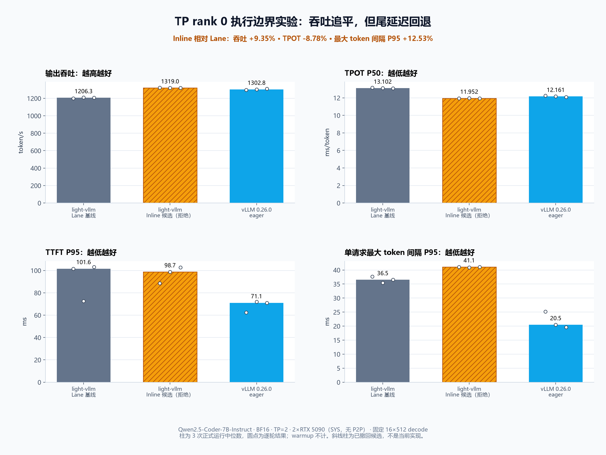

# TP rank 0 执行边界诊断

## 结论

剩余吞吐差距的主要来源已经确认：TP rank 0 每个 decode step 都经过 `ExecutionLane`，其线程往返与
Engine 控制路径形成了可见的 step 间隙。把饱和 decode 临时改为在 HTTP 事件循环内 inline 执行后，固定
`16 x 512` 负载的吞吐中位数从 `1206.26` 提升到 `1319.04 tok/s`，相对 Lane 提升 `9.35%`，并略高于
同条件 vLLM eager 的 `1302.81 tok/s`。

但该候选没有进入产品代码：单请求最大 token 间隔 P95 从 `36.52 ms` 增加到 `41.10 ms`，回退
`12.53%`。原因不是 Engine 事件队列积压，而是同步模型步骤占用了 rank 0 的 HTTP 事件循环，ASGI/socket writer
无法及时前进。尝试基于首 token 消费和事件队列做背压仍无法修复写出链路的尾延迟，因此候选已完整撤回。

| 实现 | 吞吐中位数 | TPOT P50 | TTFT P95 | 最大 token 间隔 P95 |
| --- | ---: | ---: | ---: | ---: |
| light-vllm Lane 基线 | 1206.26 tok/s | 13.102 ms | 101.60 ms | 36.52 ms |
| light-vllm inline 候选（已拒绝） | 1319.04 tok/s | 11.952 ms | 98.75 ms | 41.10 ms |
| vLLM 0.26.0 eager | 1302.81 tok/s | 12.161 ms | 71.05 ms | 20.49 ms |

## 为什么可以确认是这个问题

- light-vllm Lane trace 的相邻 step 间隙 P50 为 `1.238 ms`；此前已经移除的 Gloo 控制 collective 不再是这里的
  主要成本。
- vLLM 0.26.0 的 `EngineCore.step_with_batch_queue` 使用异步 batch queue 和非阻塞多进程 Executor；匹配 trace
  中 Engine step 调用间隙约 `0.015 ms`。它的 Scheduler `schedule` / `update_from_output` 均值分别只有
  `0.122 / 0.053 ms`。
- 只改变同一个 `PreparedStep` 在哪里执行，不做预调度、不改变 Scheduler/KV/NCCL 后，light-vllm 的吞吐即从
  `1206.26` 提升到 `1319.04 tok/s`。这是因果 A/B，不只是时间占比推测。
- 同时出现的 SSE 尾延迟回退说明：问题不能靠“删掉 lane、堵住 HTTP loop”解决。吞吐证明了瓶颈位置，尾延迟证明了
  该候选架构不可交付。

## 正确的后续修复方向

下一步应把 TP rank 0 的 Engine/模型执行与 HTTP loop 真正隔离，优先复用已有 `EngineClient` / 进程 Engine 边界：

1. HTTP 进程只做协议、tokenizer 和流写出；TP rank 0 Engine 在独立进程中拥有调度状态、KV lease 和模型执行。
2. rank 0 Engine 与其他 TP rank 继续通过现有可替换控制通道协调，NCCL tensor collective 不变。
3. Engine 与 HTTP 之间使用异步有界 IPC，明确请求、取消、事件与失败传播；用队列背压而不是事件循环 yield 次数调节。
4. 进程边界稳定后，再评估 vLLM 式 async batch queue、GPU 侧 sampled-token relay；普通 decode 仍不能在采样 token 和
   KV commit 之前提前准备下一步。

这条路线比在 Engine 内感知 SSE writer 更符合当前分层，也为后续多节点控制传输留下了替换点。

## 条件与数据位置

- 模型：Qwen2.5-Coder-7B-Instruct，BF16；两张 RTX 5090 32 GiB，`SYS` 拓扑，无 CUDA P2P。
- light-vllm：Triton paged attention、Unix socket TP 控制通道；vLLM 0.26.0：eager，关闭 CUDA Graph。
- 每个实现先 warmup，再运行 3 轮；表和图使用正式轮次中位数。
- 结果只覆盖该模型、负载和硬件拓扑，不能外推到低并发、长 prompt 或有 NVLink/P2P 的机器。
- 精确逐轮数据见 [summary.json](summary.json)。云端原始结果保留在
  `/root/autodl-tmp/tp-driver-gap-20260826/final-matched-lane/`、
  `/root/autodl-tmp/tp-driver-gap-20260826/final-backpressure-hybrid/` 和
  `/root/autodl-tmp/tp-control-perf-20260826/formal-multirun/vllm-eager/`；本地不保存模型、trace 或大体积请求结果。
