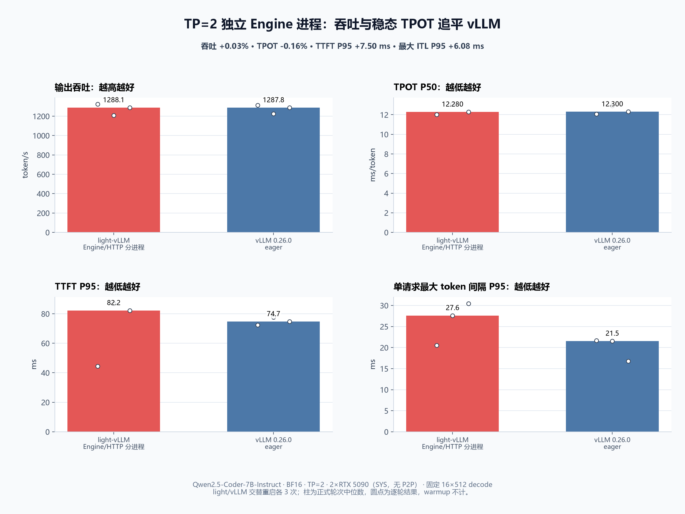

# TP Rank 0 独立 Engine 进程与 vLLM 对比

## 结论

这次修复保留了上一轮 inline 实验的吞吐收益，同时把 HTTP/tokenizer 和同步 TP collective 分到不同进程。
固定 `16 x 512` decode 的三组交替复测中，light-vLLM 吞吐中位数为 `1288.11 tok/s`，vLLM eager 为
`1287.76 tok/s`；TPOT P50 分别为 `12.280 / 12.300 ms`。在这组条件下，吞吐和稳态 TPOT 已经追平。

但还不能说所有指标都追平：light-vLLM 的 TTFT P95 仍多 `7.50 ms`，单请求最大 token 间隔 P95 仍多
`6.08 ms`。profile 排除了正式 serving 阶段的 Python full GC；剩余长尾位于 prefill/模型设备 step，后续应单独
优化 kernel、metadata 和设备流水，不能继续在 HTTP adapter 上堆补丁。

| 实现 | 吞吐中位数 | TPOT P50 | TTFT P95 | 最大 token 间隔 P95 |
| --- | ---: | ---: | ---: | ---: |
| light-vLLM Engine/HTTP 分进程 | **1288.11 tok/s** | **12.280 ms** | 82.20 ms | 27.61 ms |
| vLLM 0.26.0 eager | 1287.76 tok/s | 12.300 ms | **74.70 ms** | **21.54 ms** |

## 改了什么

- TP Rank 0 只拥有 Engine、Scheduler、逻辑 KV 和分布式 Executor；HTTP/tokenizer 在独立 spawn 进程中运行。
- 新的 `ConnectionEngineClient` 复用原有 Engine IPC 协议，不复制请求、取消、指标和错误语义。
- Rank 0 继续 cooperative inline 执行单在途模型 step，HTTP 进程可以同时推进 SSE/socket writer。
- command reader 一次交付 Pipe 中已经 ready 的请求 burst；response writer 只合并当前事件循环已经 ready 的事件，
  不设置等待窗口或墙钟 sleep。
- 普通 `ProcessEngineClient` 改为组合连接客户端，仍保留原有子进程所有权和强制清理兜底。

这个边界与 [vLLM V1 architecture](https://github.com/vllm-project/vllm/blob/main/docs/design/arch_overview.md)、
[vLLM EngineCore client](https://github.com/vllm-project/vllm/blob/main/vllm/v1/engine/core_client.py) 和
[SGLang Engine process topology](https://github.com/sgl-project/sglang/blob/main/python/sglang/srt/entrypoints/engine.py)
的成熟职责划分一致，但继续复用 light-vLLM 已有 `EngineClient` 和状态机，没有照搬其内部实现。

## 为什么这次可以保留

- 上一轮 Lane 基线只达到同轮 vLLM 吞吐的 `92.59%`；本轮 light/vLLM 吞吐比为 `100.03%`。由于两批实验不是
  同一次机器时段，这里只用各自相对 vLLM 的归一化比例判断，比例改善 `8.03%`，不直接混算绝对 tok/s。
- 上一轮被拒绝的同进程 inline 方案虽然吞吐快，但最大 token 间隔 P95 比 Lane 又差 `12.53%`。本轮进程隔离后，
  相对 vLLM 的最大 ITL 差从旧配对的 `16.04 ms` 缩到 `6.08 ms`，归一化缩小 `62.12%`。
- 两轮 correctness 各包含 4 个相同请求，每轮只有一种输出，且 8 个 token 与之前 TP=1 基线逐 token 一致。
- 在活跃生成期间终止 local rank 1 后，torchrun 在 `957 ms` 内以非零状态退出；端口、两张卡显存和全部服务进程
  都已清理，没有无限挂起或孤儿 HTTP 进程。

## 剩余差距在哪里

正式 profile 的 512 个 decode step 中，Rank 0 相邻 step 间隙 P50/P95 已降到 `0.537 / 0.583 ms`，原先
`ExecutionLane` 的约 `1.238 ms` 间隙不再是首要瓶颈。generation-0/1 GC 最大停顿为 `0.283 / 0.254 ms`，没有
generation-2 GC。

当前 TTFT 由 burst 的两个 prefill step 主导：第一个请求先进入模型，其余请求在下一步加入。最大 ITL 也会被这次
较大的后续 prefill step 拉高。设备 step 本身仍有明显长尾，所以后续优先级是：

1. 分开记录 prefill/decode 的 CUDA event 与算子 trace，定位短 prefill 的 kernel-launch 和 collective 成本；
2. 对照 vLLM/SGLang 的 fused norm、activation、RoPE、attention metadata 与 async collective 边界；
3. 先做不改变 Scheduler/KV 语义的局部 A/B，再评估 CUDA Graph；不通过人为 sleep 或 HTTP batching 掩盖 TTFT。

## 实验条件与数据位置

- 模型：Qwen2.5-Coder-7B-Instruct，BF16；两张 RTX 5090 32 GiB，`SYS` 拓扑，无 CUDA P2P。
- 软件：Python 3.12.13、PyTorch 2.11.0+cu130、CUDA 13.0、NCCL 2.28.9、Triton 3.6.0、vLLM 0.26.0。
- light-vLLM 使用 Triton paged attention 与 Unix socket TP 控制通道；vLLM 开启 eager，关闭 CUDA Graph。
- 顺序固定为 `light-r1 → vllm-r1 → ... → light-r3 → vllm-r3`；每轮重启服务、先 warmup，表和图只取正式轮次。
- 六个正式 run 均为 16/16 成功、8192 个输出 token、0 失败；模型配置与 workload SHA256 见
  [summary.json](summary.json)。
- 云端原始 JSON、Prometheus 快照、日志和 GPU 采样保留在
  `/root/autodl-tmp/tp-engine-process-20260826/interleaved-clean/`；本地不保存模型或大体积 trace。
