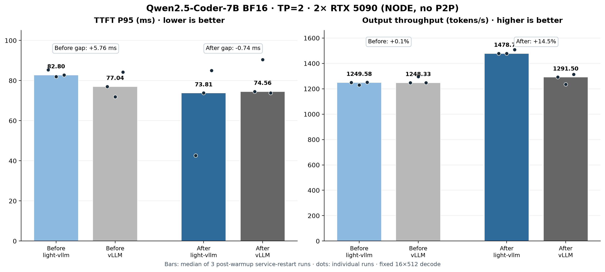

# TP2 current-stream NCCL：TTFT P95 劣化修复实验报告

## 结论

固定 `16 × 512` decode 的三组服务重启 A/B 中，旧 light-vllm 的 TTFT P95 中位数比 vLLM 高
`5.761 ms`。模型 collective 改为在模型当前 CUDA stream 上执行后，差值变为 `-0.742 ms`；原来的
5–6 ms 劣化已经消失。与此同时，light-vllm 吞吐中位数由 `1249.58` 提升到 `1478.74 tok/s`，修复后达到
同轮 vLLM eager 的 `114.50%`。

这不是通过调整调度、延迟发送请求或墙钟 sleep 得到的结果。Engine、Scheduler、批次语义和控制通道保持不变；
改动只位于 `TensorCollectives` 的 NCCL 实现边界。

## 环境与等工作量约束

- GPU：两张 RTX 5090 32 GiB；卡间 `NODE`，CUDA P2P 不可用。
- 软件：Python 3.12.13、PyTorch 2.11.0+cu130、NCCL 2.28.9、Triton 3.6.0、vLLM 0.26.0。
- 模型：Qwen2.5-Coder-7B-Instruct BF16，TP=2。
- 请求：16 个同时到达的请求，每个固定生成 512 token；每轮共 8192 输出 token。
- 两边都先 warmup；正式轮排除 warmup。vLLM 使用 eager、关闭 custom all-reduce，日志确认实际选择 PYNCCL。
- 每个主对照都重新启动服务，顺序固定为 light-vllm → vLLM；结论使用三轮指标的中位数。
- workload SHA256：`e47f4f9148fd6d91d81a4fd6fc17a0eaf3988f264e34c9fc77191e24a81e12b0`。

## 修复前后与 vLLM 对比

| 阶段 | 系统 | TTFT P95 三轮 | 中位数 | 吞吐中位数 |
| --- | --- | --- | ---: | ---: |
| 修复前 | light-vllm | 85.409 / 82.016 / 82.797 ms | 82.797 ms | 1249.58 tok/s |
| 修复前 | vLLM eager | 77.036 / 71.913 / 84.208 ms | 77.036 ms | 1248.33 tok/s |
| 修复后 | light-vllm | 42.623 / 73.813 / 84.994 ms | 73.813 ms | 1478.74 tok/s |
| 修复后 | vLLM eager | 74.555 / 90.483 / 73.796 ms | 74.555 ms | 1291.50 tok/s |

图中的柱高是三轮中位数，圆点是每个正式轮次。TTFT 单轮有明显波动，因此不能把最优的 `42.623 ms` 当作
稳定结论；`-0.742 ms` 只表示本轮数据中已经没有系统性的 5–6 ms 劣化，不宣称所有负载下都稳定领先 vLLM。

## 根因证据

轻量分层计时显示，首个模型 step 的总耗时约 `28.65 ms`，其中 device 为 `26.51 ms`、模型 forward 为
`25.48 ms`；socket broadcast 约 `0.12 ms`、完成同步约 `0.23 ms`。因此 HTTP、IPC 与控制通道不足以解释
5–6 ms 的 P95 差距。

随后只替换 collective backend，保持同一个 light-vllm 服务、Engine 和 workload：

| collective 路径 | TTFT P95 中位数 | 吞吐中位数 | TPOT P50 中位数 |
| --- | ---: | ---: | ---: |
| ProcessGroupNCCL | 80.408 ms | 1299.25 tok/s | 12.150 ms/token |
| current-stream PyNccl 诊断 | 66.190 ms | 1543.91 tok/s | 10.227 ms/token |
| vLLM eager | 73.917 ms | 1254.38 tok/s | 12.608 ms/token |

Qwen2.5-Coder-7B TP2 的一次 forward 包含每层关键路径上的 AllReduce 和最终词表 AllGather。原实现经
`ProcessGroupNCCL` 的独立通信 stream 提交这些操作，需要在每层计算与通信之间建立跨 stream 依赖；诊断实验把
相同 collective 放回模型当前 stream 后，TTFT、TPOT 和吞吐同时改善。该隔离实验与分层计时共同把根因收敛到
collective stream 边界，而不是控制面。

## 实现

正式实现不依赖 vLLM。light-vllm 只绑定 `libnccl.so.2` 中所需的 communicator、AllReduce、AllGather 和销毁 API，
并使用 `torch.cuda.current_stream()` 的 stream handle。Gloo 与 ProcessGroup 继续承担启动协调、容量事实和控制回退；
模型、Worker、Engine 和 Scheduler 不感知 NCCL 实现变化。

初版曾尝试复用 PyTorch 的 `torch.cuda.nccl.init_rank`，但 PyTorch 2.11/Python 3.12 在初始化时触发
`PY_SSIZE_T_CLEAN macro must be defined for '#' formats`，候选在服务启动前即被拒绝，没有计入性能结果。

## 最终源码、正确性与故障退出

- 最终源码的本地/远端 SHA256 一致：`distributed.py` 为
  `2a83d2203aea5e57093d79c686cf1ef08f9cadf423f15d71f862752e816cd1ea`，`nccl.py` 为
  `d89331eec56f4268515828694c70330992b88d717009b711b909c7fd9cd68462`。
- 哈希一致后，同一 light-vllm 服务再跑三轮：TTFT P95 中位数 `50.116 ms`，吞吐中位数 `1508.12 tok/s`；
  每轮 16/16 请求成功并生成 8192 token。该复测用于确认最终源码，不与服务重启 A/B 混为同一种统计设计。
- 两轮短正确性各包含 4 个 prompt × 8 token，全部严格等于既有 TP1 基线，无请求分叉。
- 活动请求中终止 Rank 1 后，torchrun 在 `968 ms` 内非零退出；端口释放、两卡显存归零、无残留服务进程。

512-token BF16 贪心长生成不作为跨重复位一致门槛：修复前同一 ProcessGroup 服务的三次运行之间已经会在近似并列
logits 处分叉。本轮使用仓库既有的 4×8 TP1/TP2 逐 token 对照作为严格正确性验收，同时要求所有性能轮工作量和
成功率完全一致。

## 边界

- 结论覆盖这台双 RTX 5090、无 P2P、Qwen2.5-Coder-7B BF16、TP2 和固定 burst decode workload。
- 当前没有跨节点、NVLink、其他模型尺寸或不同 batch/context 分布的性能结论。
- 主对照固定使用 light-vllm → vLLM 顺序，没有做随机化或反向顺序配对；结论依赖三轮中位数和隔离实验共同支撑。
- 这里证明的是原 TTFT P95 劣化在目标环境中已消失；不把单轮最优值外推成普遍性能承诺。

逐轮指标见 [runs.csv](runs.csv)，结构化聚合见 [summary.json](summary.json)。远端原始 JSON、Prometheus 快照、
GPU 采样和服务日志保留在 `summary.json` 的 `raw_evidence` 路径；本地完整副本保存在任务产物目录，没有把大日志和
逐 token 数组提交进 Git。
