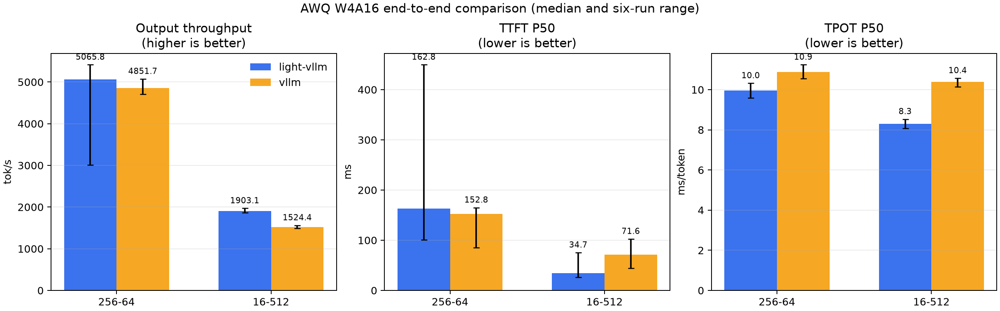

# AWQ W4A16 与 vLLM 端到端对照

候选提交：`89afaefbab690d838c6631b7a4510069e2b83a24`（工作区状态：`clean`）
设备：NVIDIA GeForce RTX 5090, GPU-88ba7823-c5e1-8d65-d557-f1e5c16107ce, 580.76.05, 32607 MiB；PyTorch 2.11.0+cu130；vLLM 0.26.0。

这是两组固定 burst 压测：64 个 256→64 请求和 16 个 16→512 请求，不代表生产流量。
表中是每个系统 6 轮实测的中位数，括号内为最小值到最大值；两边使用 greedy、FP16、
同一 AWQ checkpoint。完整环境和执行顺序见 `environment.json` 与 `commands.txt`。

| workload | 系统 | 输出吞吐 tok/s | TTFT P50 ms | TPOT P50 ms/token |
| --- | --- | ---: | ---: | ---: |
| baseline-256-64 | light-vllm | 5065.79 (3007.99–5414.35) | 162.77 (101.11–449.66) | 9.96 (9.59–10.32) |
| baseline-256-64 | vllm | 4851.69 (4705.93–5073.21) | 152.83 (85.59–164.95) | 10.88 (10.55–11.24) |
| decode-steady-16-512 | light-vllm | 1903.05 (1861.55–1969.64) | 34.69 (26.11–75.42) | 8.29 (8.08–8.53) |
| decode-steady-16-512 | vllm | 1524.40 (1487.33–1561.72) | 71.60 (44.07–102.54) | 10.40 (10.14–10.57) |

## 真实 checkpoint 与 CUDA kernel

| 项目 | Dense | AWQ W4A16 |
| --- | ---: | ---: |
| 模型权重显存 | 950.17 MiB | 454.61 MiB（47.85%） |
| 短 prompt 下一 token | 576 | 576 |
| logits cosine similarity | - | 0.946514 |

`K=N=3584`、group size 128 的同源 CUDA AWQ kernel 对照：

| 输入 token | light-vllm | vLLM legacy AWQ | light / vLLM |
| ---: | ---: | ---: | ---: |
| 1 | 0.024960 ms | 0.025520 ms | 97.81% |
| 8 | 0.024752 ms | 0.025648 ms | 96.51% |
| 64 | 0.032480 ms | 0.033584 ms | 96.71% |
| 256 | 0.120304 ms | 0.123264 ms | 97.60% |

checkpoint 检查里的 Dense 使用 Hugging Face runtime，AWQ 使用 light-vllm runtime；因此只报告权重显存和短 prompt 的 logits 诊断，不把跨 runtime forward 延迟当作量化加速证据。该检查不是完整质量评测。kernel 表对照的是 vLLM legacy AWQ op，端到端 vLLM 0.26 实际选择 Marlin。远端全量测试使用的提交与命令单独记录在 `validation/`；它与端到端候选之间只改了 benchmark 进程清理脚本，模型和推理 runtime 未变化。

同一实现的 greedy 输出稳定性（全部 15 个轮次对）：
- baseline-256-64 / light-vllm: 1 个输出 map；15/15 个轮次对完全一致；完全一致请求比例中位数 100.00% （100.00%–100.00%）；同位置 token-ID 匹配率中位数 100.00% （100.00%–100.00%）。
- baseline-256-64 / vllm: 1 个输出 map；15/15 个轮次对完全一致；完全一致请求比例中位数 100.00% （100.00%–100.00%）；同位置 token-ID 匹配率中位数 100.00% （100.00%–100.00%）。
- decode-steady-16-512 / light-vllm: 1 个输出 map；15/15 个轮次对完全一致；完全一致请求比例中位数 100.00% （100.00%–100.00%）；同位置 token-ID 匹配率中位数 100.00% （100.00%–100.00%）。
- decode-steady-16-512 / vllm: 5 个输出 map；1/15 个轮次对完全一致；完全一致请求比例中位数 37.50% （25.00%–100.00%）；同位置 token-ID 匹配率中位数 59.44% （53.22%–100.00%）。

实现间 greedy 输出对照（全部 36 个跨实现轮次对）：
- baseline-256-64: 完全一致请求比例中位数 100.00% （100.00%–100.00%）；同位置 token-ID 匹配率中位数 100.00% （100.00%–100.00%）。
- decode-steady-16-512: 完全一致请求比例中位数 25.00% （18.75%–31.25%）；同位置 token-ID 匹配率中位数 30.71% （24.94%–36.49%）。

所有测量轮次必须零请求失败、达到固定输出长度并保持相同请求集合；否则分析脚本直接失败。轮次内或实现间的 token 差异不会被丢弃，而是用全部轮次对如实统计。
同位置 token-ID 匹配率不是质量指标；logits、PPL 或任务质量需要由独立质量验收给出，不能由这组性能压测推断。
该结果只覆盖记录中的机器、模型和 workload，不能外推为所有场景下普遍优于 vLLM。

