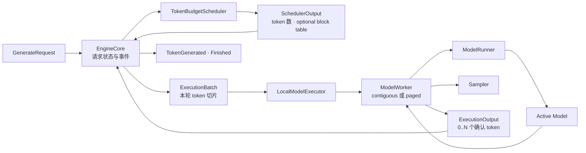
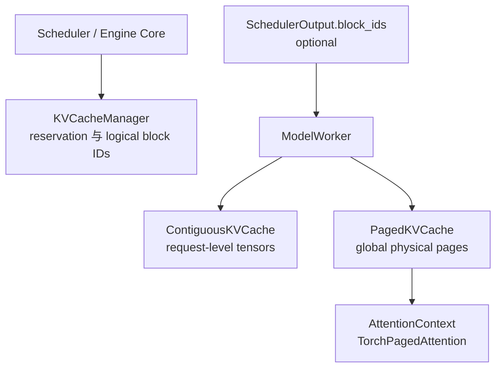
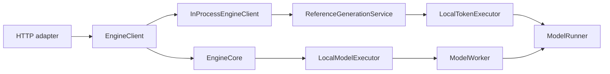

# Architecture

## 一句话原则

> Engine 编排请求，Scheduler 决定谁能算以及算多少，Executor 把可执行批次算出来。

light-vllm 优先采用 vLLM、SGLang 等成熟推理框架已经验证过的职责划分，再按当前规模删减不需要的
复杂度；不为了“架构不同”而重新命名同一个概念。

## 所有权树

```text
light_vllm/
├── modeling/   # 模型、loader、注册表与模型生命周期
├── runtime/    # generation、sampling、KV、scheduler、execution、engine
├── serving/    # HTTP/RPC 等协议 adapter
└── entrypoints/# 具体实现的装配与启动
```

`generation` 描述完整请求和用户可见事件；`execution` 描述一次设备计算；两者语义不同，但都只是
`runtime` 的子领域。KV cache 当前是 `runtime/kv_cache.py` 叶子模块，不创建含义宽泛的 `memory` 领域。

## 核心数据流



这条链不使用 `prefill`、`decode`、`greedy` 或 `KV cache` 专用 Executor：

- prompt 和生成 token 都是“尚未计算的 token”；
- chunked prefill 只是本轮预算不足以覆盖全部 pending token；
- greedy/top-k/top-p 是 Sampler 差异；
- 连续或分页 K/V 是 Worker 的物理存储与 attention 后端差异；
- 本地、CUDA、多进程才是合理的 Executor 拓扑差异。

## 模块边界

| 组件 | 负责 | 不负责 |
| --- | --- | --- |
| `EngineCore` | 请求状态、事件、停止条件、迭代与取消 | tensor、调度策略、HTTP |
| `TokenBudgetScheduler` | FCFS、并发槽、token budget、逻辑 KV 分配 | 模型 forward、采样、事件 |
| `UnboundedKVCacheManager` | 无容量限制的 reservation、提交与回滚基线 | block、K/V tensor |
| `PagedKVCacheManager` | 逻辑 block 预留、提交、回滚、释放 | K/V tensor、attention kernel |
| `ModelExecutor` | 执行已可行批次、物理资源租约 | admission、请求队列、HTTP |
| `LocalModelExecutor` | 把执行端口委托给一个本地 Worker | KV 模式、谁能运行、block 分配策略 |
| `ContiguousModelWorker` | 请求级连续 K/V、模型输入与采样正确性基线 | 逻辑 block、调度策略 |
| `PagedModelWorker` | padded batch、绝对位置、物理页池、block table 消费与采样 | 逻辑 block 分配、请求队列 |
| `TorchPagedAttention` | 原位写 K/V、逐页 causal attention、MHA/GQA correctness | 调度、生产级 kernel 优化 |
| `Sampler` | 从 logits 选择 token | 模型 forward、调度、停止条件 |
| `ModelRunner` | 当前模型生命周期和统一 forward | 具体模型/loader 条件分发 |
| `EngineClient` | serving 到 engine 的异步端口 | HTTP schema、具体运行拓扑 |
| HTTP adapter | JSON/SSE 与 generation 契约转换 | runner、torch、scheduler |

## 统一 token-budget 调度

Scheduler 不返回模式枚举，而是返回事实：

```text
ScheduledRequest
├── request_id
├── num_computed_tokens
├── num_scheduled_tokens
├── block_ids: tuple[int, ...] | None
└── sampling_required
```

假设 prompt 有 5 个 token，本轮总预算为 2：

```text
第 1 轮：computed=0, scheduled=2, sampling=false
第 2 轮：computed=2, scheduled=2, sampling=false
第 3 轮：computed=4, scheduled=1, sampling=true
第 4 轮：computed=5, scheduled=1, sampling=true
```

前三轮自然完成 chunked prefill；第三轮在追上所有已知 token 后采样第一个输出。Engine 将该输出追加到
请求状态，于是第四轮又出现一个 pending token。无需在 Engine/Executor 中维护 prefill/decode 状态机。

## 执行输入与输出

`SchedulerOutput` 先由 Engine 转成实际 token 切片：

```text
ExecutionRequest
├── request_id
├── input_token_ids
├── num_computed_tokens
├── block_ids: tuple[int, ...] | None
└── sampling_required
```

Executor 返回：

```text
RequestOutput
├── request_id
├── num_computed_tokens
└── token_ids: tuple[int, ...]
```

`token_ids` 可以为空或包含多个值：

- chunked prefill：0 个；
- 普通 decode：1 个；
- 未来投机解码：一次确认多个。

Engine 对确认 token 逐个应用 EOS 与 `max_new_tokens`，只把真正可见的前缀提交到请求状态和事件流。

## KV cache 的双重所有权



当前有两种逻辑 manager：`UnboundedKVCacheManager` 为连续缓存提供无 block、无容量限制的实验基线；
`PagedKVCacheManager` 实现以下逻辑分页管理：

二者只在 composition root 通过 `kv_reservation=unbounded|blocks` 与对应 Worker 成对选择：

```text
unbounded → UnboundedKVCacheManager → ContiguousModelWorker
blocks    → PagedKVCacheManager     → PagedModelWorker
```

Scheduler、Engine 和 `LocalModelExecutor` 不按该模式分支。`unbounded` 仅用于测试和正确性对照，不提供生产
容量保护。

1. `reserve(K)` 为本轮最坏情况预留 block；容量不足时该请求不能执行。
2. 模型成功后 `commit(M)`，其中 `M <= K`。
3. 未提交的尾部自动回滚并归还多余 block。
4. 完成、失败或取消时释放请求全部逻辑 block。
5. 交给 Worker 的 block table 精确覆盖 `computed + query`，不包含未使用尾页。
6. 当前活动物理页保持请求独占；prefix sharing 落地时必须显式表达只读共享与可写尾页 ownership。

分页 Worker 根据模型的 `ModelKVCacheSpec` 创建每层 `[block, offset, kv_head, head_size]` tensor。每个 query
token 通过 block table 映射到物理 slot；`TorchPagedAttention` 先原位写入本轮 K/V，再用在线 softmax 逐页读取
有效前缀，不物化完整历史。它是可读性优先的 CPU/PyTorch correctness backend，不是生产级性能 kernel。

非分页 Worker 使用 `block_ids=None` 和请求级连续 tensor，不得伪造 block ID。两条路径共享同一个
`ExecutionBatch → ExecutionOutput` 和模型 forward 契约，因此可以直接做结果对照。

执行前 Engine 取得物理缓存 lease。执行期间取消会立刻删除请求并使其退出后续调度；连续 tensor 延迟到
lease 退出后销毁，逻辑 block IDs 也在此安全边界之后才归还，避免仍在执行的 block table 指向已复用页。
本轮输出因 request ID 已不存在而被丢弃。

## 模型与 attention 后端边界

`ForwardBatch` 的 `input_ids`、`positions` 都是 `[batch, padded_sequence]`；`positions` 是请求内绝对位置，
不能由模型根据 prefill/decode 模式猜测。`sequence_lengths` 标识每行有效 query 长度。

使用外部 KV 的模型声明 `ModelKVCacheSpec`，每层用稳定 `layer_id` 描述 query heads、KV heads 和 head size。
attention 层只调用 `AttentionContext.forward(layer_id, query, key, value, scale)`。因此：

- 模型不知道 block size、page layout 或具体 kernel；
- Worker 不按具体模型 architecture 分支；
- 后续 CUDA/Triton backend 可以替换 `TorchPagedAttention`，不修改 Engine、Scheduler 或模型协议；
- Paged Worker 在模型加载成功后初始化物理页池，模型 generation 变化时要求安全地重建。

## Sampler

Sampler 是独立策略：

```python
class Sampler(Protocol):
    def sample(self, logits: Tensor) -> tuple[int, ...]: ...
```

`LocalTokenExecutor` 和 `LocalModelExecutor` 都通过组合使用同一个 Sampler。当前 `GreedySampler` 只执行
argmax；以后增加 temperature、top-k 或 top-p 时，不修改 Engine、Scheduler、ModelRunner 或 Executor
接口。

投机解码的 acceptance sampling 与普通 Sampler 是不同职责。未来在 Executor 内组合 proposer、target
verify 与 acceptance sampler，仍返回同一个 `ExecutionOutput`，不增加 `SpeculativeExecutor`。

## Reference 与 serving 边界



Reference 路径保留同步、全序列重算和逐 token 语义，用于教学与正确性对照；生产演进发生在 Engine Core
路径。两者共享 generation 请求/事件、ModelRunner 和 Sampler，但不通过兼容 facade 强行共享执行契约。

HTTP 的 JSON、SSE、状态码和输入上限都留在 adapter。进程拆分时可以新增 `ProcessEngineClient`，但不得
改变 `EngineClient`、generation 事件或 HTTP adapter。

## 模型加载不变量

1. `Catalog` 通过注册表解析 model factory 与 loader。
2. loader 在当前模型外构造、加载、迁移并 `eval()` 候选模型。
3. 候选完整可用后，`ModelRunner` 才在锁内替换引用并递增 generation。
4. 加载失败时当前模型和 generation 不变。
5. `forward` 在锁内只复制模型引用，实际模型计算不持有生命周期锁。
6. 可缓存模型的 KV 规格由模型声明；Worker 只能在模型加载完成且无活动请求时初始化或重建物理页池。
7. Paged Worker 为 cache 初始化和每次执行固定 generation；期间发生 reload 时丢弃整批输出，避免新模型与旧
   K/V 页混用。

## 后续演进顺序

1. 同一 `AttentionContext` 下的 CUDA/Triton Paged Attention kernel 与显存预算。
2. prefix caching 和 preemption。
3. 普通随机 Sampler。
4. `TokenProposer + target verify + AcceptanceSampler` 投机解码。
5. 进程/分布式 Worker 与生产级 serving。

任何新能力都应先证明现有事实型契约表达不了，再新增字段或接口；不为未来功能预建空包。
