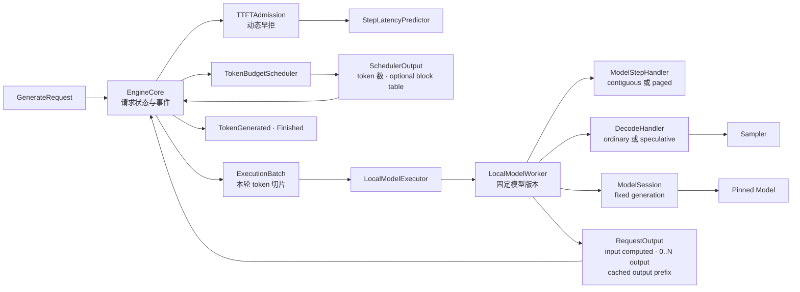
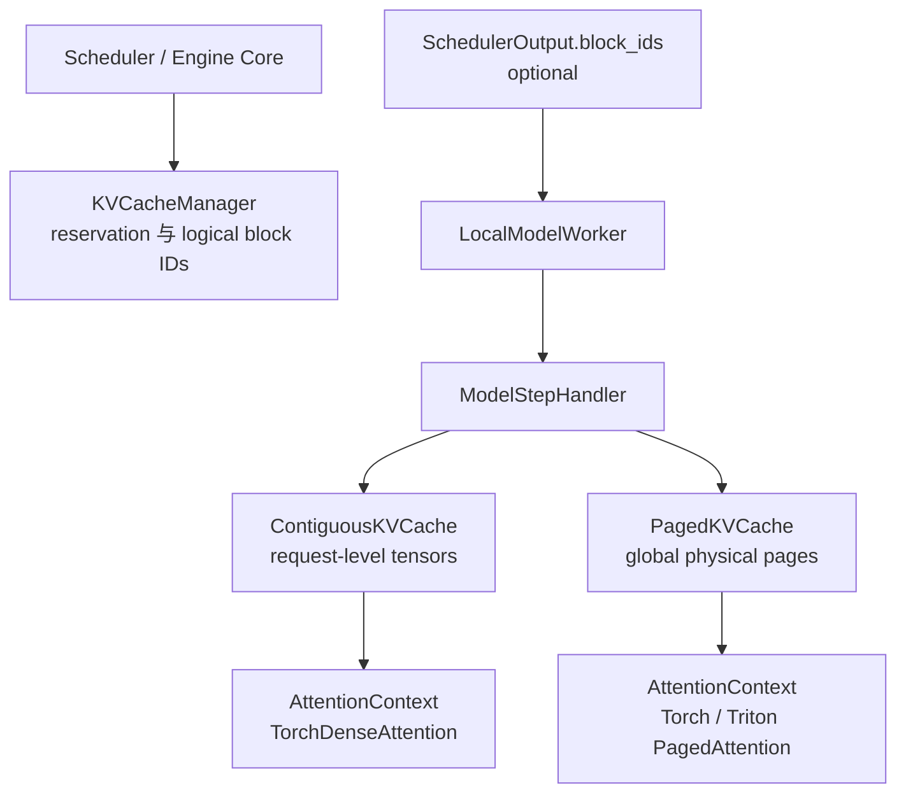
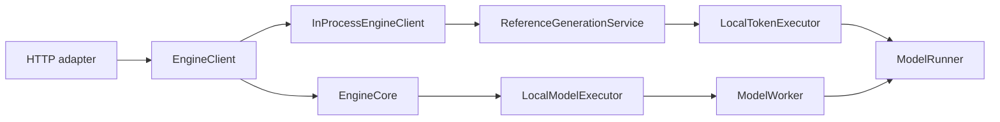

# Architecture

## 一句话原则

> Engine 编排请求，Scheduler 决定谁能算以及算多少，Executor 把可执行批次算出来。

light-vllm 优先采用 vLLM、SGLang 等成熟推理框架已经验证过的职责划分，再按当前规模删减不需要的
复杂度；不为了“架构不同”而重新命名同一个概念。

## 所有权树

```text
light_vllm/
├── modeling/   # 模型、loader、注册表与模型生命周期
├── runtime/    # generation、sampling、KV、scheduler、execution、engine
├── serving/    # HTTP/RPC 等协议 adapter
└── entrypoints/# 具体实现的装配与启动
```

`generation` 描述完整请求和用户可见事件；`execution` 描述一次设备计算；两者语义不同，但都只是
`runtime` 的子领域。KV cache 当前是 `runtime/kv_cache.py` 叶子模块，不创建含义宽泛的 `memory` 领域。

## 核心数据流



这条链不使用 `prefill`、`decode`、`greedy` 或 `KV cache` 专用 Executor：

- prompt 和生成 token 都是“尚未计算的 token”；
- chunked prefill 只是本轮预算不足以覆盖全部 pending token；
- greedy/top-k/top-p 是 Sampler 差异；
- 连续或分页 K/V 是 Step Handler 的物理存储与 attention 后端差异；
- 本地、CUDA、多进程才是合理的 Executor 拓扑差异。

`LocalModelExecutor` 与 `ModelWorker` 看起来薄，是有意保留的两层：Executor 表达 Engine 可替换的执行拓扑，
Worker 表达一个设备 rank 内固定的模型版本与请求生命周期；KV 和 attention 交给 Step Handler。未来多进程或多 rank Executor 可以管理多个 Worker，
不会迫使单机 Worker 契约进入 Engine。

## 模块边界

| 组件 | 负责 | 不负责 |
| --- | --- | --- |
| `EngineCore` | 请求状态、事件、停止条件、迭代与取消 | tensor、调度策略、HTTP |
| `CapacityAdmission` | 根据 capabilities 拒绝空闲引擎也不可能完成的请求 | 排队、公平性、victim preemption |
| `TTFTAdmission` | 根据待处理 token 与 step 延迟预测做动态 SLO 早拒 | Scheduler 排序、性能指标展示 |
| `TokenBudgetScheduler` | 分层队列、并发槽、token budget、逻辑 KV、短请求保护与自回滚 | 模型 forward、采样、事件 |
| `UnboundedKVCacheManager` | 无容量限制的 reservation、提交与回滚基线 | block、K/V tensor |
| `PagedKVCacheManager` | 逻辑 block、prefix 索引、引用计数、LRU 与回滚 | K/V tensor、attention kernel |
| `ModelExecutor` | 执行已可行批次、物理资源租约 | admission、请求队列、HTTP |
| `LocalModelExecutor` | 把执行端口委托给一个本地 Worker | KV 模式、谁能运行、block 分配策略 |
| `LocalModelWorker` | 固定模型版本、请求生命周期、组合 Step 与 Decode Handler | KV 模式分支、调度策略 |
| `ContiguousStepHandler` | 请求级连续 K/V、绝对位置与 dense attention 上下文 | 采样、逻辑 block |
| `PagedStepHandler` | padded batch、绝对位置、物理页池与 block table 消费 | 采样、逻辑 block 分配 |
| `StandardDecodeHandler` | 普通 prefill/单 token decode 的结果转换与采样 | KV 布局、调度 |
| `SpeculativeDecodeHandler` | 草稿树提议、目标验证、路径验收与 KV 压实 | KV 布局、调度 |
| `PagedKVCachePlanner` | 模型加载后把固定页数或空闲显存预算解析为容量 | 请求调度、page ownership |
| `TorchDenseAttention` | 读取连续历史、dense causal attention、暂存本轮 K/V | 模型结构、物理分页 |
| `PagedAttentionBackend` | 为页池和批次事实创建 `AttentionContext` | 模型分发、调度 |
| `TorchPagedAttention` | 原位写 K/V、逐页 causal attention、MHA/GQA correctness | 调度、生产级 kernel 优化 |
| `TritonPagedAttention` | 直接查页表并融合 QK、在线 softmax、PV | 调度、模型结构 |
| `Sampler` | 从 logits 选择 token | 模型 forward、调度、停止条件 |
| `ModelRunner` | 当前模型生命周期和固定 `ModelSession` | 请求调度、具体模型/loader 条件分发 |
| `EngineClient` | serving 到 engine 的异步端口 | HTTP schema、具体运行拓扑 |
| HTTP adapter | JSON/SSE 与 generation 契约转换 | runner、torch、scheduler |

## 统一 token-budget 调度

Scheduler 不返回模式枚举，而是返回事实：

```text
ScheduledRequest
├── request_id
├── num_computed_tokens
├── num_scheduled_tokens
├── num_lookahead_tokens
├── max_output_tokens
├── block_ids: tuple[int, ...] | None
```

假设 prompt 有 5 个 token，本轮总预算为 2：

```text
第 1 轮：computed=0, scheduled=2, max_output=0
第 2 轮：computed=2, scheduled=2, max_output=0
第 3 轮：computed=4, scheduled=1, max_output=1
第 4 轮：computed=5, scheduled=1, max_output=1
```

前三轮自然完成 chunked prefill；第三轮在追上所有已知 token 的 frontier 后允许产生输出。普通执行预算为
`lookahead=0, max_output=1`；投机执行可以预留 lookahead 并允许返回多个输出。Engine 将未缓存输出留作下一轮
pending input。无需在 Engine/Executor 中维护 prefill/decode 状态机，但可由这些事实看出本轮是否位于输出
frontier。

可选短请求策略在首次输出之前保留 token、KV 和 sequence 三类资源；短请求出首 token 后回到通用
round-robin。请求分类使用 prefix 命中后的有效 prompt 长度，并用真实 waiting step aging 防止常规请求饥饿。
默认严格请求在准入时领取 completion claim，不会在后续 decode 中因其他请求占满 KV。

## 执行输入与输出

`SchedulerOutput` 先由 Engine 转成实际 token 切片：

```text
ExecutionRequest
├── request_id
├── input_token_ids
├── context_token_ids
├── num_computed_tokens
├── num_lookahead_tokens
├── max_output_tokens
├── block_ids: tuple[int, ...] | None
└── num_readonly_prefix_blocks
```

Decode Handler 再把正式输入降为具体 model step；普通路径使用线性父链，投机路径追加草稿树：

```text
ModelStepRequest
├── request_id
├── query_token_ids
├── num_computed_tokens
├── num_reserved_query_tokens
├── query_layout: QueryLayout
├── block_ids: tuple[int, ...] | None
└── num_readonly_prefix_blocks
```

`num_reserved_query_tokens` 覆盖正式输入和所有投机槽；未使用槽位不进入 forward。`QueryLayout` 只保存
`O(Q)` 父关系，position、ancestor visibility 和物理 slot 由 Step Handler/backend 推导。

Executor 返回：

```text
RequestOutput
├── request_id
├── num_input_tokens_computed
├── output_token_ids: tuple[int, ...]
└── num_cached_output_tokens
```

`output_token_ids` 可以为空或包含多个值：

- chunked prefill：0 个；
- 普通 decode：1 个；
- 投机验证：一次确认多个，其中连续前缀可能已在本轮写入 KV。

`num_cached_output_tokens` 只描述 `output_token_ids` 的连续前缀，避免为普通 decode、投机接受和 bonus token
增加模式枚举。Engine 对输出逐个应用 EOS 与 `max_new_tokens`，提交“已算输入 + 可见的已缓存输出前缀”；其余
可见输出下一轮作为输入计算。

## KV cache 的双重所有权



当前有两种逻辑 manager：`UnboundedKVCacheManager` 为连续缓存提供无 block、无容量限制的实验基线；
`PagedKVCacheManager` 实现以下逻辑分页管理：

二者只在 composition root 通过 `kv_reservation=unbounded|blocks` 与对应 Step Handler 成对选择：

```text
unbounded → UnboundedKVCacheManager → ContiguousStepHandler
blocks    → PagedKVCacheManager     → PagedStepHandler
```

两种组合都注入同一个 `LocalModelWorker`。Scheduler、Engine、Executor 和 Worker 不按该模式分支。
`unbounded` 仅用于测试和正确性对照，不提供生产
容量保护。

分页组合只创建一个 `PagedKVCachePlanner`：固定页数用于 CPU correctness 和确定性测试；CUDA 模式在模型权重
加载后读取空闲显存，并按 `memory_fraction` 计算预算。每个 block 的字节数只由
`ModelKVCacheSpec × block_size × dtype` 推导。逻辑 manager 与物理 Step Handler 共享同一个 planner，因此不存在两份
`num_blocks`。planner 解析完成后，Executor 通过 capabilities 报告实际 KV token 容量。

1. `reserve(K)` 为本轮最坏情况预留 block；容量不足时该请求不能执行。
2. 模型成功后 `commit(M)`，其中 `M <= K`。
3. 未提交的尾部自动回滚并归还多余 block。
4. 完成、失败或取消时释放请求全部逻辑 block。
5. 交给 Worker 的 block table 精确覆盖已提交 token、本轮 query 和显式 lookahead reservation，不包含未预留尾页。
6. Prefix cache 只复用已经提交的完整 prompt 页；共享页必须在相同逻辑位置且双方都声明只读，可写尾页保持独占。

连续与分页 Step Handler 都根据模型的同一个 `ModelKVCacheSpec` 创建物理缓存；装配层不再重复填写 layer/head 形状。
分页 Step Handler 创建每层 `[block, offset, kv_head, head_size]` tensor。每个 query
token 通过 block table 映射到物理 slot；`TorchPagedAttention` 先原位写入本轮 K/V，再用在线 softmax 逐页读取
有效前缀，不物化完整历史。它是可读性优先的 CPU/PyTorch correctness backend，不是生产级性能 kernel。
可选 `TritonPagedAttention` 复用同一页池和 metadata：先完成 K/V 写入，再在同一 CUDA stream 启动 fused
attention。batch metadata 只在 context 创建时转一次 GPU tensor，不在每个模型层重复创建。

非分页 Step Handler 使用 `block_ids=None` 和请求级连续 tensor，不得伪造 block ID。两条路径共享同一个
`ExecutionBatch → ExecutionOutput` 和模型 forward 契约，因此可以直接做结果对照。

执行前 Engine 取得执行 lease。执行期间取消会立刻删除请求并使其退出后续调度；连续 tensor 延迟到 lease
退出后销毁。分页页池本身是进程级全局资源，其 lease 当前为幂等空操作；真正防止页被过早复用的是
Scheduler 将逻辑 block ID 延迟到该安全边界之后归还。本轮输出因 request ID 已不存在而被丢弃。

## 模型与 attention 后端边界

`ForwardBatch` 的 `input_ids`、`positions` 都是 `[batch, padded_sequence]`；`positions` 是请求内绝对位置，
不能由模型根据 prefill/decode 模式猜测。`sequence_lengths` 标识每行有效 query 长度。

可缓存模型声明 `ModelKVCacheSpec`，每层用稳定 `layer_id` 描述 query heads、KV heads 和 head size。模型的
attention 层只调用 `AttentionContext.forward(layer_id, query, key, value, scale)`，不得自己实现 dense fallback。
reference 与连续 Step Handler 创建 `TorchDenseAttention`；分页 Step Handler 通过
`PagedAttentionBackend.create(cache, metadata)` 创建分页上下文。因此：

- 模型不知道 block size、page layout 或具体 kernel；
- Worker 不按具体模型 architecture 分支；
- PyTorch 与 Triton backend 实现同一个 factory 边界，不修改 Engine、Scheduler 或模型协议；
- 分页 Step Handler 在模型加载成功后初始化物理页池，模型 generation 变化时由 Worker 安全地重建。

当前原生 Qwen2 路径也遵守这条边界：模型层负责 embedding、RMSNorm、RoPE、Q/K/V 投影、输出投影和 MLP；
`AttentionContext` 才负责读取历史 K/V、因果 softmax 和 value 聚合。HF 模型里的 FlashAttention 也是 attention
backend，不是 Qwen 权重本身的一部分；普通 HF FlashAttention 无法直接理解本项目的 block table 和物理页池。
CPU reference/连续 KV 路径通过执行层接入可读的 `TorchDenseAttention`，分页路径让同一个模型接入
`TorchPagedAttention` 或 `TritonPagedAttention`。模型在两种布局和两个分页 backend 下都没有条件分支。

## Qwen 与 checkpoint 来源

`qwen2` 与 `qwen2.5` 注册项指向同一个 Qwen family factory，因为官方 Qwen2.5 checkpoint 仍使用
`model_type: qwen2` 和 `Qwen2ForCausalLM` 权重结构；模型规模完全由快照配置决定，核心路由不按 3B 等尺寸
分支。当前用官方 Qwen2.5-3B-Instruct 配置覆盖 36 层、GQA 和 BF16 目标构造，并继续支持
full-attention、default-RoPE、tied embedding 和分片 safetensors。sliding-window、rope scaling、量化权重
和 tokenizer 尚未实现，遇到这些配置会明确拒绝，不会回退到近似计算。

Hugging Face 和 ModelScope 只负责把模型快照下载到本地。两边常见的 `config.json + model*.safetensors +
model.safetensors.index.json` 目录都交给同一个 `SafetensorsModelLoader`；loader 解析配置、逐分片复制权重并检查
重复、缺失、多余和形状错误。`ModelRunner` 仍然只按 Catalog 解析 `qwen2 + safetensors`，不知道快照来自哪个
网站。Transformers 只作为可选测试 oracle，对照相同权重的 logits，不进入生产执行路径。

## Capabilities、admission 与非抢占策略

容量事实从拥有它的实体向上汇总：模型声明 `max_model_tokens`，Step Handler 通过 Worker 报告
`max_kv_cache_tokens`，Scheduler
报告并发槽和单轮 token budget。`EngineCapabilities.max_request_tokens` 取模型与单请求可用 KV 上限的较小值。
HTTP 通过 `/capabilities` 展示这些事实，不再硬编码 prompt 长度。

`CapacityAdmission` 只拒绝“即使引擎空闲也不可能完成”的请求。可选 `PredictiveTTFTAdmission` 使用
`prompt + waiting pending + running pending` 的全局当前工作量动态早拒：prefill 贡献剩余 prompt，普通 decode
通常贡献当前 1 个 token，不提前展开未来输出预算。延迟表按实际进入模型 forward 的 token 数更新并构造单调包络；
样本不足时 fail-open，超过全局 SLO 时由 HTTP 表达为 429。预测器会改变准入结果，因此是独立控制组件；
`PerformanceObserver` 仍然只读。Engine 在 step 完成后把同一个 `StepObservation` 显式交给二者。

默认路径不挑选第三方 victim。分页请求准入时领取覆盖最大可提交长度的 completion claim，逻辑管理器保持
`used unique blocks + claims <= capacity`。可选 self-resubmit 只让常规请求 best-effort 使用 KV；撞墙者释放自己
的页、保留 Engine 中的可见 token 历史并回到 PREFILL。旧 token 不重复发送，回滚不增加 aging；达到次数或累计
回滚进度阈值后恢复 strict claim，整轮无进展时最早回滚者也走严格恢复。这是 cooperative self rollback，不是
victim preemption。未来重算式或 swap 式第三方抢占仍只能在 Scheduler 边界内落地。

## Sampler

Sampler 是独立策略：

```python
class Sampler(Protocol):
    def sample(self, logits: Tensor) -> tuple[int, ...]: ...
```

`LocalTokenExecutor` 和 `LocalModelExecutor` 都通过组合使用同一个 Sampler。当前 `GreedySampler` 只执行
argmax；以后增加 temperature、top-k 或 top-p 时，不修改 Engine、Scheduler、ModelRunner 或 Executor
接口。

投机解码的 acceptance sampling 与普通 Sampler 是不同职责。`NGramChainProposer` 保留最近命中的线性续写，
`NGramTrieProposer` 将最长重复后缀的所有历史续写按频次、最近位置和 token ID 确定性裁剪为有界 BFS 树。二者只
返回 `DraftTree`，由 `SpeculativeDecodeHandler` 统一构造 `QueryLayout`、执行目标验证、沿命中分支验收，并在返回
`RequestOutput` 前 compact 非连续 KV 路径。候选不足 lookahead 时，剩余预留仍留在 metadata 中，因此 block table
继续严格覆盖最坏情况，不增加模式枚举。

## Reference 与 serving 边界



Reference 路径保留同步、全序列重算和逐 token 语义，用于教学与正确性对照；`LocalTokenExecutor` 为每轮完整
序列创建无历史的 `TorchDenseAttention`。生产演进发生在 Engine Core 路径。两者共享 generation 请求/事件、
ModelRunner 和 Sampler，但不通过兼容 facade 强行共享执行契约。

HTTP 的 JSON、SSE 和状态码留在 adapter；容量上限来自 `EngineClient.capabilities`，而不是 transport 常量。
进程拆分时可以新增 `ProcessEngineClient`，但不得
改变 `EngineClient`、generation 事件或 HTTP adapter。

## 性能观察者与监控控制面

`PerformanceObserver` 是独立角色，不是 Scheduler、Executor 或模型的一部分。Engine 只在状态已经生效后报告：

- 请求成功进入 Scheduler 后开始计时；
- 通过执行结果校验并准备发送的 token 才计入 TTFT、可见 token 间隔和吞吐；
- Executor 在自己的设备边界测量已经完成的 step；CPU 使用单调墙钟，CUDA 使用 event；
- 正常结束、失败和取消各自只记录一次；
- 容量拒绝和 TTFT 过载在请求进入 Scheduler 前分别计数；
- Scheduler/KV 每次状态变化后发布不可变快照。

Scheduler 分开公开两种 token 事实：`pending_tokens` 是当前已知但尚未计算的输入，适合 TTFT 排队估算；
`max_remaining_tokens` 还包含请求声明的最大输出预算，是偏保守的 HPA backlog。Paged KV 使用率按不能立即回收的
block token slot 计算；completion claim、短请求首 token lane、self-resubmit 次数与回滚的已计算进度单独公开；
可淘汰 prefix page 视为可用，无固定上限的连续缓存不输出伪容量。

投机树的 proposed/accepted、root、branching parent、max depth 与 compact 搬运量经独立 `SpeculationObserver`
进入同一快照；旁路首次失败后停用，不影响输出。Prometheus renderer 只依赖 `PerformanceMetricsReader`，
生成 HTTP 路由仍只依赖 `EngineClient`。Grafana 看板和
HPA 位于仓库外控制面：前者查询 histogram/计数，后者经 Prometheus Adapter 读取每 Pod 的
`light_vllm_waiting_max_remaining_tokens`。observer 不执行 I/O 或自动调参；安全组合器会在第三方 observer 首次
失败后停用它，而且不在 Engine 热路径写日志。未来 Guardian 需要单独控制端口和有界安全更新点。

## 模型加载不变量

1. `Catalog` 通过注册表解析 model factory 与 loader。
2. loader 在当前模型外构造、加载、迁移并 `eval()` 候选模型。
3. 候选完整可用后，`ModelRunner` 才在锁内替换引用并递增 generation。
4. 加载失败时当前模型和 generation 不变。
5. `open_session()` 在锁内复制模型引用和 generation，返回对旧模型的强引用；实际模型计算不持有生命周期锁。
6. Reference 请求和 Worker 都在请求开始前固定 session，一个请求绝不跨 generation。
7. 可缓存模型的 KV 规格由 session 中的模型声明；Worker 只能在模型加载完成且无活动请求时初始化或重建 Step Handler。
8. reload 后旧请求继续使用旧 session；Worker 暂停新准入，活动请求清空后才按新 generation 重新初始化。

## 后续演进顺序

1. 增加 Triton 长上下文分段并行与归并，并补充跨显卡性能验收。
2. Scheduler-owned victim preemption。
3. 普通随机 Sampler。
4. 进程/分布式 Worker 与生产级 serving。

任何新能力都应先证明现有事实型契约表达不了，再新增字段或接口；不为未来功能预建空包。
