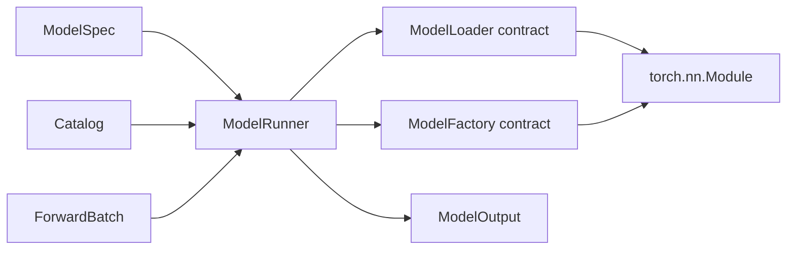

# Architecture

## 一句话原则

稳定的核心只编排契约；变化频繁的能力以组件形式注册。

## 模块边界

| 模块 | 唯一职责 | 不应该知道 |
| --- | --- | --- |
| `Registry` / `Catalog` | 保存名字到组件的映射 | 权重格式、tensor、执行设备 |
| `ModelLoader` | 创建模型并装载权重 | 请求调度、forward 业务 |
| `Model` | 从 `ForwardBatch` 计算 `ModelOutput` | 权重来自哪里、由谁调度 |
| `ModelRunner` | 管理当前模型并执行 forward | 具体模型架构和权重格式 |

## 依赖方向

`ModelRunner` 通过注册表选择组件，不通过模型名、格式名或设备类型的条件树进行选择。

## 热插拔语义

1. 新组件可以在运行时注册到某个 `Catalog` 实例。
2. `ModelRunner.load` 在当前模型之外完整构造候选模型。
3. 候选模型加载成功后，在锁内一次性替换当前引用并递增 generation。
4. 候选加载失败时，当前模型保持不变。

这保证的是进程内组件注册与模型热替换，不承诺首版已经支持无损迁移 KV cache。

## 哪些分支是允许的

完全消灭 `if` 既不现实也没有价值。首版允许两类局部分支：

- 契约校验，例如输入必须是二维 token tensor、state dict 路径不能为空。
- 生命周期状态，例如尚未加载模型时拒绝 forward。

功能分发不使用条件树。新增模型架构、权重格式或后端时，应新增实现并注册，而不是修改
`ModelRunner`。

## 演进顺序

1. **Model path（当前）**：model spec、loader、统一 forward、原子替换。
2. **Request path**：不可变 request/response 契约与 scheduler 接口。
3. **Memory path**：KV cache 接口、block allocator、显存预算。
4. **Execution path**：prefill/decode runner、批处理策略、设备后端。
5. **Serving path**：异步 engine、流式输出、OpenAI-compatible adapter。

每一层都应先建立接口和参考实现，再考虑优化实现；性能优化不能反向污染上层契约。

