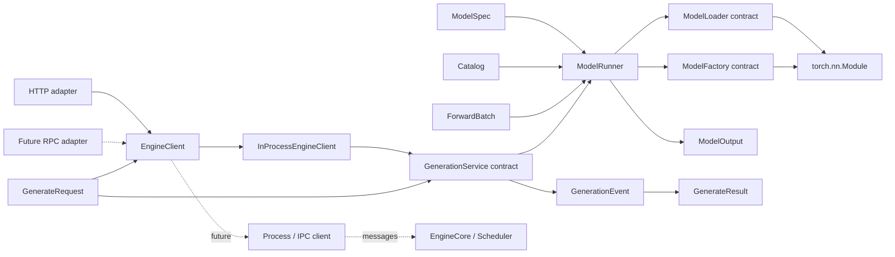
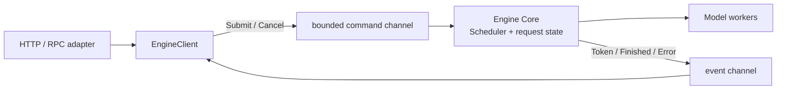
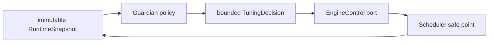

# Architecture

## 一句话原则

稳定的核心只编排契约；变化频繁的能力以组件形式注册。

## 模块边界

| 模块 | 唯一职责 | 不应该知道 |
| --- | --- | --- |
| `Registry` / `Catalog` | 保存名字到组件的映射 | 权重格式、tensor、执行设备 |
| `ModelLoader` | 创建模型并装载权重 | 请求调度、forward 业务 |
| `Model` | 从 `ForwardBatch` 计算 `ModelOutput` | 权重来自哪里、由谁调度 |
| `ModelRunner` | 管理当前模型并执行 forward | 具体模型架构和权重格式 |
| `GenerationService` | 同步 reference 生成与离线 baseline | HTTP、RPC、进程与线程 |
| `EngineClient` | serving 到 engine 的异步端口 | HTTP schema、runner、具体模型 |
| `InProcessEngineClient` | 异步准入、sync-to-async 桥接与取消清理 | scheduling、IPC、生成算法 |
| HTTP adapter | JSON/SSE 与生成契约之间转换 | generation service、runner、torch |
| Composition root | 创建并连接 runtime、service、transport | 生成算法和模型计算细节 |

## 依赖方向

`ModelRunner` 通过注册表选择组件，不通过模型名、格式名或设备类型的条件树进行选择。
HTTP/RPC adapter 通过 `EngineClient` 调用生成，不知道 reference service、runner、进程拓扑和模型实现。

## 热插拔语义

1. 新组件可以在运行时注册到某个 `Catalog` 实例。
2. `ModelRunner.load` 在当前模型之外完整构造候选模型。
3. 候选模型加载成功后，在锁内一次性替换当前引用并递增 generation。
4. 候选加载失败时，当前模型保持不变。

这保证的是进程内组件注册与模型热替换，不承诺首版已经支持无损迁移 KV cache。

## 哪些分支是允许的

完全消灭 `if` 既不现实也没有价值。首版允许两类局部分支：

- 契约校验，例如输入必须是二维 token tensor、state dict 路径不能为空。
- 生命周期状态，例如尚未加载模型时拒绝 forward。

功能分发不使用条件树。新增模型架构、权重格式或后端时，应新增实现并注册，而不是修改
`ModelRunner`。

事件类型和生命周期状态的局部分支也是允许的。例如 adapter 必须区分 token、完成和错误事件，
但这种分支只负责同一协议内的编码，不负责选择模型、loader 或执行后端。

## 生成与传输协议

`GenerationService.stream` 是同步 reference 的唯一生成路径，按顺序产生 `TokenGenerated`，最后产生
一个 `GenerationFinished`。同步 `generate` 只负责收集该流，保留可独立运行、教学和性能对比的
baseline。

`EngineClient.stream` 是 serving 边界上的异步生成路径。当前 `InProcessEngineClient` 逐个拉取同步事件；
异步 `generate` 收集这个异步流。将来 IPC client 可以替换进程内实现，但 adapter 不变。

当前 client 使用异步准入锁串行化完整请求。同步 reference service 仍保留自己的执行锁，以支持独立
离线调用；HTTP 等并发等待者停留在 event loop，不会各自占用 worker thread 等待同步锁。被接纳的
stream 使用专属单线程执行器，因此同步 stream 的创建、逐步推进和关闭具有稳定的线程归属，也不会
依赖 event loop 的共享默认线程池。取消会等待当前同步步骤到达安全边界，再执行关闭，避免
`next()` 与 `close()` 竞态。

HTTP adapter 提供 JSON 与 SSE；未来 gRPC 等 adapter 可以提供 unary 与 server-streaming RPC。
transport 的请求模型、错误码和流格式各自留在 adapter 内。新增协议应新增同级 adapter，并在
composition root 装配，不能向生成服务或 runner 增加协议判断。

当前参考生成器使用独立执行锁串行化完整请求。它与 runner 生命周期锁职责不同，并必须在 iterator
关闭、取消或异常时释放。未来同步 pipeline 实现可以继续满足 `GenerationService` 以便直接对比；
异步 scheduler 则可以实现 `EngineClient` 或位于 process client 之后，不能改变 transport-neutral 数据
契约。

reference HTTP adapter 对输入 prompt 和新增 token 数各设置 4096 的安全上限。这个上限只保护当前
adapter 的基础资源边界，不代表任意模型的 context length；模型相关限制应在未来配置与 admission
边界中表达。

## Engine 与进程边界

当前只有 `InProcessEngineClient`，它建立边界但不建立新进程。增加 Scheduler 后，可以新增
`ProcessEngineClient`，通过 request ID 和不可变消息与 Engine Core 通信：

进程 client 负责 request ID、事件分发、背压、取消和 engine 存活状态；Engine Core 独占 Scheduler、
KV cache 与执行状态。IPC 可以从 `multiprocessing` 演进到 ZMQ，但不得改变 adapter 或 generation 数据
契约。进程拆分应在 Scheduler 建立以后进行，避免当前 reference 纵切提前承担路由、心跳和恢复复杂度。

## Performance Guardian

Guardian 可以加入，但它属于控制面，不属于生成数据面。它不接收 token，也不直接修改 Scheduler、
runner 或 KV cache 内部字段：

Guardian 应拆成三项职责：指标观察、决策策略和受控执行。Engine 仍拥有参数，并在安全点校验和应用
决策。第一版只记录建议（dry-run）；之后才能自动调整有明确上下界、可回滚且不改变请求语义的参数，
例如 batch token budget、并发序列上限或调度等待窗口。模型结构、dtype、KV block size 等需要重建或
迁移状态的配置不能作为普通在线旋钮。

任何自动调优都必须具备参数边界、冷却时间、迟滞、单次变更幅度、审计记录和回滚条件，避免指标噪声
造成振荡。Guardian 依赖 Scheduler 指标和 `EngineControl` 端口，因此实现顺序应晚于 Scheduler 与基础
metrics；当前只固定方向，不增加空接口。

## 演进顺序

1. **Model path（已完成）**：model spec、loader、统一 forward、原子替换。
2. **参考纵切（已完成）**：不可变 generate 契约、greedy event stream、HTTP JSON/SSE adapter。
3. **Request path（下一步）**：scheduler 与执行批次接口。
4. **Memory path**：KV cache 接口、block allocator、显存预算。
5. **Execution path**：prefill/decode runner、批处理策略、设备后端。
6. **Production serving path**：进程 client、异步 engine、取消传播、OpenAI-compatible adapter。
7. **Adaptive control path**：metrics、EngineControl、dry-run Guardian、有界自动调优。

每一层都应先建立接口和参考实现，再考虑优化实现；性能优化不能反向污染上层契约。
