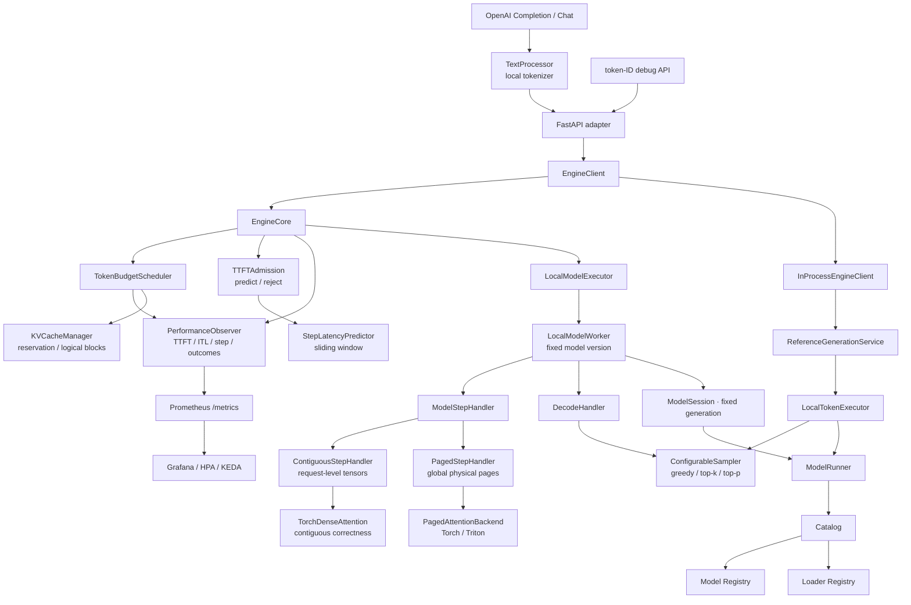
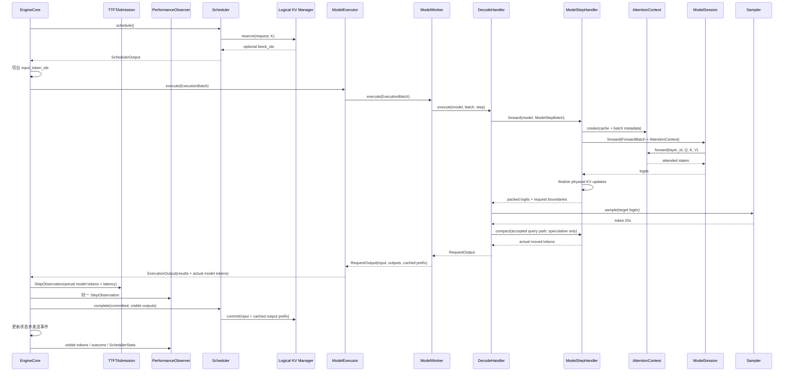

# light-vllm 架构设计（v0.14）

这份文档记录当前已经落地的设计。更细的职责说明见 [architecture.md](architecture.md)。

> **稳定核心只编排事实型契约；策略和后端通过组合接入。**

## 1. 设计目标

| 目标 | 当前落实方式 |
| --- | --- |
| 轻量 | `EngineCore → Scheduler → Executor` 单向调用链 |
| 高可读性 | 请求、调度、执行、采样、模型和协议各有唯一职责 |
| 高扩展性 | 模型/loader 注册；Sampler、Executor 与 attention backend 通过组合替换 |
| 少模式分支 | 不用 prefill/decode/greedy/KV 专用 Executor |
| 成熟实践 | 采用统一 token budget、Scheduler/KV 协作和 Step Handler 物理缓存边界 |
| 可观测 | 独立 PerformanceObserver 记录事实，Prometheus/Grafana 只做控制面消费 |
| SLO 保护 | 短请求资源池与独立 TTFTAdmission 通过组合接入，不污染 Worker 热路径 |

## 2. 包结构

```text
src/light_vllm/
├── modeling/
│   ├── attention/
│   ├── models/
│   ├── loaders/
│   ├── runner.py
│   ├── catalog.py
│   └── registry.py
├── runtime/
│   ├── generation/
│   ├── scheduler/
│   ├── execution/
│   ├── engine/
│   ├── observability/
│   ├── sampling.py
│   └── kv_cache.py
├── serving/
├── entrypoints/
└── bootstrap.py
```

一级包只表示大的所有权边界。`sampling.py`、`kv_cache.py` 目前职责单一，因此保留为叶子文件；只有真实
实现增长到多个清晰组件时才拆目录。

## 3. 当前组件图

可视化索引（均为可直接浏览的单文件 HTML）：

- [当前架构总览](diagrams/light-vllm-current-overview.html)：区分模型加载路径与固定 ModelSession 的执行热路径，不承载 KV 和 attention 细节；
- [KV cache 容量与所有权](diagrams/light-vllm-kv-ownership.html)：从模型 KV 形状、显存预算一直画到逻辑 page ID、物理张量和提交/回收；
- [Paged Attention 地址映射](diagrams/light-vllm-paged-attention-token-path.html)：用具体数字展示绝对位置、block table、物理 slot、K/V 写入和逐页 attention；
- [普通与投机解码的共同执行契约](diagrams/light-vllm-iteration-transaction.html)：区分两种 Decode Handler，并展示 cached prefix 如何提交；
- [Worker 与模型版本生命周期](diagrams/light-vllm-worker-lifecycle.html)：模型重新加载时，旧请求、旧 Step Handler 和新请求之间的边界。

原有 [`light-vllm-overall-architecture.drawio`](assets/light-vllm-overall-architecture.drawio) 及其
[SVG](assets/light-vllm-overall-architecture.svg) / [PNG](assets/light-vllm-overall-architecture.png) 导出继续保留；
它更完整地记录了早期 reference-centered vertical slice，新总览用于反映当前 `EngineCore + Worker + Paged
Attention` 架构，不覆盖旧图。



`UnboundedKVCacheManager` 只维护 reservation/commit 生命周期，不限制容量或产生位置；
`PagedKVCacheManager` 分配固定大小逻辑 block。composition root 同时选择匹配的逻辑 manager 和 Step Handler：

- `unbounded → UnboundedKVCacheManager + ContiguousStepHandler`；
- `blocks → PagedKVCacheManager + PagedStepHandler`。

两种组合共用一个 `LocalModelWorker`。`LocalModelExecutor`、Worker、Scheduler 和 Engine 不包含 KV 模式判断。
Executor 与 Worker 两层会保留：前者表示可替换执行拓扑，后者表示一个设备 rank 内的模型版本和请求生命周期；
未来多进程 Executor 可以管理多个 Worker。
`TorchDenseAttention` 是 reference 与连续缓存共用的 dense correctness backend；`TorchPagedAttention` 直接读取
物理页。可选 `TritonPagedAttention` 复用同一批次事实和物理页池，在一个 kernel 中完成 QK、在线 softmax 与
PV。它们都实现模型看到的 `AttentionContext`，切换 backend 不改变模型、Worker 或 Scheduler 契约。

## 4. 稳定契约

| 契约 | 含义 |
| --- | --- |
| `GenerateRequest` / events | 协议无关的用户生成语义 |
| `SchedulerOutput` | 本轮每请求 computed、scheduled、lookahead、输出预算和可选 block table |
| `ExecutionBatch` | Engine 从请求状态切出的本轮真实 token；只有草稿 proposer 需要时才附带完整 token history 快照 |
| `DraftTree` / `QueryLayout` | 有界候选父链，以及一次 model step 的 query 依赖事实 |
| `ModelStepRequest` / `ModelStepBatch` | Decode Handler 已确定的 query、reservation、布局、block table 和待消费 logits 行 |
| `ModelStepOutput` | 连续的已请求 logits，以及允许空切片的请求边界 |
| `ExecutionOutput` | 每轮请求结果、实际进入模型 forward 的 token 数和可选设备耗时 |
| `RequestOutput` | 每请求完成的输入计算量、零到多个确认输出与已缓存输出前缀 |
| `ModelExecutor` | 执行已可行批次并管理执行期物理资源 |
| `ModelWorker` | 一个设备 rank 内固定模型版本并编排请求生命周期 |
| `ModelStepHandler` | 准备模型输入，管理物理 KV，并返回连续有效 logits 与请求边界 |
| `DecodeHandler` | 组织普通或投机解码，把 logits 转为确认 token |
| `SamplingParams` / `SamplingMetadata` | 不可变逐请求采样参数，以及与动态 batching 顺序无关的输出位置事实 |
| `Sampler` | 从二维 `[batch, vocabulary]` logits 按逐请求元数据选择 token |
| `ForwardBatch` / `ModelOutput` | 一维 token 流、请求边界、绝对 position、attention 上下文与对应 logits 的统一模型边界 |
| `ModelKVCacheSpec` | 模型声明的逐 attention 层 K/V 形状 |
| `AttentionContext` | 模型调用连续或分页 attention 后端的稳定边界 |
| `EngineCapabilities` | 初始化后可发现的模型、KV、并发和单轮容量事实 |
| `EngineClient` | serving 使用的异步生成端口和 capabilities 查询 |
| `TextProcessor` / `IncrementalTextDecoder` | serving 内的文本编码、chat template 和 Unicode 安全增量解码端口 |
| `SchedulerStats` / `KVCacheStats` | 队列、token backlog 与 KV 容量的一次性不可变事实 |
| `ShortRequestPolicy` / `SelfResubmitPolicy` | 可选调度策略配置，不进入 Engine、Worker 或协议契约 |
| `StepLatencyPredictor` / `TTFTAdmission` | 用已完成 step 更新的独立延迟预测与动态准入控制端口 |
| `PerformanceObserver` | Engine 生命周期事实的轻量接收端，不执行 I/O 或控制运行时 |
| `SpeculationObserver` | 成功树验证的候选、命中、验证产出、深度和 KV 搬运事实旁路 |
| `PerformanceMetricsReader` | Prometheus、日志等控制面读取不可变性能快照的端口 |

`SchedulerOutput` 和 `RequestOutput` 是扩展的关键：前者不包含模式名，后者不限制一次只能输出一个 token，
并明确哪些输出已经写入 KV。chunked prefill、普通 decode 和投机验证因此共用同一循环。Decode Handler 还精确
声明本轮会消费哪些 query 行的 logits：普通生成只选择每个请求最后一个有效输入，纯 prefill 选择空集，投机验证
选择正式输入最后一行和全部草稿节点。模型在 vocabulary head 前收窄 hidden states，避免先对无用 query 行
投影再由 Worker 丢弃。Step Handler 不把连续结果拆成请求 tensor；普通 Decode Handler 直接对这块矩阵采样，
投机 Decode Handler 才按 `ModelStepOutput.logits_start_loc` 取各请求的验证切片。

原生 Qwen family 模型也使用这组契约：`qwen2` 与 `qwen2.5` 注册名指向同一个 factory，官方 Qwen2.5
checkpoint 仍声明 `model_type: qwen2`，3B 等模型尺寸只来自 `config.json`，不会进入 runner 的分发逻辑。
Qwen 层只生成带 RoPE 的 Q/K/V 并调用 `AttentionContext`，不再保留模型内 dense fallback。上下文完成 KV
读写、softmax 和 value 聚合。HF/ModelScope 兼容快照统一由 `SafetensorsModelLoader` 读取；来源差异不会
扩散到模型、Worker 或 Engine。权重、device、dtype 与 `eval()` 全部就绪后，loader 可以调用模型拥有的
`prepare_for_inference()` hook；Qwen 用它打包 QKV/Gate-Up 权重并预计算 RoPE table，Runner 仍只接收已经完整
构造的候选模型。当前支持 full attention 和 default RoPE，未实现配置在加载时直接报错。

## 5. 一次迭代



Engine 每次只允许一个 `PreparedStep` 在模型侧执行。它在锁内完成 schedule、构造不可变 `ExecutionBatch` 并取得
lease。默认路径由 Engine 私有的 `ExecutionLane` 交给同一个常驻线程执行；独立 Engine 进程则在自己的事件循环
内协作式执行同步 Executor，避免每个 token 的跨线程提交开销。协作式路径在提交上一轮结果前推进已经到达的 IPC
控制任务，并在下一步模型执行前推进已经发布的请求事件；检查点不等待墙钟，只给 ready task 公平执行机会。
设备越过安全边界并释放 lease 后，Engine 仍在一个锁区内提交上一轮 `CompletedStep`、应用可见 token 并准备
下一轮。两条执行路径都只传递批次和结果，不拥有请求或 KV 状态。这个单在途状态机让取消与 KV 所有权保持明确，
并把相邻轮次的 finish、apply、schedule 和 Scheduler 快照收敛成一次原子状态推进。

执行失败时 Engine 移除本轮请求。连续 Step Handler 的请求级 tensor 由 lease 延迟销毁；分页页池是进程级全局
资源，执行中的请求取消时由 Scheduler 把 block ID 延迟到安全边界后归还，防止物理页被过早复用。
不会出现逻辑状态已经前进但模型 K/V 没有成功写入的半提交状态。

## 6. KV reserve / commit / rollback

无 block 基线使用 `UnboundedKVCacheManager`，其 reservation 返回 `block_ids=None`，执行成功后仍按同一
commit 语义推进 token 计数。逻辑分页实现使用固定 `block_size`：

```text
committed=1, reserve=4, block_size=2
需要覆盖 5 token → 临时持有 3 blocks

若只 commit=2：
committed 变为 3 → 只需 2 blocks → 自动释放尾部 1 block
```

当前普通执行完整提交本轮输入，输出 token 留到下一轮计算。投机验证可额外提交已经写入 KV 的确认输出前缀；
bonus token 等未缓存输出仍是下一轮 pending input。取消或失败使用 `remove()` 释放整个请求，无需另外维护
rollback API。

默认非抢占路径在请求准入时领取 completion claim。逻辑管理器始终保持
`已占用唯一页 + 未兑现 claim <= 总页数`；`reserve()` 把 claim 转成真实 block，部分提交则把不再使用的尾页
还原为 claim。因此一个已经严格接纳的请求不会在 decode 中途因其他请求占满 KV。开启 self-resubmit 后，只有
常规请求使用乐观准入：原子领取覆盖 `prompt + 1 block` 的初始 claim，同时为已经 running 的 decode 保留全局
10% KV。该水位只限制新请求准入；running 请求仍可消耗这部分余量。它用完初始 claim 后按实时容量继续申请页，
真正撞墙时释放自己的 KV 并重新排队。短请求和触发 fallback 的请求仍使用严格 claim。

分页 Step Handler 持有每层 `[block, offset, kv_head, head_size]` 的全局 K/V tensor。它把请求逻辑位置映射为
`block_id * block_size + offset`，原位写入本轮 K/V，并按 block table 逐页完成 causal attention。不同长度
请求会组成一维 token-major forward batch；`query_start_loc` 保存各请求的首尾边界，`positions` 始终保存请求内
绝对位置。Step Handler 在 H2D 前按模型上限验证这些 CPU 语义位置，并用显式标记告诉模型无需在 CUDA 热路径
重复检查；直接构造 `ForwardBatch` 的其他调用者仍走完整校验。Q/K/V、hidden states 与 slot mapping 都只包含
真实 token，不为 mixed prefill/decode 补齐宽度。
连续与分页 Step Handler 都从模型唯一的 `ModelKVCacheSpec` 获取逐层 KV 形状，装配层不再重复配置层数、KV head 或
head size。`QueryLayout` 将每个 query 的语义位置与物理 slot 分开：兄弟节点可以有相同 RoPE position，但只能读取
已提交前缀、祖先和自身，并写入不同 slot。验收路径不是展平前缀时，Step Handler 先 gather/clone/scatter 压实 KV，
再向 Engine 返回结果。模型只调用 `AttentionContext`，不依赖具体 page layout。block table 必须精确覆盖当前有效前缀、
query 与显式 lookahead reservation，不携带未预留尾页。可选 prefix cache 只索引已经提交的完整 prompt 页；
哈希链保留父摘要和本页精确 token，零引用页进入 LRU。跨请求只允许在相同逻辑位置共享双方都声明为只读的前缀页，
query 与未填满尾页始终独占。命中时至少留一个 token 重新计算 logits；prompt 恰好整页时会重算最后一整页。

Triton backend 在 context 创建时把 block table、已计算长度、query 边界和 token 到请求的映射合并到 pinned staging，
一次异步传入 GPU 后供所有模型层复用。普通线性 query 的可见性由 `key_query_offset <= query_offset` 直接表达，不构造 visibility；
非线性草稿树把每个请求的方阵连续拼接成紧凑一维 visibility，不产生跨请求 padding。
本轮 K/V 由一个 Triton program 同时写入 K 和 V，再在同一 CUDA stream 启动 fused attention；两步不放进同一个
grid，避免 prefill 的某个 query program 读取到另一个 program 尚未写完的 K/V。常见 GQA 形状改由一个 program
为同一 KV head 下的整组 query heads 复用一次 K/V 读取；不支持的形状仍回退到逐 query head kernel。两条路径都
只覆盖真实 token、直接按逻辑位置查页表，并用 FP32 累计在线 softmax。长上下文的分段并行与归并留给后续优化。

连续 Step Handler 为每个请求创建 `TorchDenseAttention`。它读取请求级连续历史，在模型逐层调用时完成 dense
attention 并暂存本轮 K/V；只有模型 forward 和输出校验全部成功，Handler 才把所有层一次性追加到
`ContiguousKVCache`。因此模型不返回 K/V，连续路径仍保持跨层原子更新。

## 7. ModelSession、容量规划与非抢占调度

`ModelRunner.open_session()` 在短临界区内复制当前模型引用和 generation。Reference 请求在生成开始时打开一次
session；`LocalModelWorker` 初始化时也固定一次 session。reload 只替换 Runner 的当前模型，旧 session 仍强引用旧模型，
所以活动请求不会跨 generation。Worker 此时对新请求报告 not-ready；活动请求结束后才能按新 generation 重建
物理 KV。

分页组合只创建一个容量策略对象：固定 `num_blocks` 用于 CPU correctness 和确定性测试；CUDA 策略在模型权重
已加载后读取空闲显存，按 `memory_fraction` 形成预算，再使用唯一的 `ModelKVCacheSpec`、`block_size` 和 dtype
计算实际页数。逻辑 `PagedKVCacheManager` 与物理 `PagedStepHandler` 共享这个对象，容量不会漂移。

`EngineCapabilities` 汇总模型最大 token、KV token 容量、并发序列数与单轮 token budget。HTTP 的
`/capabilities` 只展示这些事实，不维护固定 prompt 上限。`CapacityAdmission` 只拒绝空闲引擎也永远无法满足的
请求；瞬时容量、排队和公平性归 Scheduler。服务入口的默认单轮 token budget 为 2048，减少长 prompt 被过度
切碎；模型或显存较小时仍可显式调低，Scheduler 的 chunked-prefill 语义不变。

默认调度是严格非抢占：已接纳请求不会被第三方挑作 victim。可选 `ShortRequestPolicy` 把首次可见 token 之前的
资源拆成通用池与短请求预留池，同时保留 scheduled-token、KV token slot 和 sequence 三个维度。短请求用 prefix
命中后的有效 prompt 长度和最大总长度分类；首 token 产生后回到通用 round-robin。`running` 数永远不超过
`max_num_sequences`，短请求 completion claim 也只随实际准入 slot 发放，不能批量锁死 KV。等待达到
`regular_aging_steps` 的常规请求可借用短请求 KV 水位，避免持续短流量造成饥饿。

可选 `SelfResubmitPolicy` 用较小初始 claim 降低最大输出长度高估造成的容量浪费。默认初始承诺为
`prompt_len + block_size`，按页向上取整；新乐观请求的 `used + completion claims + initial claims` 最多到全局
容量的 90%，留下 10% 给已运行请求继续 decode。这里没有进展锚点，也没有按请求反复刷新的 rolling 10%。
初始 claim 消耗后，请求使用实时空闲页；申请新页失败才回滚自己。

可选 `PredictiveTTFTAdmission` 在请求进入队列前估算
`prompt_len + waiting_pending_tokens + running_pending_tokens` 的全局当前工作量。prefill 贡献剩余 prompt，普通
decode 通常贡献当前 1 个 token，未来输出预算不提前展开；预测器按实际进入模型 forward 的 token 数保存真实
step 延迟滑窗。每个桶默认取 p90，并构造随 token 规模不下降的包络；在已知桶之间插值，对更大负载按比例
外推，默认累计 100 个 step 后才启用预测，样本不足时 fail-open。pending 请求上限和 KV 水位是预测之前的独立
门控，冷启动时仍生效；请求可以用自己的 TTFT SLO 覆盖全局值。任一动态门控拒绝时 HTTP 返回可重试的 429，
确定性容量拒绝仍是 422。预测器是会反向影响准入的控制组件，不能塞进只读
`PerformanceObserver`；Engine 把同一个 `StepObservation` 显式喂给两者。

`SelfResubmitPolicy` 默认关闭且只支持分页 KV，并强制开启 prefix cache。开启后，乐观请求撞到实时容量边界时
只释放自己的 KV，保留
Engine 中已经可见的完整 token 历史，回到 PREFILL 重算；它不会回滚或打断第三方，因此不是 victim preemption。
重算阶段不重复发出旧 token，也不会凭空获得 aging。达到回滚次数或累计回滚进度阈值后，下一次准入强制领取
completion claim；若一整轮候选都撞墙，最早回滚者也会进入这个严格恢复路径。这样可实验较高 KV 利用率，同时
仍有有界的活锁逃生口。prefix cache 会找回已提交的完整 prompt 页；生成阶段 KV 仍需重算。

## 8. Sampler

`Sampler` 已从本地 Executor 中抽离。composition root 为 reference 与普通 Engine 路径装配同一个
`ConfigurableSampler`：

```python
sampler = ConfigurableSampler()
reference_executor = LocalTokenExecutor(runner, sampler)
step_factory = partial(
    PagedStepHandler,
    cache_planner=paged_cache_planner,
    attention_backend=paged_attention_backend,
)
worker = LocalModelWorker(runner, step_factory, StandardDecodeHandler(sampler))
model_executor = LocalModelExecutor(worker)
```

`SamplingParams` 表达 temperature、top-k、top-p 和可选 seed；`temperature=0` 始终走 greedy。Engine 只为未指定
seed 的随机请求生成一次私有 seed，之后每轮把同一组参数和当前输出位置作为 `SamplingMetadata` 传给 Sampler；
greedy 请求保持原参数，不生成 seed。因此同一随机请求的序列不受并发请求进入、退出或批次行顺序影响，取消、异常
和结束也无需在 Sampler 内维护可泄漏的可变状态。v0.2 明确拒绝“随机 sampling + speculative decoding”的组合。

投机解码的 acceptance sampler 不等同于普通 Sampler：
`NGramChainProposer` 和 `NGramTrieProposer` 都返回 `DraftTree`，通用 `SpeculativeDecodeHandler` 将正式输入和草稿
降为 `QueryLayout`，交给目标模型一次验证。`GreedyTreeAcceptanceSampler` 沿目标 token 命中的唯一分支前进；第一次
不命中时返回已接受路径和目标 token，命中叶子时再返回 bonus token。Handler 在返回前 compact 非连续路径，
Scheduler 只提交真实接受的草稿节点。

## 9. Reference 与 Engine Core

Reference 是同步、无调度、每轮全序列重算的语义基线；`InProcessEngineClient` 仅把它适配到异步端口。

OpenAI adapter 只依赖 `EngineClient` 和 serving 自己的 `TextProcessor`。本地 Hugging Face tokenizer 负责普通 prompt、
`apply_chat_template(add_generation_prompt=True)`、EOS 和增量解码；模型目录只以 `local_files_only=True`、
`trust_remote_code=False` 打开。Completion 不套 chat template，Chat 首版只接受 system/user/assistant 字符串消息。
流式与非流式响应共用同一条 Engine event stream、增量 decoder 和 stop matcher；stop、超时和客户端取消最终都关闭
Engine stream，沿已有安全取消边界释放 Scheduler、KV 和 Worker 资源。usage 的 completion token 包含为了识别 stop
已经计算但未返回的 token。OpenAI schema、SSE、错误对象和状态码都不进入 `GenerateRequest` 或 Engine。

Engine Core 是后续性能能力唯一继续生长的路径。旧的 `FullSequenceBatchEngine`、`KVCacheBatchEngine`、
`GreedyFullSequenceBatchExecutor`、`GreedyContiguousKVCacheExecutor` 和 `KVCacheBatchTokenExecutor` 已删除，
不保留兼容 alias。

## 10. 性能观测

观测只建立在已经生效的事实上：请求成功加入 Executor 和 Scheduler 后开始计时；输出通过校验并成为可见
token 时记录 TTFT/可见 token 间隔；请求完成、失败或取消时记录结果。Scheduler 分开提供已知 pending 输入和
包含最大输出预算的保守 backlog；Executor 报告按实际模型 token 桶聚合的已完成 step 延迟。Qwen2、Qwen2.5、
投机解码和普通解码复用同一路径。

控制面还公开短请求首 token lane 当前请求数、KV completion/initial claim、self-resubmit 次数与回滚的已计算进度，
并通过独立 `SpeculationObserver` 记录尝试/命中节点、验证产出 token、草稿根、真实分支父节点、最大深度和 compact
搬运量；`verified_tokens_total / attempts_total` 表达每次 target verification 的平均产出长度；
确定性 `rejected` 和动态 `overloaded` 与已经启动后的 finished/failed/cancelled 分开计数。这样可以同时验证
短请求保护是否生效、best-effort 是否产生过多重算，以及 TTFT 429 是否需要调参。

`InMemoryPerformanceObserver` 是专门的性能观察角色，只做短临界区计数。它不能调整 Scheduler 参数，也不执行
网络或文件 I/O；`SafeCompositePerformanceObserver` 会停用首次失败的旁路实现，指标故障不能泄漏请求、同步刷屏
或改变生成结果。
`serving/prometheus.py` 把快照转换成标准文本；Grafana 直接消费 Prometheus，HPA 可以通过
Prometheus Adapter 消费 `light_vllm_waiting_max_remaining_tokens`，KEDA 也可以直接查询同一指标并管理 HPA。
这些路径互相替换，不能同时控制同一个 Deployment。未来性能 Guardian 必须通过单独的有界控制端口工作，
不能把策略塞进 observer 或 token 热路径。

## 11. 代码映射

| 角色 | 文件 |
| --- | --- |
| Attention 契约 | `src/light_vllm/modeling/attention/interfaces.py` |
| 模型契约 | `src/light_vllm/modeling/models/interfaces.py` |
| loader 契约 | `src/light_vllm/modeling/loaders/interfaces.py` |
| safetensors 快照 | `src/light_vllm/modeling/loaders/safetensors.py` |
| Qwen2 模型 | `src/light_vllm/modeling/models/qwen2.py` |
| 模型生命周期 | `src/light_vllm/modeling/runner.py` |
| 生成契约 | `src/light_vllm/runtime/generation/interfaces.py` |
| reference 生成 | `src/light_vllm/runtime/generation/reference.py` |
| 采样 | `src/light_vllm/runtime/sampling.py` |
| 逻辑 KV / 连续物理基线 | `src/light_vllm/runtime/kv_cache.py` |
| 调度契约 | `src/light_vllm/runtime/scheduler/interfaces.py` |
| 分层 token-budget 调度 | `src/light_vllm/runtime/scheduler/token_budget.py` |
| 执行契约 | `src/light_vllm/runtime/execution/interfaces.py` |
| query 布局推导 | `src/light_vllm/runtime/execution/layout.py` |
| chain/trie 树形投机解码 | `src/light_vllm/runtime/execution/speculative.py` |
| 本地 Executor | `src/light_vllm/runtime/execution/local.py` |
| 执行 step 计时 | `src/light_vllm/runtime/execution/timing.py` |
| 本地 Worker | `src/light_vllm/runtime/execution/worker.py` |
| Dense Attention | `src/light_vllm/runtime/execution/dense_attention.py` |
| 物理分页 KV | `src/light_vllm/runtime/execution/paged_cache.py` |
| Paged Attention | `src/light_vllm/runtime/execution/paged_attention.py` |
| Triton Paged Attention | `src/light_vllm/runtime/execution/triton_paged_attention.py` |
| Engine Core | `src/light_vllm/runtime/engine/core.py` |
| 容量与 TTFT admission | `src/light_vllm/runtime/engine/admission.py` |
| EngineClient | `src/light_vllm/runtime/engine/interfaces.py` |
| 性能观察契约 | `src/light_vllm/runtime/observability/interfaces.py` |
| 进程内性能聚合 | `src/light_vllm/runtime/observability/performance.py` |
| 性能观察者隔离 | `src/light_vllm/runtime/observability/dispatch.py` |
| HTTP adapter | `src/light_vllm/serving/http.py` |
| 文本处理契约 | `src/light_vllm/serving/interfaces.py` |
| 本地 tokenizer | `src/light_vllm/serving/text.py` |
| stream 生命周期 | `src/light_vllm/serving/streams.py` |
| OpenAI adapter | `src/light_vllm/serving/openai.py` |
| Prometheus adapter | `src/light_vllm/serving/prometheus.py` |
| 装配入口 | `src/light_vllm/entrypoints/http.py` |

## 12. 当前完成度

```mermaid
flowchart LR
    Model["Model path<br/>完成"] --> Serving["Reference serving<br/>完成"]
    Serving --> Core["Token-budget Engine Core<br/>完成"]
    Core --> Logical["逻辑 block reserve/commit/rollback<br/>完成"]
    Logical --> Sampling["逐请求 greedy / top-k / top-p<br/>完成"]
    Sampling --> Paged["物理 Paged Attention<br/>PyTorch correctness 完成"]
    Paged --> Capacity["capacity discovery + admission<br/>完成"]
    Capacity --> Prefix["Prefix cache<br/>完成"]
    Prefix --> Spec["Tree speculative decoding<br/>CPU 正确性完成"]
    Spec --> Kernel["Packed Triton tree mask<br/>代码/测试完成 · GPU 待验收"]
    Kernel --> Metrics["性能指标 + Prometheus/Grafana/HPA<br/>完成"]
    Metrics --> SLO["短请求池 + TTFT 早拒 + 可选 self-resubmit<br/>完成"]
    SLO --> OpenAI["本地 tokenizer + OpenAI Completion / Chat<br/>CPU/E2E 测试完成"]
```



当前“完成”指契约、CPU 参考实现和行为测试完成，不代表已经具有生产吞吐。Triton backend 已在 RTX 5090、
Torch 2.8.0、Triton 3.4.0 环境完成既有线性场景的 JIT 和数值对照；packed tree visibility kernel 测试已经
加入，但仍需 CUDA 环境验收。长上下文性能、跨显卡和 chain/trie 端到端收益也仍是后续工作。

## 13. 验证要求

提交前至少运行：

```powershell
.\.venv\Scripts\python.exe -m pytest
.\.venv\Scripts\ruff.exe check .
.\.venv\Scripts\ruff.exe format --check .
git diff --check
```

测试必须覆盖固定 ModelSession、token budget、chunked prefill、多 token 与已缓存输出前缀、容量规划与 admission、
prefix 命中/LRU/epoch、草稿树约束/兄弟隔离/非连续路径验收/compact、无候选退化、逻辑 block 回滚、
非连续物理页、block table
别名拒绝、跨页 prefill/decode、GQA、Sampler 替换、逐请求固定 seed 与 batch 交错、tokenizer/chat template、
Unicode 增量解码、跨 chunk stop、OpenAI SDK、流式/非流式一致性、usage、超时取消、标准错误码、
短请求 token/KV/sequence 预留与 aging、TTFT 预测/冷启动/429、
self-resubmit 的 prompt+1 block/global watermark、不重复输出/严格 fallback/资源归还、TTFT/ITL、step 延迟、
两种 token backlog、KV 使用率、执行失败和
取消资源释放。核心 CPU 测试不得依赖可选 GPU 环境。
Triton 数值测试在没有 CUDA 或 Triton 时自动跳过；GPU 环境需覆盖 FP16/BF16、packed mixed GQA、decode 历史、
共享 prefix、未使用 lookahead 和 packed mixed tree visibility。

边界命名与职责参考 [vLLM Architecture Overview](https://docs.vllm.ai/en/latest/design/arch_overview/)；分页布局与
按需读取原则参考 [PagedAttention 论文](https://arxiv.org/abs/2309.06180)。完整页哈希与 LRU 参考
[vLLM Automatic Prefix Caching](https://docs.vllm.ai/en/latest/design/prefix_caching/)，简单候选策略参考
[vLLM N-Gram Speculation](https://docs.vllm.ai/en/latest/features/speculative_decoding/n_gram/) 和
[SGLang Speculative Decoding](https://github.com/sgl-project/sglang/blob/main/docs_new/docs/advanced_features/speculative_decoding.mdx)。
Triton kernel 的在线 softmax 组织参考
[官方 fused attention 教程](https://triton-lang.org/main/getting-started/tutorials/06-fused-attention.html)。本项目保留
这些成熟边界，但优先选择容易检查和扩展的实现，再逐步增加并行优化。
