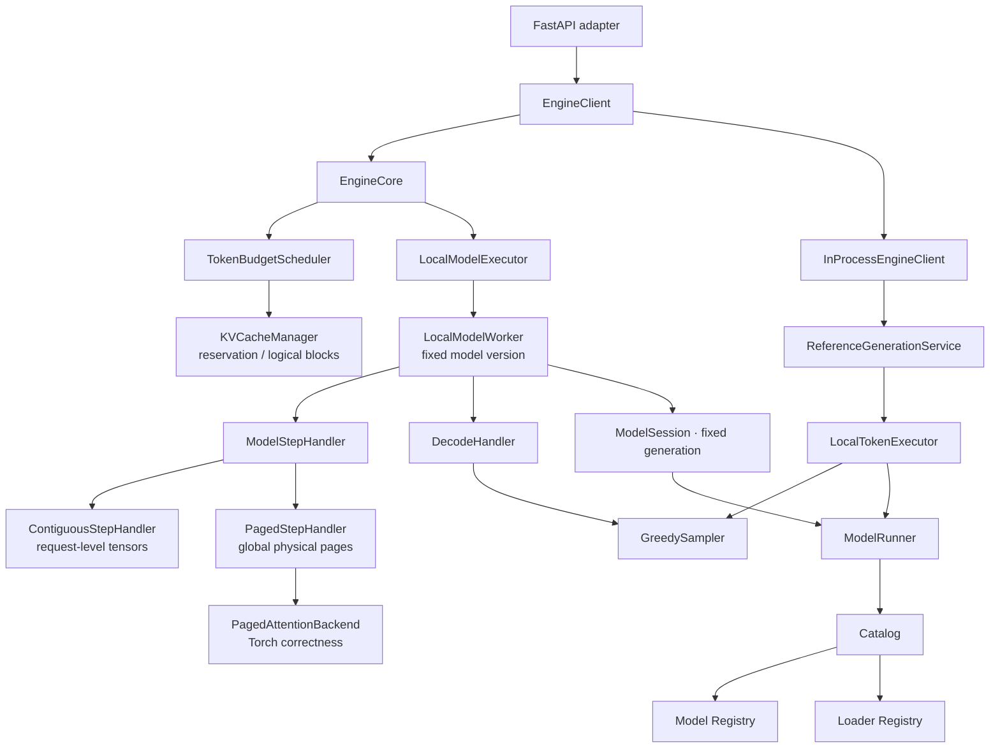
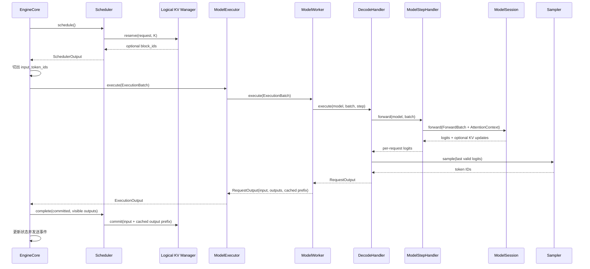

# light-vllm 架构设计（v0.9）

这份文档记录当前已经落地的设计。更细的职责说明见 [architecture.md](architecture.md)。

> **稳定核心只编排事实型契约；策略和后端通过组合接入。**

## 1. 设计目标

| 目标 | 当前落实方式 |
| --- | --- |
| 轻量 | `EngineCore → Scheduler → Executor` 单向调用链 |
| 高可读性 | 请求、调度、执行、采样、模型和协议各有唯一职责 |
| 高扩展性 | 模型/loader 注册；Sampler、Executor 与 attention backend 通过组合替换 |
| 少模式分支 | 不用 prefill/decode/greedy/KV 专用 Executor |
| 成熟实践 | 采用统一 token budget、Scheduler/KV 协作和 Step Handler 物理缓存边界 |

## 2. 包结构

```text
src/light_vllm/
├── modeling/
│   ├── attention/
│   ├── models/
│   ├── loaders/
│   ├── runner.py
│   ├── catalog.py
│   └── registry.py
├── runtime/
│   ├── generation/
│   ├── scheduler/
│   ├── execution/
│   ├── engine/
│   ├── sampling.py
│   └── kv_cache.py
├── serving/
├── entrypoints/
└── bootstrap.py
```

一级包只表示大的所有权边界。`sampling.py`、`kv_cache.py` 目前职责单一，因此保留为叶子文件；只有真实
实现增长到多个清晰组件时才拆目录。

## 3. 当前组件图

可视化索引（均为可直接浏览的单文件 HTML）：

- [当前架构总览](diagrams/light-vllm-current-overview.html)：保留整体组件和调用方向，不承载细节；
- [KV cache 容量与所有权](diagrams/light-vllm-kv-ownership.html)：从模型 KV 形状、显存预算一直画到逻辑 page ID、物理张量和提交/回收；
- [Paged Attention 地址映射](diagrams/light-vllm-paged-attention-token-path.html)：用具体数字展示绝对位置、block table、物理 slot、K/V 写入和逐页 attention；
- [普通与投机解码的共同执行契约](diagrams/light-vllm-iteration-transaction.html)：区分当前普通 Decode Handler 和未来投机 Decode Handler，并展示 cached prefix 如何提交；
- [Worker 与模型版本生命周期](diagrams/light-vllm-worker-lifecycle.html)：模型重新加载时，旧请求、旧 Step Handler 和新请求之间的边界。

原有 [`light-vllm-overall-architecture.drawio`](assets/light-vllm-overall-architecture.drawio) 及其
[SVG](assets/light-vllm-overall-architecture.svg) / [PNG](assets/light-vllm-overall-architecture.png) 导出继续保留；
它更完整地记录了早期 reference-centered vertical slice，新总览用于反映当前 `EngineCore + Worker + Paged
Attention` 架构，不覆盖旧图。



`UnboundedKVCacheManager` 只维护 reservation/commit 生命周期，不限制容量或产生位置；
`PagedKVCacheManager` 分配固定大小逻辑 block。composition root 同时选择匹配的逻辑 manager 和 Step Handler：

- `unbounded → UnboundedKVCacheManager + ContiguousStepHandler`；
- `blocks → PagedKVCacheManager + PagedStepHandler`。

两种组合共用一个 `LocalModelWorker`。`LocalModelExecutor`、Worker、Scheduler 和 Engine 不包含 KV 模式判断。
Executor 与 Worker 两层会保留：前者表示可替换执行拓扑，后者表示一个设备 rank 内的模型版本和请求生命周期；
未来多进程 Executor 可以管理多个 Worker。
当前 `TorchPagedAttention` 是直接读取物理页的 PyTorch correctness backend；生产级 CUDA/Triton kernel 可以
实现同一 `PagedAttentionBackend → AttentionContext` 契约。

## 4. 稳定契约

| 契约 | 含义 |
| --- | --- |
| `GenerateRequest` / events | 协议无关的用户生成语义 |
| `SchedulerOutput` | 本轮每请求 computed、scheduled、lookahead、输出预算和可选 block table |
| `ExecutionBatch` | Engine 从请求状态切出的本轮真实 token |
| `RequestOutput` | 每请求完成的输入计算量、零到多个确认输出与已缓存输出前缀 |
| `ModelExecutor` | 执行已可行批次并管理执行期物理资源 |
| `ModelWorker` | 一个设备 rank 内固定模型版本并编排请求生命周期 |
| `ModelStepHandler` | 准备模型输入，管理物理 KV，并返回每请求有效 logits |
| `DecodeHandler` | 组织普通或投机解码，把 logits 转为确认 token |
| `Sampler` | 从二维 `[batch, vocabulary]` logits 选择 token |
| `ForwardBatch` / `ModelOutput` | token、绝对 position 与模型输出的统一张量边界 |
| `ModelKVCacheSpec` | 模型声明的逐 attention 层 K/V 形状 |
| `AttentionContext` | 模型调用连续或分页 attention 后端的稳定边界 |
| `EngineCapabilities` | 初始化后可发现的模型、KV、并发和单轮容量事实 |
| `EngineClient` | serving 使用的异步生成端口和 capabilities 查询 |

`SchedulerOutput` 和 `RequestOutput` 是未来扩展的关键：前者不包含模式名，后者不限制一次只能输出一个 token，
并明确哪些输出已经写入 KV。chunked prefill、普通 decode 和未来投机验证因此能共用同一循环。

## 5. 一次迭代



执行失败时 Engine 移除本轮请求。连续 Step Handler 的请求级 tensor 由 lease 延迟销毁；分页页池是进程级全局
资源，执行中的请求取消时由 Scheduler 把 block ID 延迟到安全边界后归还，防止物理页被过早复用。
不会出现逻辑状态已经前进但模型 K/V 没有成功写入的半提交状态。

## 6. KV reserve / commit / rollback

无 block 基线使用 `UnboundedKVCacheManager`，其 reservation 返回 `block_ids=None`，执行成功后仍按同一
commit 语义推进 token 计数。逻辑分页实现使用固定 `block_size`：

```text
committed=1, reserve=4, block_size=2
需要覆盖 5 token → 临时持有 3 blocks

若只 commit=2：
committed 变为 3 → 只需 2 blocks → 自动释放尾部 1 block
```

当前普通执行完整提交本轮输入，输出 token 留到下一轮计算。投机验证可额外提交已经写入 KV 的确认输出前缀；
bonus token 等未缓存输出仍是下一轮 pending input。取消或失败使用 `remove()` 释放整个请求，无需另外维护
rollback API。

分页 Step Handler 持有每层 `[block, offset, kv_head, head_size]` 的全局 K/V tensor。它把请求逻辑位置映射为
`block_id * block_size + offset`，原位写入本轮 K/V，并按 block table 逐页完成 causal attention。不同长度
请求会组成一个 padded forward batch，`sequence_lengths` 屏蔽 padding，`positions` 始终保存请求内绝对位置。
连续与分页 Step Handler 都从模型唯一的 `ModelKVCacheSpec` 获取逐层 KV 形状，装配层不再重复配置层数、KV head 或
head size。模型只调用 `AttentionContext`，不依赖具体 page layout。block table 必须精确覆盖当前有效前缀、
query 与显式 lookahead reservation，不携带未预留尾页；当前每个活动物理页归一个请求独占。未来 prefix sharing 必须显式
区分只读共享前缀与可写尾页，不能仅允许 block ID 别名。

## 7. ModelSession、容量规划与准入

`ModelRunner.open_session()` 在短临界区内复制当前模型引用和 generation。Reference 请求在生成开始时打开一次
session；`LocalModelWorker` 初始化时也固定一次 session。reload 只替换 Runner 的当前模型，旧 session 仍强引用旧模型，
所以活动请求不会跨 generation。Worker 此时对新请求报告 not-ready；活动请求结束后才能按新 generation 重建
物理 KV。

分页组合只创建一个容量策略对象：固定 `num_blocks` 用于 CPU correctness 和确定性测试；CUDA 策略在模型权重
已加载后读取空闲显存，按 `memory_fraction` 形成预算，再使用唯一的 `ModelKVCacheSpec`、`block_size` 和 dtype
计算实际页数。逻辑 `PagedKVCacheManager` 与物理 `PagedStepHandler` 共享这个对象，容量不会漂移。

`EngineCapabilities` 汇总模型最大 token、KV token 容量、并发序列数与单轮 token budget。HTTP 的
`/capabilities` 只展示这些事实，不维护固定 prompt 上限。`CapacityAdmission` 只拒绝空闲引擎也永远无法满足的
请求；瞬时容量、排队、公平性和未来 preemption 仍归 Scheduler。

## 8. Sampler

`GreedySampler` 已从本地 Executor 中抽离。普通解码通过 `StandardDecodeHandler` 接收它：

```python
sampler = GreedySampler()
reference_executor = LocalTokenExecutor(runner, sampler)
step_factory = partial(
    PagedStepHandler,
    cache_planner=paged_cache_planner,
    attention_backend=paged_attention_backend,
)
worker = LocalModelWorker(runner, step_factory, StandardDecodeHandler(sampler))
model_executor = LocalModelExecutor(worker)
```

新增 top-k/top-p 时实现新的 Sampler 并装配。投机解码的 acceptance sampler 不等同于普通 Sampler，
未来会作为投机 `DecodeHandler` 的内部组件与 proposer、target verify 组合。

## 9. Reference 与 Engine Core

Reference 是同步、无调度、每轮全序列重算的语义基线；`InProcessEngineClient` 仅把它适配到异步端口。

Engine Core 是后续性能能力唯一继续生长的路径。旧的 `FullSequenceBatchEngine`、`KVCacheBatchEngine`、
`GreedyFullSequenceBatchExecutor`、`GreedyContiguousKVCacheExecutor` 和 `KVCacheBatchTokenExecutor` 已删除，
不保留兼容 alias。

## 10. 代码映射

| 角色 | 文件 |
| --- | --- |
| Attention 契约 | `src/light_vllm/modeling/attention/interfaces.py` |
| 模型契约 | `src/light_vllm/modeling/models/interfaces.py` |
| loader 契约 | `src/light_vllm/modeling/loaders/interfaces.py` |
| 模型生命周期 | `src/light_vllm/modeling/runner.py` |
| 生成契约 | `src/light_vllm/runtime/generation/interfaces.py` |
| reference 生成 | `src/light_vllm/runtime/generation/reference.py` |
| 采样 | `src/light_vllm/runtime/sampling.py` |
| 逻辑 KV / 连续物理基线 | `src/light_vllm/runtime/kv_cache.py` |
| 调度契约 | `src/light_vllm/runtime/scheduler/interfaces.py` |
| token-budget 调度 | `src/light_vllm/runtime/scheduler/token_budget.py` |
| 执行契约 | `src/light_vllm/runtime/execution/interfaces.py` |
| 本地 Executor | `src/light_vllm/runtime/execution/local.py` |
| 本地 Worker | `src/light_vllm/runtime/execution/worker.py` |
| 物理分页 KV | `src/light_vllm/runtime/execution/paged_cache.py` |
| Paged Attention | `src/light_vllm/runtime/execution/paged_attention.py` |
| Engine Core | `src/light_vllm/runtime/engine/core.py` |
| admission | `src/light_vllm/runtime/engine/admission.py` |
| EngineClient | `src/light_vllm/runtime/engine/interfaces.py` |
| HTTP adapter | `src/light_vllm/serving/http.py` |
| 装配入口 | `src/light_vllm/entrypoints/http.py` |

## 11. 当前完成度

```mermaid
flowchart LR
    Model["Model path<br/>完成"] --> Serving["Reference serving<br/>完成"]
    Serving --> Core["Token-budget Engine Core<br/>完成"]
    Core --> Logical["逻辑 block reserve/commit/rollback<br/>完成"]
    Logical --> Sampling["独立 Greedy Sampler<br/>完成"]
    Sampling --> Paged["物理 Paged Attention<br/>PyTorch correctness 完成"]
    Paged --> Capacity["capacity discovery + admission<br/>完成"]
    Capacity --> Kernel["CUDA/Triton kernel<br/>下一步"]
    Kernel --> Prefix["Prefix cache / preemption"]
    Prefix --> Spec["Speculative decoding"]
```



当前“完成”指契约、CPU 参考实现和行为测试完成，不代表已经具有生产吞吐。

## 12. 验证要求

提交前至少运行：

```powershell
.\.venv\Scripts\python.exe -m pytest
.\.venv\Scripts\ruff.exe check .
.\.venv\Scripts\ruff.exe format --check .
git diff --check
```

测试必须覆盖固定 ModelSession、token budget、chunked prefill、多 token 与已缓存输出前缀、容量规划与 admission、
逻辑 block 回滚、非连续物理页、block table 别名拒绝、跨页 prefill/decode、GQA、Sampler 替换、执行失败和取消
资源释放。核心 CPU 测试不得依赖可选 GPU 环境。

边界命名与职责参考 [vLLM Architecture Overview](https://docs.vllm.ai/en/latest/design/arch_overview/)；分页布局与
按需读取原则参考 [PagedAttention 论文](https://arxiv.org/abs/2309.06180)。本项目保留这些成熟边界，但以
可读的 PyTorch correctness backend 先固定行为，再替换优化 kernel。
