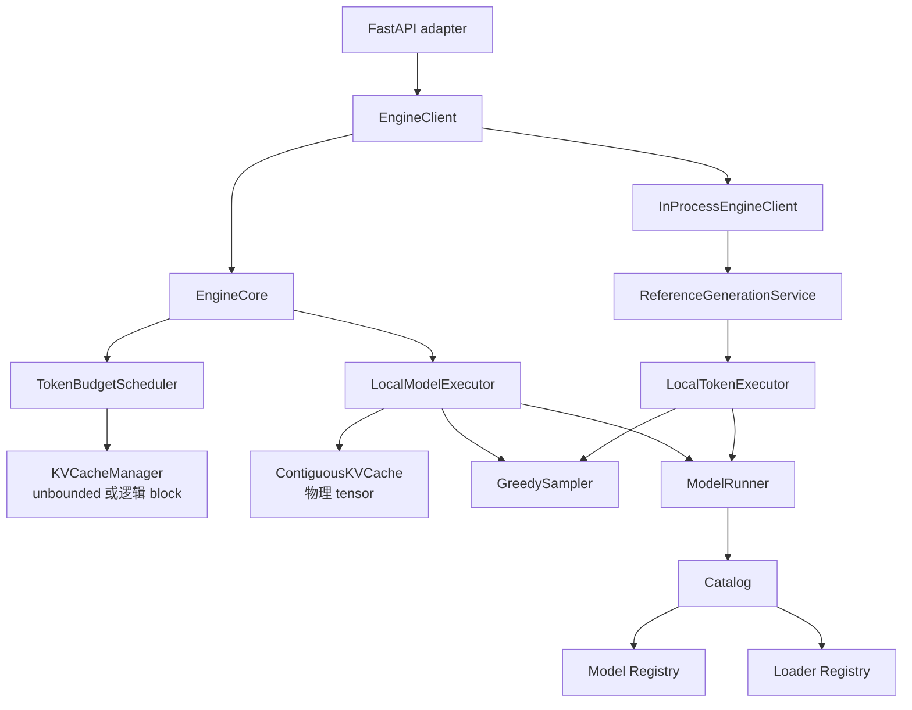
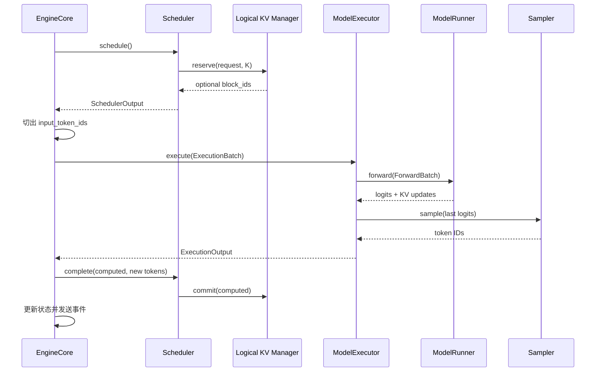
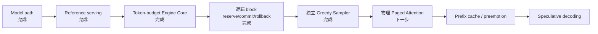

# light-vllm 架构设计（v0.7）

这份文档记录当前已经落地的设计。更细的职责说明见 [architecture.md](architecture.md)。

> **稳定核心只编排事实型契约；策略和后端通过组合接入。**

## 1. 设计目标

| 目标 | 当前落实方式 |
| --- | --- |
| 轻量 | `EngineCore → Scheduler → Executor` 单向调用链 |
| 高可读性 | 请求、调度、执行、采样、模型和协议各有唯一职责 |
| 高扩展性 | 模型/loader 注册；Sampler 与 Executor 通过组合替换 |
| 少模式分支 | 不用 prefill/decode/greedy/KV 专用 Executor |
| 成熟实践 | 采用统一 token budget、Scheduler/KV 协作和 Worker 物理缓存边界 |

## 2. 包结构

```text
src/light_vllm/
├── modeling/
│   ├── models/
│   ├── loaders/
│   ├── runner.py
│   ├── catalog.py
│   └── registry.py
├── runtime/
│   ├── generation/
│   ├── scheduler/
│   ├── execution/
│   ├── engine/
│   ├── sampling.py
│   └── kv_cache.py
├── serving/
├── entrypoints/
└── bootstrap.py
```

一级包只表示大的所有权边界。`sampling.py`、`kv_cache.py` 目前职责单一，因此保留为叶子文件；只有真实
实现增长到多个清晰组件时才拆目录。

## 3. 当前组件图



`UnboundedKVCacheManager` 只维护 reservation/commit 生命周期，不限制容量或产生位置；
`PagedKVCacheManager` 分配固定大小逻辑 block。执行侧仍是连续 tensor，所以当前阶段明确没有
Paged Attention。composition root 使用 `kv_reservation=blocks|unbounded` 选择二者，Scheduler 和 Engine
不包含模式判断。

## 4. 稳定契约

| 契约 | 含义 |
| --- | --- |
| `GenerateRequest` / events | 协议无关的用户生成语义 |
| `SchedulerOutput` | 本轮每请求 token 数、computed 位置和可选逻辑 block table |
| `ExecutionBatch` | Engine 从请求状态切出的本轮真实 token |
| `ExecutionOutput` | 每请求完成的计算量与零到多个确认 token |
| `ModelExecutor` | 执行已可行批次并管理执行期物理资源 |
| `Sampler` | 从二维 `[batch, vocabulary]` logits 选择 token |
| `ForwardBatch` / `ModelOutput` | 统一模型张量边界 |
| `EngineClient` | serving 使用的异步生成端口 |

`SchedulerOutput` 和 `ExecutionOutput` 是未来扩展的关键：前者不包含模式名，后者不限制一次只能输出一个
token。chunked prefill、普通 decode 和未来投机验证因此能共用同一循环。

## 5. 一次迭代



执行失败时 Engine 移除本轮请求；Scheduler 释放 reservation 与全部逻辑 block，Executor 的物理缓存经
lease 在安全边界释放。不会出现逻辑状态已经前进但模型 K/V 没有成功写入的半提交状态。

## 6. KV reserve / commit / rollback

无 block 基线使用 `UnboundedKVCacheManager`，其 reservation 返回 `block_ids=None`，执行成功后仍按同一
commit 语义推进 token 计数。逻辑分页实现使用固定 `block_size`：

```text
committed=1, reserve=4, block_size=2
需要覆盖 5 token → 临时持有 3 blocks

若只 commit=2：
committed 变为 3 → 只需 2 blocks → 自动释放尾部 1 block
```

当前普通执行总是完整提交本轮输入；部分提交语义为未来投机验证准备。取消或失败使用 `remove()` 释放
整个请求，无需另外维护 rollback API。

## 7. Sampler

`GreedySampler` 已从本地 Executor 中抽离。两个执行路径显式接收 `Sampler`：

```python
sampler = GreedySampler()
reference_executor = LocalTokenExecutor(runner, sampler)
model_executor = LocalModelExecutor(runner, kv_cache, sampler)
```

新增 top-k/top-p 时实现新的 Sampler 并装配。投机解码的 acceptance sampler 不等同于普通 Sampler，
未来会作为 speculative decoder 的内部组件与 proposer、target verify 组合。

## 8. Reference 与 Engine Core

Reference 是同步、无调度、每轮全序列重算的语义基线；`InProcessEngineClient` 仅把它适配到异步端口。

Engine Core 是后续性能能力唯一继续生长的路径。旧的 `FullSequenceBatchEngine`、`KVCacheBatchEngine`、
`GreedyFullSequenceBatchExecutor`、`GreedyContiguousKVCacheExecutor` 和 `KVCacheBatchTokenExecutor` 已删除，
不保留兼容 alias。

## 9. 代码映射

| 角色 | 文件 |
| --- | --- |
| 模型契约 | `src/light_vllm/modeling/models/interfaces.py` |
| loader 契约 | `src/light_vllm/modeling/loaders/interfaces.py` |
| 模型生命周期 | `src/light_vllm/modeling/runner.py` |
| 生成契约 | `src/light_vllm/runtime/generation/interfaces.py` |
| reference 生成 | `src/light_vllm/runtime/generation/reference.py` |
| 采样 | `src/light_vllm/runtime/sampling.py` |
| 逻辑/物理 KV 基线 | `src/light_vllm/runtime/kv_cache.py` |
| 调度契约 | `src/light_vllm/runtime/scheduler/interfaces.py` |
| token-budget 调度 | `src/light_vllm/runtime/scheduler/token_budget.py` |
| 执行契约 | `src/light_vllm/runtime/execution/interfaces.py` |
| 本地执行 | `src/light_vllm/runtime/execution/local.py` |
| Engine Core | `src/light_vllm/runtime/engine/core.py` |
| EngineClient | `src/light_vllm/runtime/engine/interfaces.py` |
| HTTP adapter | `src/light_vllm/serving/http.py` |
| 装配入口 | `src/light_vllm/entrypoints/http.py` |

## 10. 当前完成度



当前“完成”指契约、CPU 参考实现和行为测试完成，不代表已经具有生产吞吐。

## 11. 验证要求

提交前至少运行：

```powershell
.\.venv\Scripts\python.exe -m pytest
.\.venv\Scripts\ruff.exe check .
.\.venv\Scripts\ruff.exe format --check .
git diff --check
```

测试必须覆盖 token budget、chunked prefill、多 token 输出、逻辑 block 回滚、Sampler 替换、执行失败和
取消资源释放。核心 CPU 测试不得依赖可选 GPU 环境。
