# light-vllm 架构设计（v0.4）

这份文档描述 light-vllm 当前已经落地的最小架构，以及后续功能应该沿着哪些边界继续生长。

核心思想只有一句话：

> **稳定核心只负责编排契约；变化能力通过注册组件接入。**

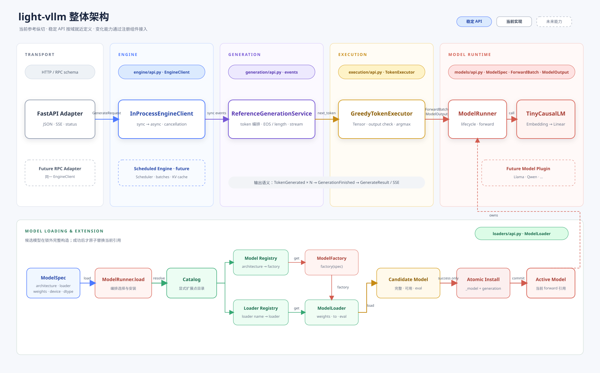

可编辑源文件：[Draw.io](assets/light-vllm-overall-architecture.drawio) ·
[SVG 矢量图](assets/light-vllm-overall-architecture.svg) ·
[PNG 预览图](assets/light-vllm-overall-architecture.png)

## 1. 设计目标

| 目标 | 在当前架构中的落实方式 |
| --- | --- |
| 轻量 | 模型路径与生成路径各自保持单向、短小的依赖链 |
| 热插拔 | 组件可以运行时注册；新模型完整加载后再原子替换旧引用 |
| 高扩展 | 模型架构和权重格式各自拥有独立注册表 |
| 高可读性 | 配置、选择、加载、生成、协议转换和装配各自只有一个职责 |
| 少边界 case | 功能分发依赖映射，不依赖不断扩大的 `if-elif-else` 树 |

完全消灭 `if` 不是目标。输入校验、错误处理和生命周期检查仍然应该显式存在；需要消除的是跨功能、跨后端的条件分发树。

## 2. 总体组件图

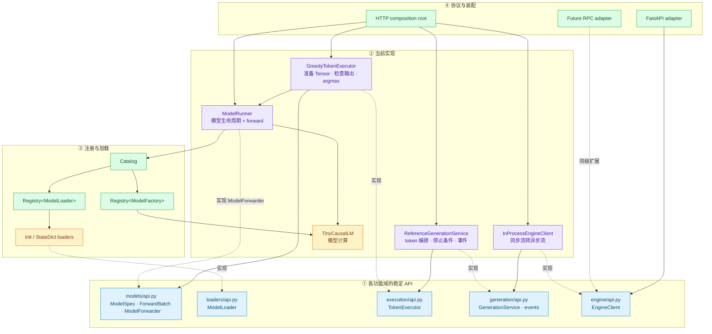

稳定接口不再集中在一个全局文件，而是由 `models`、`loaders`、`execution`、`generation` 和 `engine`
分别在自己的 `api.py` 中维护。实现依赖本域或下游域的 API，不依赖其他具体实现。

当前最关键的执行边界是：`ReferenceGenerationService` 只依赖 `TokenExecutor`，不再导入 torch、device、
`ModelRunner` 或模型输出。`GreedyTokenExecutor` 负责本地 PyTorch 输入准备、输出检查和贪心选择；协议
adapter 仍只依赖异步 `EngineClient`。

## 3. 模型加载时序

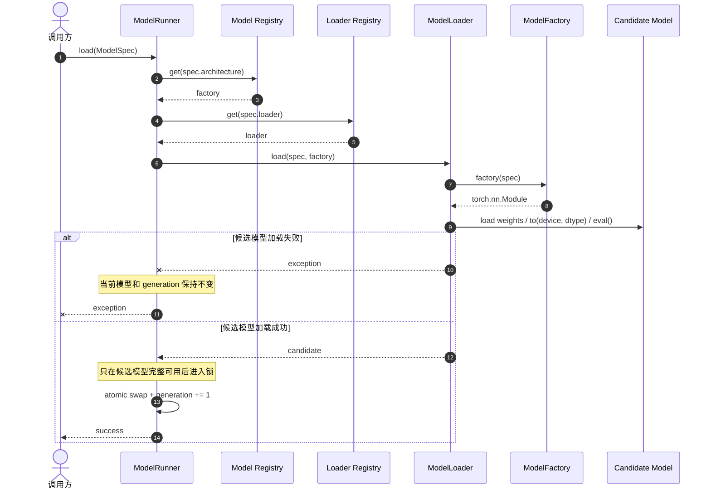

这个顺序刻意避免“先卸载旧模型，再尝试加载新模型”。首版保证进程内模型引用的原子替换；它还没有承诺跨模型迁移 KV cache 或请求状态。

## 4. 最简单的 forward

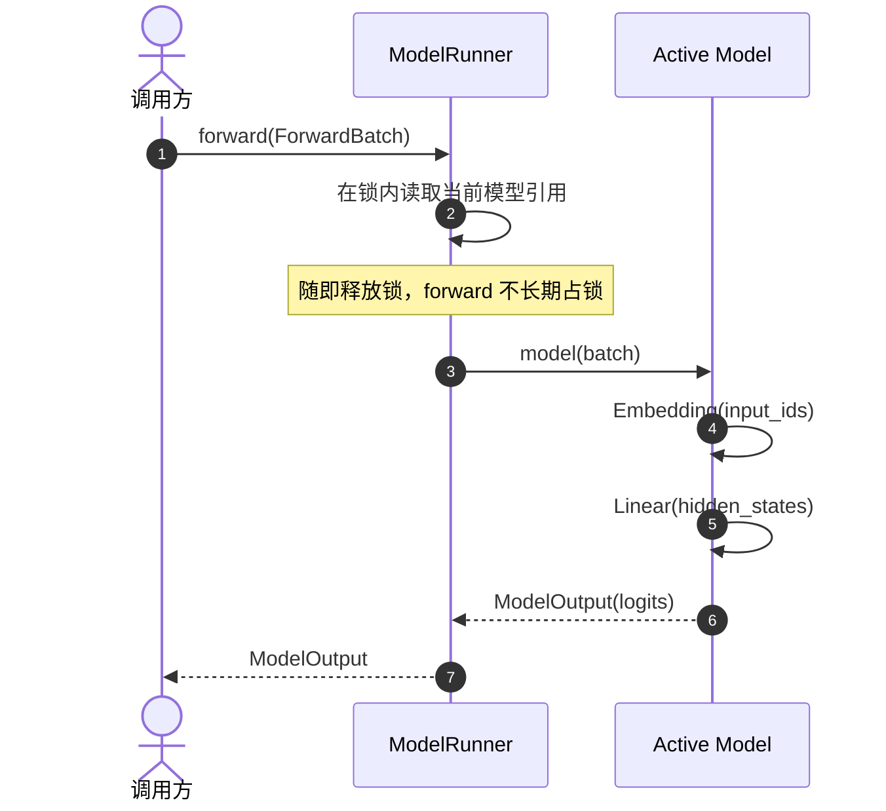

当前 `TinyCausalLM` 只实现 `Embedding → Linear`。它不是为了模拟完整 Transformer，而是为了先固定输入输出、加载和运行生命周期这三条契约。

## 5. 热替换状态机

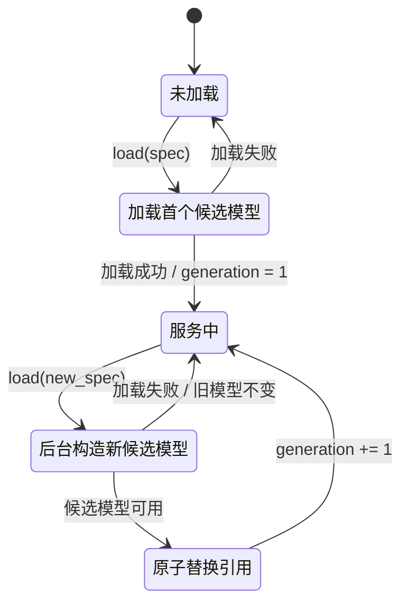

## 6. 为什么新增能力不改核心

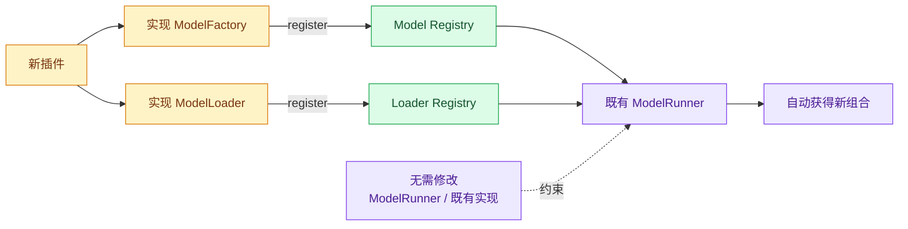

例如新增 `SafetensorsLoader` 时，应该新增 loader 实现并注册：

```python
catalog.loaders.register("safetensors", SafetensorsLoader())
```

不应该在 `ModelRunner.load` 中加入：

```python
# 不推荐：功能矩阵最终会变成难以维护的条件树
if spec.loader == "safetensors":
    ...
elif spec.loader == "state-dict":
    ...
```

## 7. 代码映射

| 架构角色 | 当前文件 |
| --- | --- |
| 模型 API | `src/light_vllm/models/api.py` |
| loader API | `src/light_vllm/loaders/api.py` |
| 执行 API | `src/light_vllm/execution/api.py` |
| 生成 API | `src/light_vllm/generation/api.py` |
| Engine API | `src/light_vllm/engine/api.py` |
| 通用注册表 | `src/light_vllm/registry.py` |
| 模型与 loader 目录 | `src/light_vllm/catalog.py` |
| 内置组件装配 | `src/light_vllm/bootstrap.py` |
| 模型生命周期和 forward | `src/light_vllm/runner.py` |
| 本地 PyTorch 贪心执行 | `src/light_vllm/execution/local.py` |
| 协议无关的参考生成 | `src/light_vllm/generation/reference.py` |
| 进程内 Engine 实现 | `src/light_vllm/engine/in_process.py` |
| FastAPI JSON/SSE adapter | `src/light_vllm/serving/http.py` |
| runtime/engine/transport 装配与 CLI | `src/light_vllm/entrypoints/http.py` |
| 基础 loader | `src/light_vllm/loaders/torch.py` |
| 最小参考模型 | `src/light_vllm/models/tiny.py` |

## 8. 当前边界与下一步

```mermaid
flowchart LR
    P0["P0 已完成<br/>Loader + Minimal Forward"] --> Slice["参考纵切已完成<br/>Generate + EngineClient + HTTP"]
    Slice --> P1["P1 下一步<br/>Scheduler / Execution Batch"]
    P1 --> P2["P2 Memory Path<br/>KV Cache / Block Allocator"]
    P2 --> P3["P3 Execution Path<br/>Prefill / Decode / Batch"]
    P3 --> P4["P4 Production Serving<br/>Async Engine / Compatibility API"]
    P4 --> P5["P5 Adaptive Control<br/>Metrics / Guardian"]

    classDef done fill:#dcfce7,stroke:#16a34a,color:#14532d;
    classDef next fill:#e0f2fe,stroke:#0284c7,color:#0c4a6e;
    class P0,Slice done;
    class P1,P2,P3,P4,P5 next;
```

当前 HTTP 能力是一条用于验证边界的参考纵切，不是绕过 P1-P3 的生产 serving。当前 `TokenExecutor`
只描述单请求逐 token 的参考路径；下一步应在既有 `GenerateRequest` 之后单独定义 Scheduler 和执行批次，
让后续 KV cache 与 prefill/decode 优化有清晰挂载点。

## 9. 生成与协议边界

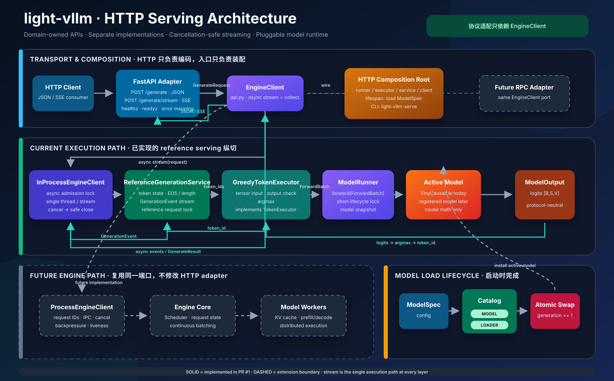

静态文件：[SVG 矢量图](assets/http-serving-architecture.svg) ·
[PNG 预览图](assets/http-serving-architecture.png)

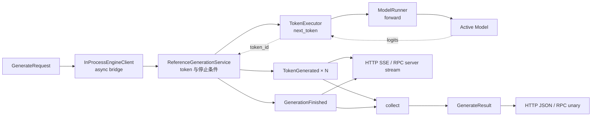

增量事件流是每个边界的唯一生成执行路径。同步 reference 与异步 EngineClient 各自的 `generate` 都
收集其 `stream`，因此两种响应模式不会产生两套采样或停止逻辑。HTTP 的 `/generate` 返回 JSON，
`/generate/stream` 把事件编码成 SSE；未来 RPC adapter 可以把同一事件映射为 unary response 或
server stream。

`stream` 是否启用、Pydantic/Protobuf schema、HTTP status 和 SSE event name 都属于 adapter，不能进入
`GenerateRequest`。流在发出首事件前失败时，HTTP adapter 可以返回正常错误状态；发出首事件后状态码
已经确定，错误会被编码为 `error` event 并结束流。

`InProcessEngineClient` 用一个很薄的 async bridge 每次拉取一个同步领域事件。客户端断开时，bridge
会关闭底层 iterator，让生成服务的 `finally`/上下文管理及时释放执行锁。HTTP adapter 本身只处理
async event stream，不知道当前 engine 与它是否处于同一进程。

bridge 在进入 worker thread 前持有一个异步准入锁，因此并发等待者停留在 event loop。若只依赖同步
generator 内部跨 `yield` 持有的执行锁，每个等待请求都会占用一个 worker thread；线程池耗尽后，当前
持锁请求将无法调度下一次 `next()` 或 `close()`，造成线程池饥饿死锁。被接纳的 stream 使用专属
单线程执行器，同步 stream 的创建、`next()` 和 `close()` 固定在同一线程。取消先等待当前同步步骤
结束，再关闭 iterator，因此不会让后台 `next()` 与清理并发执行。

当前 `ReferenceGenerationService` 每次把完整 token 序列交给 `TokenExecutor`，并用独立执行锁串行化生成。
它只维护 token、EOS/长度停止条件和事件，不接触 torch、device、runner 或 logits。当前
`GreedyTokenExecutor` 会重新构造完整 Tensor，调用 runner、检查 logits 并执行 argmax。这是 CPU 可测试的
清晰参考实现，不承诺 KV cache、continuous batching 或高并发吞吐；未来 scheduler 可以作为新的 Engine
实现接入 `EngineClient`，不必把异步调度强塞进同步 reference 契约。

## 10. EngineClient 与进程演进

当前装配仍然是单进程：

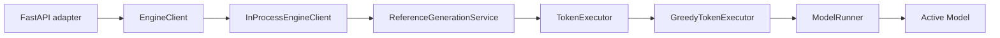

这次拆分固定的是调用方向，不是提前实现分布式。`ReferenceGenerationService` 仍可以被离线代码直接调用，
因此它既是教学实现也是后续 pipeline/scheduled generation 的性能和语义 baseline。

当前 HTTP reference 对输入和输出 token 数各设置 4096 的 adapter 安全上限。它不是模型 context-length
契约；未来 Scheduler/admission 应根据实际模型配置给出更准确的限制。

Scheduler 建立后，可以增加另一个实现而不改 HTTP/RPC adapter：

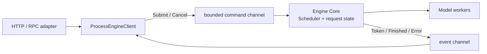

`ProcessEngineClient` 负责 request ID、输出分发、背压、取消和 engine 存活状态；Engine Core 独占
Scheduler、KV cache 和执行状态。IPC 可以先用 `multiprocessing`，有实际扩展需求后再换 ZMQ。传输实现
不得改变 `EngineClient` 或 generation 数据契约。

## 11. Performance Guardian

Guardian 是可行的，但应位于控制面，不得进入 token 数据热路径：

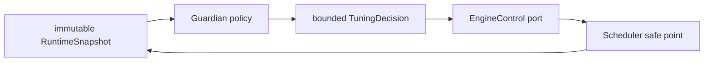

它应拆成三个独立职责：

1. **Observer**：聚合吞吐、TTFT、TPOT、队列长度、batch 利用率、KV 使用率和 OOM 等指标，输出不可变
   snapshot。
2. **Policy**：从 snapshot 产生带原因的 `TuningDecision`；第一版只 dry-run 并记录建议。
3. **Actuator**：通过 `EngineControl` 请求 Engine 在调度安全点校验并应用决策，Guardian 不直接修改
   Scheduler 或 KV cache 字段。

适合在线调整的是有明确范围、可回滚且不改变请求语义的参数，例如 batch token budget、并发序列上限
和调度等待窗口。dtype、模型结构、KV block size 等需要重建或迁移状态的配置不应成为普通在线旋钮。
自动模式必须包含上下界、冷却时间、迟滞、单次变化幅度、审计日志和回滚条件，避免指标噪声引起振荡。

因此实现顺序是：Scheduler → metrics/snapshot → EngineControl safe point → Guardian dry-run → 有界自动模式。
当前只记录边界，不增加尚无消费者的空接口。
