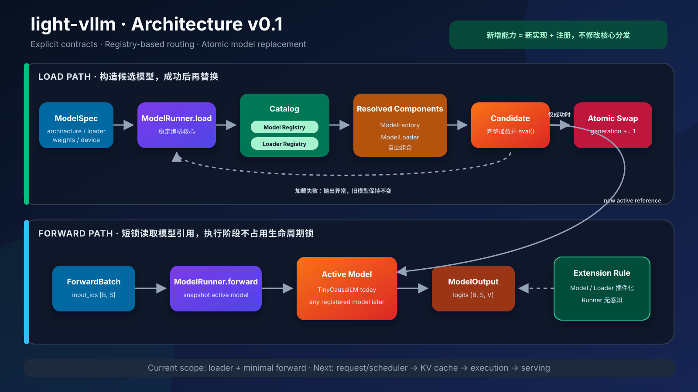
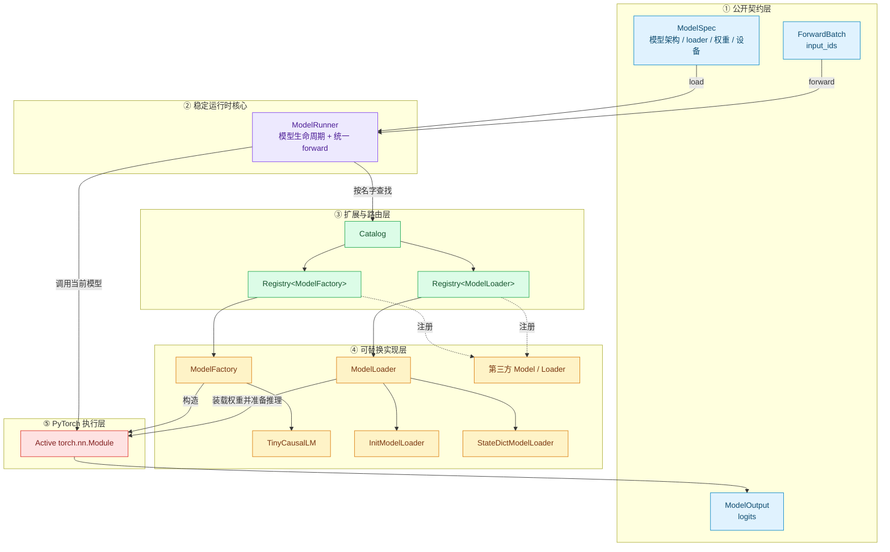
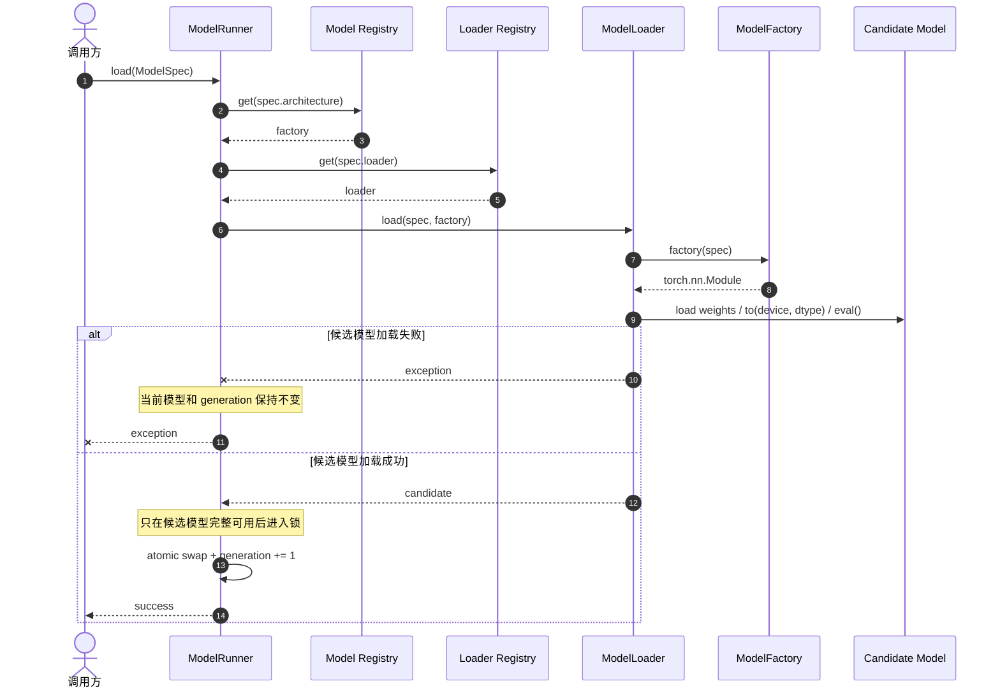
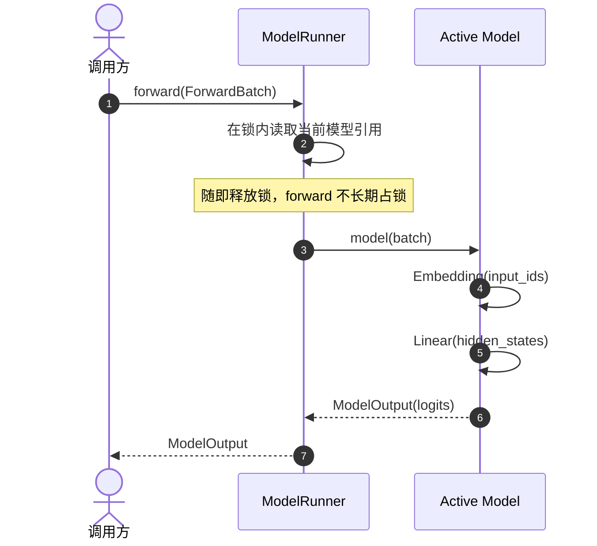
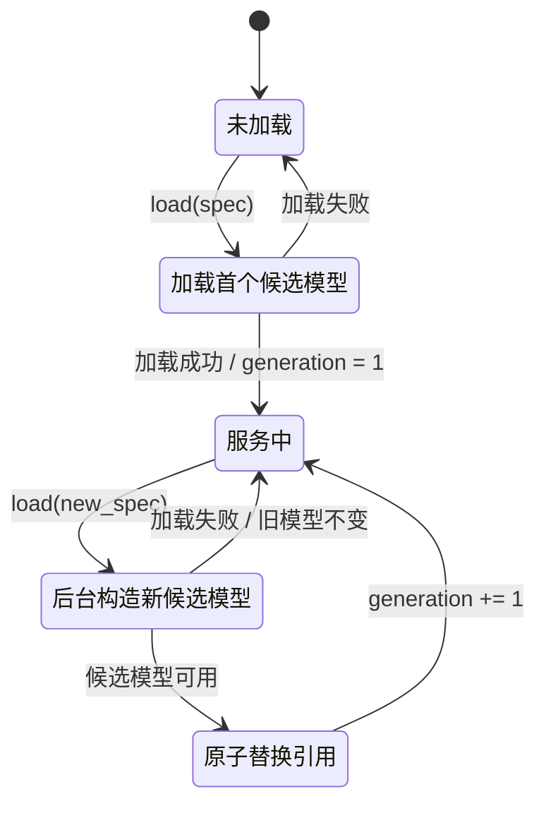
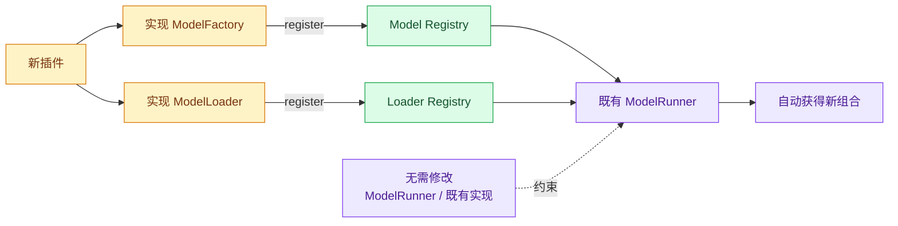
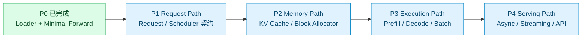

# light-vllm 架构设计（v0.1）

这份文档描述 light-vllm 当前已经落地的最小架构，以及后续功能应该沿着哪些边界继续生长。

核心思想只有一句话：

> **稳定核心只负责编排契约；变化能力通过注册组件接入。**



静态文件：[SVG 矢量图](assets/architecture-overview.svg) ·
[PNG 预览图](assets/architecture-overview.png)

## 1. 设计目标

| 目标 | 在当前架构中的落实方式 |
| --- | --- |
| 轻量 | 核心闭环只有 `Catalog → Loader/Factory → ModelRunner → Model` |
| 热插拔 | 组件可以运行时注册；新模型完整加载后再原子替换旧引用 |
| 高扩展 | 模型架构和权重格式各自拥有独立注册表 |
| 高可读性 | 配置、选择、加载、执行四个职责分开 |
| 少边界 case | 功能分发依赖映射，不依赖不断扩大的 `if-elif-else` 树 |

完全消灭 `if` 不是目标。输入校验、错误处理和生命周期检查仍然应该显式存在；需要消除的是跨功能、跨后端的条件分发树。

## 2. 总体组件图



最关键的依赖方向是：`ModelRunner` 依赖 `ModelLoader` 和 `ModelFactory` 契约，不依赖具体的 Tiny、Llama、Safetensors 或量化实现。

## 3. 模型加载时序



这个顺序刻意避免“先卸载旧模型，再尝试加载新模型”。首版保证进程内模型引用的原子替换；它还没有承诺跨模型迁移 KV cache 或请求状态。

## 4. 最简单的 forward



当前 `TinyCausalLM` 只实现 `Embedding → Linear`。它不是为了模拟完整 Transformer，而是为了先固定输入输出、加载和运行生命周期这三条契约。

## 5. 热替换状态机



## 6. 为什么新增能力不改核心



例如新增 `SafetensorsLoader` 时，应该新增 loader 实现并注册：

```python
catalog.loaders.register("safetensors", SafetensorsLoader())
```

不应该在 `ModelRunner.load` 中加入：

```python
# 不推荐：功能矩阵最终会变成难以维护的条件树
if spec.loader == "safetensors":
    ...
elif spec.loader == "state-dict":
    ...
```

## 7. 代码映射

| 架构角色 | 当前文件 |
| --- | --- |
| 公开数据契约 | `src/light_vllm/contracts.py` |
| 通用注册表 | `src/light_vllm/registry.py` |
| 模型与 loader 目录 | `src/light_vllm/catalog.py` |
| 内置组件装配 | `src/light_vllm/bootstrap.py` |
| 模型生命周期和 forward | `src/light_vllm/runner.py` |
| 基础 loader | `src/light_vllm/loaders/torch.py` |
| 最小参考模型 | `src/light_vllm/models/tiny.py` |

## 8. 当前边界与下一步



下一步最合理的工作不是立刻加入 CUDA kernel，而是先定义 `Request`、`Scheduler` 和执行批次之间的稳定边界，让后续 KV cache 与 prefill/decode 优化有清晰的挂载点。
