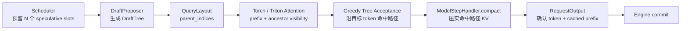

# Tree Speculative Decoding 设计提案

> 状态：核心实现与 CPU 正确性测试已完成；Triton 树形测试已加入，GPU 数值与性能验收待完成。
>
> 目标：在不污染 Engine、Scheduler 和 Worker 热路径的前提下，为 light-vllm
> 增加 N-Gram Trie 多分支草稿与单次目标模型并行验证能力。

## 1. 背景

当前投机解码已经具备正确的主干边界：

- Scheduler 通过 `num_lookahead_tokens` 预留候选可能写入的 token slot；
- `DecodeHandler` 组合 proposer、目标模型验证与 acceptance sampler；
- `RequestOutput` 可以一次返回多个确认 token，并单独报告已写入 KV 的连续前缀；
- Engine 只按事实提交实际算完的输入和已缓存输出，不理解具体投机算法。

改造前的实现假设草稿是一条线性链：

1. `TokenProposer` 返回 `tuple[int, ...]`；
2. 投机 Handler 通过 `input + drafts` 构造线性验证序列；
3. Dense/Paged Attention 默认第 `i` 个 query 可以看到此前全部 query；
4. 验收后只能用 `truncate()` 保留草稿的连续前缀。

多分支 Trie 验证打破了后两项假设。兄弟节点具有相同的语义位置，但必须使用不同的物理 KV slot；每个节点只能看到
正式 prefix、自身和祖先，不能看到其他分支；最终接受的路径也不一定是展平数组的连续前缀。

## 2. 目标与非目标

### 2.1 目标

- 支持从当前请求历史构造有界 N-Gram Trie；
- 将多个候选分支放入一次目标模型 forward 并行验证；
- 同时支持 PyTorch correctness backend 和 Triton Paged Attention；
- 保持现有非抢占 completion claim、KV reserve/commit 和失败清理语义；
- 让现有线性 N-Gram 草稿成为候选树的退化形式；
- 为后续外部检索、REST 风格 proposer 或模型型 proposer 保留扩展点。

### 2.2 非目标

- 首版不引入外部语料库或跨请求可变 Trie；
- 首版只支持 greedy 目标采样，不实现概率型 speculative sampling；
- 不新增 TreeExecutor、TreeWorker 或 tree-specific Scheduler；
- 不改变 EngineClient、生成事件、HTTP schema 和模型注册体系；
- 不在完成端到端 benchmark 前宣称生产吞吐提升。

## 3. 核心决策

采用“**树节点展平到已预留 query slots + `QueryLayout` 表达依赖 + 验收后压实命中路径 KV**”的方案。



Scheduler 仍只管理 token 数量和逻辑 KV reservation；候选算法只存在于 `DecodeHandler` 组合；物理位置、attention
mask 和 KV 搬运仍由 Step Handler 与 Attention backend 负责。

## 4. 新增事实型契约

### 4.1 `DraftTree`

```python
@dataclass(frozen=True, slots=True)
class DraftTree:
    token_ids: tuple[int, ...]
    parent_indices: tuple[int, ...]
```

约束：

- 节点只要求 parent 先于 child；当前 `NGramTrieProposer` 使用稳定 BFS 生成顺序；
- `parent_indices[i] == -1` 表示节点直接从当前正式 token 尾部生长；
- 其他 parent 必须满足 `0 <= parent < i`；
- 同一 parent 下不能出现重复 token，否则目标 token 无法唯一选择子节点；
- 节点总数不得超过 Scheduler 提供的 speculative slot budget。

线性草稿 `(a, b, c)` 表达为：

```text
token_ids      = (a, b, c)
parent_indices = (-1, 0, 1)
```

因此不需要为 chain 和 tree 维护两套执行流程。

### 4.2 `QueryLayout`

```python
@dataclass(frozen=True, slots=True)
class QueryLayout:
    parent_indices: tuple[int, ...]
```

`QueryLayout` 描述一次实际 model step 内 query token 的依赖关系，而不是投机算法类型：

- `-1` 表示该 query 直接继承已经提交的 KV prefix；
- 其他 parent 指向本次 query 中更早的节点；
- query 始终可以读取自身；
- query 可以读取其 parent 链上的全部祖先；
- query 不得读取非祖先节点。

它以 `O(Q)` 的 parent 数组作为稳定契约。Torch/Triton backend 可以在 batch metadata 中生成 `O(Q²)`
visibility matrix，但不把具体 mask 表示扩散到 Engine 或 Scheduler。

线性 query 的布局为 `(-1, 0, 1, ...)`。树验证时，正式输入部分保持线性；每个草稿根节点指向正式输入的最后一个
query，其他草稿节点指向对应的父节点。

### 4.3 `ModelStepRequest`

当前 `ModelStepHandler.forward()` 直接消费 `ExecutionBatch`。线性投机 Handler 会构造第二个
`ExecutionRequest`，并把草稿追加到 `context_token_ids`。树节点不存在合法的线性 context，因此不应继续复用这个
契约。

新增只表达一次具体模型计算的中间契约：

```python
@dataclass(frozen=True, slots=True)
class ModelStepRequest:
    request_id: str
    query_token_ids: tuple[int, ...]
    num_computed_tokens: int
    num_reserved_query_tokens: int
    query_layout: QueryLayout
    block_ids: tuple[int, ...] | None
    num_readonly_prefix_blocks: int = 0
```

- `ExecutionRequest` 继续表达 Engine 已调度的正式输入、完整历史和输出预算；
- `DecodeHandler` 把它转换为一个具体的 `ModelStepRequest`；
- `ModelStepHandler` 不再接触 proposer context、最大输出数等策略事实；
- `num_reserved_query_tokens` 可以大于本次实际 query 数，用于严格校验未使用的 reservation 和 block table。

普通解码构造线性 `ModelStepRequest`；投机解码构造带树布局的 `ModelStepRequest`。Worker 只负责把同一个
Decode Handler 委托给同一个 Step Handler，不增加模式分支。

### 4.4 验收结果

树验收不仅要返回确认 token，还必须告诉物理缓存哪些草稿节点属于接受路径：

```python
@dataclass(frozen=True, slots=True)
class AcceptanceResult:
    output_token_ids: tuple[int, ...]
    accepted_draft_indices: tuple[int, ...]
```

`RequestOutput` 不需要改变。Decode Handler 根据 `accepted_draft_indices` 得到
`num_cached_output_tokens`，并在返回前完成物理 KV 压实。

## 5. 单轮执行语义

假设正式输入有 `B` 个 token，Scheduler 预留 `N` 个 speculative slots，proposer 实际生成 `Q <= N` 个树节点：

1. Scheduler reserve `B + N` 个逻辑 token slot；
2. proposer 从只读 `context_token_ids` 生成 `DraftTree(Q)`；
3. Decode Handler 将正式输入与树节点展平为 `B + Q` 个 query；
4. `QueryLayout` 为正式输入建立线性依赖，为草稿节点建立树依赖；
5. Step Handler 为每个 query 生成语义 position 和独立物理 slot；
6. 目标模型执行一次 forward；
7. acceptance 从正式输入最后一行 logits 开始，按目标 token 在 Trie 中逐层选择子节点；
8. 命中子节点时继续读取该节点对应 logits；无法命中时返回当前目标 token；
9. 全部命中到叶子时，叶子 logits 产生 bonus token；
10. Step Handler 将正式输入和命中路径的 KV 压实到连续正式尾部；
11. Handler 返回确认 token 和已缓存路径长度；
12. Engine 只 commit `B + accepted_path_length`，未使用和拒绝分支的 reservation 自动释放。

目标模型对每个 query 状态只产生一个 greedy token。Trie 的作用是让目标 token 有机会匹配多个候选分支之一，
而不是在同一状态同时接受多个 token。

## 6. 位置、可见性与物理 slot

树验证必须分开三种概念：

| 概念 | 含义 |
| --- | --- |
| 语义 position | RoPE 使用的请求内绝对位置；由 parent 深度推导，兄弟节点可以相同 |
| query index | 树节点在本次 padded model batch 中的展平下标 |
| 物理 KV slot | `block_id * block_size + offset`；每个树节点必须唯一 |

对节点 `i`：

```text
position(i) = num_computed_tokens                         if parent(i) == -1
position(i) = position(parent(i)) + 1                     otherwise

visible(i) = committed_prefix + ancestors(i) + self(i)
```

正式输入部分的 parent 链保证现有 chunked prefill 和普通 decode 语义不变。树节点虽然可能共享语义 position，但绝不
共享物理 slot。

## 7. Attention backend 改造

### 7.1 PyTorch Dense/Paged correctness backend

首版由 `QueryLayout` 构造显式 visibility：

- 已提交 prefix 对所有有效 query 可见；
- 新 query 区域仅允许读取自身和祖先；
- padding、兄弟和其他分支不可见。

Dense backend 直接将 visibility 应用于拼接后的 `past + query K/V`。Paged backend 根据 visible logical position
逐页读取，不拼接完整历史 tensor。

### 7.2 Triton Paged Attention

首版在 context 创建时生成一次 `[batch, query, query]` 的 boolean/int8 visibility tensor，供所有模型层复用。
kernel 的有效 key 条件改为：

```text
key_position < num_computed_tokens
or query_visibility[batch, query_offset, key_query_offset]
```

KV 写入和 attention 继续使用同一 CUDA stream 上的两个顺序步骤，避免某个 program 读取尚未写完的兄弟节点 KV。
当 node budget 证明需要扩大时，可以把 visibility 压成 bitset；该优化不改变 `QueryLayout` 契约。

## 8. KV 路径压实

现有 `truncate(request_id, num_cached_tokens)` 只能保留展平数组的连续前缀。将其替换为更一般的事实操作：

```python
ModelStepHandler.compact(
    request: ModelStepRequest,
    retained_query_indices: tuple[int, ...],
) -> int
```

返回值是 source/destination 物理位置不同、实际发生搬运的 token 数。`retained_query_indices` 按最终正式 token
顺序包含：

1. 本轮全部正式输入 query；
2. acceptance 选中的草稿路径 query。

连续缓存实现：

- 从本轮追加区域 gather 被保留的逐层 K/V；
- clone 后覆盖正式连续尾部，避免源/目标重叠；
- 将有效长度更新为 `old_length + retained_count`。

分页缓存实现：

- 使用本轮 block table 把 source/destination logical position 映射为 physical slot；
- 每层先 gather/clone，再 scatter 到连续正式尾部；
- 拒绝分支的旧值无需清零，逻辑 trim 后不可达，下次分配会覆盖。

只有全部模型层压实成功后 Handler 才返回。任一层失败、输出校验失败或请求取消时，Engine 不执行逻辑 commit，并按
现有请求清理路径释放资源，因此不会产生可见的半提交状态。

## 9. 容量与非抢占保证

首版继续把 `num_lookahead_tokens=N` 解释为“本轮最多可供草稿占用的 query/KV slots”，而不是树深度。
`max_output_tokens` 继续使用保守上限 `N + 1`。

当前 Scheduler 保证：

```text
N <= remaining_output_tokens - 1
```

因此：

```text
computed + scheduled_input + N <= max_num_committed_tokens
```

树节点展平后仍落在请求已有 completion claim 覆盖范围内，不需要新增临时页池或第二套容量账本。实际命中路径通常
短于 `N`，多余空间在 commit 时恢复成 completion claim。

这个方案首版会保守预留节点数而不是最大路径深度。后续如果 benchmark 证明预留浪费显著，可以再引入独立的
speculative workspace claim；在此之前不扩大 Scheduler/KV 协议。

## 10. Proposer 与装配

新增 `NGramTrieProposer`：

- 只读取当前请求完整历史，不保存跨请求可变状态；
- 找到最长匹配后缀后，收集历史中所有匹配位置的后续 token；
- 按频次构造 Trie；同分时依次比较最近 occurrence 和 token ID；
- 使用 `max_nodes`、`max_depth` 和 `max_branching` 做确定性裁剪；
- 无匹配时返回空树，自动退化为普通单 token 解码。

组合根可以装配：

```text
linear ngram proposer ─┐
                      ├─ SpeculativeDecodeHandler ─ ModelStepHandler
ngram trie proposer ──┘
```

候选算法的选择只允许出现在 composition root。Scheduler、Engine、Executor、Worker 和模型不得导入具体 proposer。

## 11. 文件级改造范围

| 文件 | 改造 |
| --- | --- |
| `runtime/execution/interfaces.py` | 增加 `DraftTree`、`QueryLayout`、`ModelStepRequest/Batch` 与通用 compact 契约 |
| `runtime/execution/layout.py` | 从父链推导线性/树形 layout、语义 position 与 ancestor visibility |
| `runtime/execution/speculative.py` | 通用树形 Handler、N-Gram chain/trie proposer、greedy tree acceptance |
| `runtime/execution/worker.py` | Step Handler 消费 `ModelStepBatch`，按 layout 生成 position/metadata |
| `runtime/execution/dense_attention.py` | 使用 prefix + ancestor visibility |
| `runtime/execution/paged_attention.py` | 支持非连续祖先可见性和树形 slot metadata |
| `runtime/execution/triton_paged_attention.py` | 增加 query visibility 输入与 tree mask |
| `runtime/kv_cache.py` | 连续缓存实现 gather/compact |
| `runtime/execution/paged_cache.py` | 分页缓存实现跨页 slot gather/copy |
| `entrypoints/http.py` | 只在装配层选择 chain 或 trie proposer |
| `tests/` | 增加布局、验收、KV、Engine 和 GPU parity 覆盖 |
| `AGENTS.md`、`docs/design.md` | 实现落地时同步更新架构不变量和当前能力 |

不需要修改 EngineClient、HTTP adapter、模型 forward 契约、ModelRunner、Catalog 或 Scheduler 决策逻辑。Scheduler
相关文件只需澄清 `lookahead` 是 speculative slot budget，并补充回归测试。

## 12. 不采用的方案

### 12.1 新增 TreeExecutor / TreeWorker

树验证是 Decode Handler 和 attention layout 的差异，不是执行拓扑差异。新增专用 Executor/Worker 会复制模型生命周期、
请求注册和物理缓存逻辑，并违反现有扩展边界。

### 12.2 让 Scheduler 理解 Trie

Scheduler 只需要知道本轮最多消费多少 model/KV token slot。把 parent、branch 或 tree depth 放入调度契约会让候选
策略进入核心热路径，并阻碍未来替换 proposer。

### 12.3 独立临时 KV arena

绕开逻辑 KV manager 分配临时页会产生第二套容量事实，使物理页使用可能超过 completion claim，破坏当前非抢占
保证和取消安全边界。

### 12.4 把完整 Q×Q mask 放入稳定执行契约

mask 是 backend 表达，不是核心事实。稳定契约只保留 `O(Q)` parent 关系，Torch/Triton 各自在 batch metadata 中
生成适合自己的表示。

## 13. 分阶段实施

### Phase 1：拆清 model-step 契约，不改变行为（已完成）

- 引入 `ModelStepRequest/Batch` 和线性 `QueryLayout`；
- Standard/现有 N-Gram 路径全部迁移；
- 输出、KV 和调度测试必须与当前 main 完全一致。

### Phase 2：PyTorch 树验证正确性（已完成）

- 引入 `DraftTree` 和固定树 proposer；
- Dense/Paged backend 支持 ancestor visibility；
- 连续和分页缓存实现 compact；
- 使用 tiny model 与 greedy 基线做端到端输出对照。

### Phase 3：N-Gram Trie（已完成）

- 实现历史匹配、频次 Trie 和有界裁剪；
- 接入通用 speculative Handler；
- 增加 chain/trie 装配选择和可观测计数。

### Phase 4：Triton tree mask（代码与测试已完成，GPU 验收待完成）

- 增加 visibility tensor 和 kernel mask；
- 在 RTX 5090 上覆盖 FP16/BF16、GQA、padded batch、跨页和 prefix cache；
- 比较 Torch/Triton 数值与 greedy 输出。

### Phase 5：性能验收与默认策略（待完成）

- 对代码、RAG/模板、普通对话分别测试；
- 比较 chain N-Gram、Trie N-Gram 和关闭投机三组；
- 根据 accepted length、target forwards、TPOT、吞吐和临时 KV 峰值决定是否默认开放。

## 14. 必须覆盖的测试

### 14.1 契约测试

- parent 必须先于 child；
- 同 parent 下 token 唯一；
- 节点数不得超过预留；
- 线性 layout 与当前 causal mask 完全一致；
- 无候选时退化为单 token decode。

### 14.2 语义测试

- 兄弟节点互不可见；
- 子节点可见正式 prefix、祖先和自身；
- 多根、单链、完全命中、首 token 拒绝、中途拒绝和叶子 bonus；
- 树验证输出与逐 token greedy 输出一致。

### 14.3 KV 测试

- 接受路径不是展平连续前缀时仍能正确 compact；
- source/destination 重叠复制；
- 路径跨 block 边界；
- prefix cache 只读页不被写入；
- 拒绝、异常、取消和输出校验失败不提交逻辑 KV；
- commit 后 block table 只覆盖正式连续前缀。

### 14.4 调度与容量测试

- `actual model tokens <= scheduled input + speculative slots`；
- `used unique blocks + completion claims <= total blocks` 始终成立；
- 短请求首 token 路径仍不等待投机 workspace；
- self-resubmit、严格 fallback 和整轮无进展语义不回退。

### 14.5 GPU 测试

- Torch/Triton FP16、BF16 数值对照；
- MHA/GQA、decode history、chunked prefill、shared prefix、padded mixed tree；
- node budget 跨页，accepted path 跨页；
- CUDA step 计时统计实际 query 节点数，不统计未使用 reservation。

## 15. 性能判定

并行验证不天然等于加速。Trie 在重复结构明显的代码、RAG 引用和模板生成中更可能有效；普通对话或高并发场景可能因
额外 query、mask 和 KV compact 降低吞吐。

实现通过独立 `SpeculationObserver` 上报这些事实；观察端首次失败后停用，不能改变生成结果。至少记录：

- proposed/accepted node count；
- accepted path length，以及包含最终 target token 的 verified token count；
- tree hit/miss 和平均 branching factor；
- 每个可见 token 的目标模型 forward 次数；
- TTFT、TPOT、吞吐和 p50/p95 step latency；
- speculative workspace 峰值和 compact 搬运量。

只有在目标 workload 上端到端 TPOT 或吞吐优于 chain N-Gram，并且不破坏短请求与非抢占保证时，才宣称性能收益。

树验证的主要算法指标采用 Mean Verified Tokens：

```text
mean_verified_tokens = speculative_verified_tokens_total / speculation_attempts_total
```

一次 greedy 验证的 verified tokens 等于接受的草稿节点数加 target model 最终补出的一个 token。该指标衡量一次
target verification 平均让请求前进多少 token；`accepted / proposed` 只作为草稿节点利用率诊断。最终性能仍以
TPOT、吞吐和端到端 speedup 为准，因为更大的树也会增加 attention 与 KV compact 开销。

## 16. 参考

- [REST: Retrieval-Based Speculative Decoding](https://aclanthology.org/2024.naacl-long.88/)：检索续写、Trie 构造与 Tree Attention 验证；
- [SpecInfer](https://arxiv.org/abs/2305.09781)：token tree verification 与 ancestor-only attention；
- [PagedAttention](https://arxiv.org/abs/2309.06180)：分页 KV 管理与按需读取；
- [Triton Fused Attention Tutorial](https://triton-lang.org/main/getting-started/tutorials/06-fused-attention.html)：融合 attention 和在线 softmax 的实现参考。
